# Aetherion: Voidfall — Guia Aseprite, Estilo 16-bit e Código-Fonte

**Para:** Thiago, Matheus, Isabella, Bianca, Sammer e Wesley  
**Objetivo:** produzir **novos cenários terrestres e espaciais** e **naves** no mesmo estilo 8/16-bit do T1 e dos heróis, e entender onde isso entra no código.  
**Base:** repositório `gabriellucasalves/aetherion-voidfall`, commit `69d4612`, Unity **6000.5.9f1**.

> **Legenda deste documento**
> ✅ **Verificado** — conferido no código do repo ou na documentação oficial/README do projeto citado.
> ⚠️ **Não verificado** — informação pública que **não testamos** aqui (nenhum Aseprite, Unity ou servidor MCP foi executado na preparação deste guia). Confira antes de depender disso.

## Sumário

1. Preparação do ambiente (repo, Unity, Aseprite)
2. Scripts Aseprite do projeto (templates de personagem, cenário e nave + exportação)
3. Exportar do Aseprite e importar no Unity
4. Guia de estilo extraído dos assets reais
5. Como um cenário e uma nave entram no código
6. Aseprite + Unity com ferramentas de IA (Cursor, Codex, Claude, Antigravity, Copilot)
7. Apêndice de código-fonte

---

## 1. Preparação do ambiente

### 1.1 Clonar o repositório

```bash
git clone https://github.com/gabriellucasalves/aetherion-voidfall.git
cd aetherion-voidfall
git checkout -b art/<seu-nome>-<assunto>     # ex.: art/isabella-naves
```

Cada pessoa trabalha em **branch própria** e abre Pull Request. Não commite a pasta `Library/`, `Temp/`, `Logs/` nem builds (`webgl/`).

### 1.2 Abrir no Unity 6000.5.9f1 ✅

1. Instale o **Unity Hub** e, em *Installs → Install Editor → Archive*, a versão exata **6000.5.9f1** (é a que está em `ProjectSettings/ProjectVersion.txt`). Marque o módulo **WebGL Build Support** (o Wesley precisa dele para o build web).
2. No Hub: *Projects → Add → Add project from disk* → selecione a pasta clonada.
3. A primeira abertura reimporta tudo (alguns minutos). Abra a cena pelo menu **Aetherion → Abrir Boot** e aperte Play.
4. As cenas são quase vazias de propósito: os controladores se criam sozinhos em runtime (`[RuntimeInitializeOnLoadMethod]` + `EnsureExists()` chamados por `SceneTransitionManager.AttachFor`). Não espere encontrar o cenário montado no Hierarchy em modo de edição.

### 1.3 Instalar o Aseprite ✅

* Compre/baixe em **aseprite.org** ou pela **Steam** (ambas servem). Alunos também podem compilar o código-fonte (gratuito, ver `github.com/aseprite/aseprite`, arquivo `INSTALL.md`).
* Versão recomendada: **1.3.x** ou mais nova (API de scripts com `Dialog`, `app.params`, tags e `ExportSpriteSheet`).

### 1.4 Instalar os scripts do projeto no Aseprite ✅

1. No Aseprite: **File → Scripts → Open Scripts Folder**. A pasta é:
   * Windows: `%APPDATA%\Aseprite\scripts`
   * macOS: `~/Library/Application Support/Aseprite/scripts`
   * Linux: `~/.config/aseprite/scripts`
2. Copie para lá os arquivos `.lua` de `Tools/Aseprite/`:
   * `CreateCharacterTemplate.lua` (já existe no repo)
   * `CreateSceneryTemplate.lua`, `CreateShipTemplate.lua`, `ExportForUnity.lua` (em `Tools/Aseprite/`)
3. **File → Scripts → Rescan Scripts Folder** e execute **File → Scripts → CreateCharacterTemplate**. Deve abrir um sprite 64×64 com as camadas `GUIDE - *` e as de pintura (`BODY`, `CLOTHING`, …).

> ⚠️ Os três scripts foram revisados contra a API do Aseprite 1.3 (`Dialog:number` pode devolver texto em builds antigos — os valores passam por `tonumber`; `sprite.layers` é só o primeiro nível; `layer.parent` de uma camada raiz é o sprite; `ExportSpriteSheet` com `layer` vazio exporta só o que está visível; `frame.duration` é em segundos). Ainda **não rodaram dentro de um Aseprite real**. Na primeira execução, testar cada tipo de template e os três modos de exportação.

---

## 2. Scripts Aseprite do projeto

| Script | Para quê | Resultado |
|---|---|---|
| `CreateCharacterTemplate.lua` (repo) | heróis e inimigos humanoides | 64×64, guias do Guerreiro (cabeça 34, ombros 47, mãos 49, cintura 53, joelhos 56, pés 60, chão 61) |
| `CreateSceneryTemplate.lua` (novo) | camadas de parallax, props, plataformas, tileset, fundos de espaço | canvas no tamanho do T1, grade 16 px, guia da câmera 304×171, emendas de loop, paleta T1 |
| `CreateShipTemplate.lua` (novo) | naves do jogador, inimigos e chefes | célula 32/64/128, 17 frames com tags, guias de centro/hitbox/motor/bico |
| `ExportForUnity.lua` (novo) | exportar sem as guias | sheet 7 colunas + JSON, PNG achatado, ou 1 PNG por camada |

Todos seguem o estilo do script original: constantes no topo, tabelas `GUIDE`/`PAINT_LAYERS`, helpers `draw_hline`/`draw_vline`/`draw_rect_outline`, tudo dentro de `app.transaction(...)` e um `app.alert` final em português. Os novos também aceitam **`--script-param`** para rodar sem interface (útil para IA/CLI, ver seção 6).

### 2.1 Tipos do template de cenário

| Tipo (`kind`) | Tamanho | Equivalente no T1 | Parallax / sorting |
|---|---|---|---|
| `sky` | 480×192 | `T1/sky.png` | `T1Backdrop` 0,95 · order −50 |
| `far` | 512×130 | `T1/far.png` | 0,9 · −36 |
| `city` | 640×176 | `T1/city.png` | 0,8 · −30 |
| `pavement` | 512×44 (loop horizontal) | `T1/pavement.png` (repetida a cada 32 unidades) | 0 · −4 |
| `prop` | livre (ex.: 48×96) | `statue_warrior`, `tree`, `lamp`… | 0,4 (perto) ou 0 (mundo) · −7…−1; frente 30 |
| `platform` | `round(unidades×16)+4` × 19 | `plat115` 22×19, `plat420` 71×19, `plat540` 90×19 | order 2 |
| `tileset` | 128×64 (32 tiles 16×16) | (não existe ainda; para o Tile Set do importer) | — |
| `space_v` | 320×384 (loop vertical) | **novo** — fundo de fase de nave vertical | sugerido 0,9 / 0,6 / 0,3 |
| `space_h` | 640×192 (loop horizontal) | **novo** — fundo de fase de nave lateral | idem |

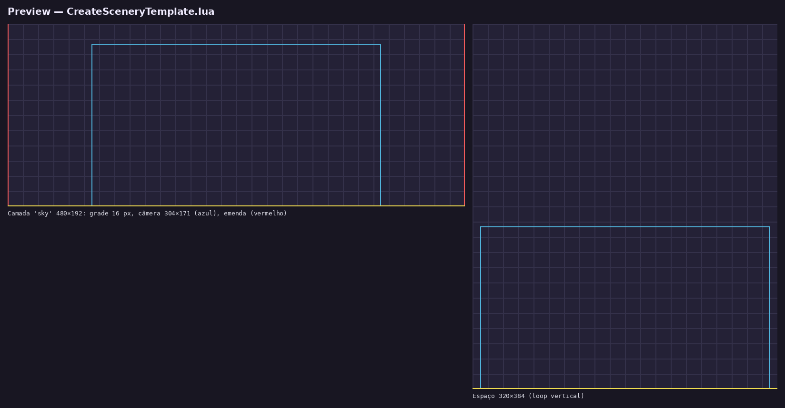

**Arquivo: `CreateSceneryTemplate.lua (novo)`** — 247 linhas

```lua
-- CreateSceneryTemplate.lua
-- Aetherion: Voidfall — templates de cenário (camadas de parallax, props, plataformas,
-- tileset 16x16 e fundos de espaço) nos tamanhos e na paleta do T1.
-- Uso: File > Scripts > CreateSceneryTemplate (copie este arquivo para a pasta Scripts do Aseprite).
-- Linha de comando (sem UI):
--   aseprite -b --script-param kind=city --script-param out=city.aseprite --script CreateSceneryTemplate.lua
--
-- Contrato de runtime (T1Scenery.cs): PPU 16, filtro Point.
-- Camadas/props: pivô bottom-center (0.5, 0). Plataformas: pivô no centro do corpo de pedra.
-- 1 pixel = 1/16 de unidade. Câmera ortográfica 5.35 => ~304x171 px visíveis.

local PPU = 16
local CAM_W, CAM_H = 304, 171

-- Tamanhos iguais aos PNGs de Assets/Resources/T1 (medidos no repo)
local KINDS = {
  { id = "sky",      label = "Céu (parallax 0.95) 480x192",            w = 480, h = 192, seam = false, cam = true  },
  { id = "far",      label = "Fundo distante (0.9) 512x130",           w = 512, h = 130, seam = false, cam = true  },
  { id = "city",     label = "Cidade / meio (0.8) 640x176",            w = 640, h = 176, seam = false, cam = true  },
  { id = "pavement", label = "Calçada do plano jogável (loop) 512x44", w = 512, h = 44,  seam = true,  cam = false },
  { id = "prop",     label = "Prop (tamanho livre)",                    w = 48,  h = 96,  seam = false, cam = false },
  { id = "platform", label = "Plataforma (largura em unidades)",        w = 0,   h = 19,  seam = false, cam = false },
  { id = "tileset",  label = "Tileset 16x16 (8x4 tiles = 128x64)",      w = 128, h = 64,  seam = false, cam = false },
  { id = "space_v",  label = "Espaço — loop vertical 320x384",          w = 320, h = 384, seam = true,  cam = true  },
  { id = "space_h",  label = "Espaço — loop horizontal 640x192",        w = 640, h = 192, seam = true,  cam = true  },
}

-- Camadas de pintura por tipo (de baixo para cima)
local PAINT_LAYERS = {
  default = { "BASE", "SHADOW", "DETAIL", "HIGHLIGHT", "MOSS", "FX" },
  space   = { "SPACE_BASE", "STARS_FAR", "NEBULA", "STARS_NEAR", "PLANETS", "DEBRIS", "FX" },
  tileset = { "TILES", "DETAIL", "HIGHLIGHT" },
}

-- Paleta nomeada do T1 (Assets/Art/T1/build_t1.py) + 2 acentos de espaço PROPOSTOS
local PALETTE = {
  {5,5,13},{8,9,23},{20,15,38},{36,23,51},{77,18,26},{224,230,247},{158,171,209},
  {14,13,29},{19,19,36},{26,24,43},{36,33,54},{56,54,82},{22,20,36},{77,77,112},
  {255,158,56},{13,13,26},{255,115,26},{255,209,89},{26,43,31},{41,66,41},{107,23,31},
  {71,15,23},{23,18,26},{36,28,38},{69,64,87},{104,99,128},{40,37,56},{150,148,181},
  {48,87,51},{79,128,66},{199,154,66},{130,96,38},{156,94,224},{97,54,148},
  {89,217,255},{38,122,153}, -- VOID_CYAN / VOID_TEAL (propostos para o espaço)
}

local C_GRID   = Color{ r=60,  g=56,  b=84,  a=150 }
local C_CAM    = Color{ r=80,  g=180, b=220, a=255 }
local C_SEAM   = Color{ r=240, g=90,  b=90,  a=255 }
local C_GROUND = Color{ r=240, g=220, b=80,  a=255 }
local C_EDGE   = Color{ r=50,  g=50,  b=50,  a=255 }

-- Dialog:number devolve número no Aseprite 1.3 atual, mas builds anteriores
-- devolvem o texto. math.floor em string quebra no Lua 5.4.
local function as_number(value, fallback)
  local n = tonumber(value)
  if not n then return fallback end
  return n
end

local function as_int(value, fallback)
  return math.floor(as_number(value, fallback))
end

local function draw_hline(img, y, color)
  if y < 0 or y >= img.height then return end
  for x = 0, img.width - 1 do img:drawPixel(x, y, color) end
end

local function draw_vline(img, x, color)
  if x < 0 or x >= img.width then return end
  for y = 0, img.height - 1 do img:drawPixel(x, y, color) end
end

local function draw_rect_outline(img, x0, y0, x1, y1, color)
  for x = x0, x1 do
    if x >= 0 and x < img.width then
      if y0 >= 0 and y0 < img.height then img:drawPixel(x, y0, color) end
      if y1 >= 0 and y1 < img.height then img:drawPixel(x, y1, color) end
    end
  end
  for y = y0, y1 do
    if y >= 0 and y < img.height then
      if x0 >= 0 and x0 < img.width then img:drawPixel(x0, y, color) end
      if x1 >= 0 and x1 < img.width then img:drawPixel(x1, y, color) end
    end
  end
end

local function find_kind(id)
  for _, k in ipairs(KINDS) do
    if k.id == id or k.label == id then return k end
  end
  return KINDS[1]
end

-- ---------- parâmetros: diálogo (UI) ou --script-param (CLI) ----------
local kind, propW, propH, platUnits, outFile

if app.isUIAvailable then
  local labels = {}
  for _, k in ipairs(KINDS) do labels[#labels + 1] = k.label end
  local dlg = Dialog("Aetherion — Template de Cenário")
  dlg:combobox{ id = "kind", label = "Tipo:", option = labels[1], options = labels }
  dlg:separator{ text = "Prop" }
  dlg:number{ id = "pw", label = "Largura (px):", text = "48", decimals = 0 }
  dlg:number{ id = "ph", label = "Altura (px):",  text = "96", decimals = 0 }
  dlg:separator{ text = "Plataforma" }
  dlg:number{ id = "units", label = "Largura (unidades):", text = "4.20", decimals = 2 }
  dlg:label{ text = "PNG = round(unidades*16)+4 x 19  (ex.: 4.20 -> plat420 71x19)" }
  dlg:button{ id = "ok", text = "Criar", focus = true }
  dlg:button{ id = "cancel", text = "Cancelar" }
  dlg:show()
  if not dlg.data.ok then return end
  kind = find_kind(dlg.data.kind)
  propW = as_int(dlg.data.pw, 48)
  propH = as_int(dlg.data.ph, 96)
  platUnits = as_number(dlg.data.units, 4.2)
else
  local p = app.params or {}
  kind = find_kind(p.kind or "sky")
  propW = as_int(p.w, 48)
  propH = as_int(p.h, 96)
  platUnits = as_number(p.units, 4.2)
  outFile = p.out
end

local W, H = kind.w, kind.h
local suggested = kind.id
if kind.id == "prop" then
  W, H = math.max(8, propW), math.max(8, propH)
elseif kind.id == "platform" then
  -- Sprite() rejeita largura < 1. Unidades negativas cairiam nesse caso.
  W = math.max(1, math.floor(platUnits * PPU + 0.5) + 4)
  suggested = "plat" .. math.floor(platUnits * 100 + 0.5)
end

local spr = Sprite(W, H, ColorMode.RGB)
app.activeSprite = spr

app.transaction("Create Scenery Template", function()
  -- paleta
  local pal = Palette(#PALETTE + 1)
  pal:setColor(0, Color{ r=0, g=0, b=0, a=0 })
  for i, c in ipairs(PALETTE) do
    pal:setColor(i, Color{ r=c[1], g=c[2], b=c[3], a=255 })
  end
  spr:setPalette(pal)
  spr.gridBounds = Rectangle(0, 0, 16, 16)

  local function ensure_cel_image(layer)
    local cel = layer:cel(1)
    if not cel then
      local img = Image(W, H, ColorMode.RGB)
      img:clear()
      spr:newCel(layer, 1, img, Point(0, 0))
      cel = layer:cel(1)
    end
    return cel.image
  end

  local function guide_layer(name, painter)
    local layer = spr:newLayer()
    layer.name = name
    local cel = spr:newCel(layer, 1, Image(W, H, ColorMode.RGB), Point(0, 0))
    local img = cel.image
    img:clear()
    painter(img)
    cel.image = img
    layer.opacity = 160
    return layer
  end

  -- camadas de pintura (a camada padrão vira a primeira)
  local list = PAINT_LAYERS.default
  if kind.id == "space_v" or kind.id == "space_h" then list = PAINT_LAYERS.space end
  if kind.id == "tileset" then list = PAINT_LAYERS.tileset end
  local base = spr.layers[1]
  base.name = list[1]
  ensure_cel_image(base):clear()
  for i = 2, #list do
    local layer = spr:newLayer()
    layer.name = list[i]
  end

  -- guias (ficam por cima; o ExportForUnity.lua ignora "GUIDE - *")
  guide_layer("GUIDE - Grid 16", function(img)
    for x = 0, W - 1, 16 do draw_vline(img, x, C_GRID) end
    for y = H % 16, H - 1, 16 do draw_hline(img, y, C_GRID) end
    draw_rect_outline(img, 0, 0, W - 1, H - 1, C_EDGE)
  end)

  -- base do sprite = pivô bottom-center (0.5, 0): o que encosta no chão fica na última linha.
  -- Plataforma: T1Scenery.RuinPlatform usa o centro do corpo de pedra, não a base do PNG.
  guide_layer("GUIDE - Pivot / Chão", function(img)
    local cx = math.floor(W / 2)
    if kind.id == "platform" then
      -- Unity y=0 é a base. Corpo [10, 16) px; pivô em 10 + (0.38*16)/2 ≈ 13.
      -- Aseprite y=0 é o topo, então o pixel do pivô é (H-1) - 13.
      local pivotY = H - 1 - 13
      draw_hline(img, pivotY, C_GROUND)
      for y = pivotY - 4, pivotY + 4 do
        if y >= 0 and y < img.height then img:drawPixel(cx, y, C_GROUND) end
      end
      draw_hline(img, H - 17, C_CAM)   -- topo pisável (topo do colisor, ~16 px da base)
      draw_hline(img, H - 11, C_CAM)   -- base do corpo de pedra (10 px da base)
      draw_vline(img, 2, C_SEAM); draw_vline(img, W - 3, C_SEAM) -- 2 px de borda irregular por lado
    else
      draw_hline(img, H - 1, C_GROUND)
      for y = math.max(0, H - 6), H - 1 do img:drawPixel(cx, y, C_GROUND) end
    end
  end)

  if kind.cam then
    guide_layer("GUIDE - Camera 304x171", function(img)
      local x0 = math.floor((W - CAM_W) / 2)
      local y0 = H - CAM_H
      if y0 < 0 then y0 = 0 end
      draw_rect_outline(img, x0, y0, x0 + CAM_W - 1, math.min(H - 1, y0 + CAM_H - 1), C_CAM)
    end)
  end

  if kind.seam then
    guide_layer("GUIDE - Loop Seam", function(img)
      if kind.id == "space_v" then
        draw_hline(img, 0, C_SEAM); draw_hline(img, H - 1, C_SEAM)
        draw_hline(img, 16, C_SEAM); draw_hline(img, H - 17, C_SEAM)
      else
        draw_vline(img, 0, C_SEAM); draw_vline(img, W - 1, C_SEAM)
        draw_vline(img, 16, C_SEAM); draw_vline(img, W - 17, C_SEAM)
      end
    end)
  end

  app.activeLayer = spr.layers[1]
end)

if outFile then
  spr:saveAs(outFile)
elseif app.isUIAvailable then
  local pivot = "PPU 16, pivô bottom-center, Point."
  if kind.id == "platform" then
    pivot = "PPU 16, pivô no centro do corpo de pedra (não na base do PNG), Point."
  end
  app.alert("Template '" .. kind.id .. "' " .. W .. "x" .. H .. " criado.\n" ..
    "Nome sugerido do PNG: " .. suggested .. ".png (Assets/Resources/<Fase>/)\n" ..
    pivot .. "\nOculte as camadas GUIDE - * antes de exportar\n" ..
    "(ou use ExportForUnity.lua). Use Ctrl+' para mostrar a grade 16x16.")
end
```

### 2.2 Template de nave

Contrato **proposto** (não existe nave no código ainda; a constante `GameScenes.SpaceLevel` existe, mas não há controlador para ela):

* **Célula 64×64** (jogador/elite), 32×32 (inimigo pequeno) ou 128×128 (chefe). Silhueta máxima = ¾ da célula (48×48 em 64).
* **PPU 15** (mesma escala dos heróis, para a nave "parecer do mesmo jogo"), **pivô no centro (0.5, 0.5)**, Point, sem compressão.
* **Hitbox** bem menor que o desenho (~14×14 numa nave 64), como nos shmups 16-bit.
* Frames: `idle` 4 · `bank_up` 2 · `bank_dn` 2 · `hit` 2 · `special` 3 · `death` 4 = **17 frames**, 83 ms cada (~12 fps). Exportado em 7 colunas → sheet **448×192**, o mesmo layout dos heróis (o código de leitura dos `*Visual.cs` pode ser reaproveitado).

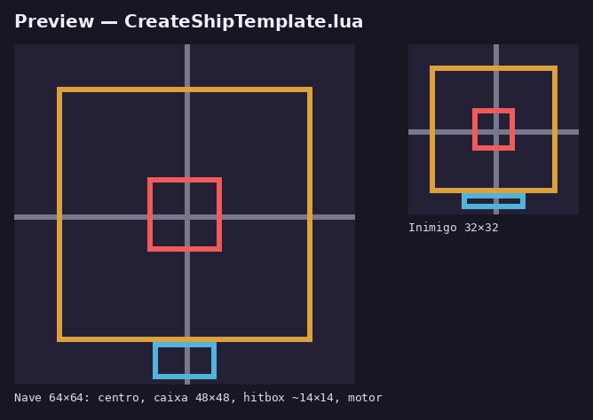

**Arquivo: `CreateShipTemplate.lua (novo)`** — 196 linhas

```lua
-- CreateShipTemplate.lua
-- Aetherion: Voidfall — template de nave (jogador ou inimiga) com guias, camadas,
-- frames e tags prontos para virar spritesheet de 7 colunas.
-- Uso: File > Scripts > CreateShipTemplate (copie este arquivo para a pasta Scripts do Aseprite).
-- Linha de comando (sem UI):
--   aseprite -b --script-param size=64 --script-param dir=right --script-param out=nave.aseprite --script CreateShipTemplate.lua
--
-- Contrato de runtime proposto para naves: PPU 15 (mesma escala dos heróis), pivô no CENTRO
-- (0.5, 0.5), filtro Point, sem compressão. A nave cabe na caixa 48x48 (célula 64) e o
-- hitbox fica bem menor que o desenho (~14x14), como em shmups 16-bit.

-- Tags na ordem do sheet (frames 1-based, ~12 fps = 83 ms)
local TAGS = {
  { name = "idle",    count = 4 },
  { name = "bank_up", count = 2 }, -- "inclinar" para cima / esquerda (nave vertical)
  { name = "bank_dn", count = 2 }, -- para baixo / direita
  { name = "hit",     count = 2 },
  { name = "special", count = 3 },
  { name = "death",   count = 4 },
}
local FRAME_MS = 83

local PAINT_LAYERS = {
  "HULL",
  "COCKPIT",
  "DETAIL",
  "OUTLINE",
  "SHADOW",
  "HIGHLIGHT",
  "ENGINE_FX",
  "FX",
}

-- Paleta: base fria do T1 + fogo/orbe + acentos de espaço PROPOSTOS
local PALETTE = {
  {5,5,13},{13,13,26},{22,20,36},{36,33,54},{56,54,82},{77,77,112},{104,99,128},
  {150,148,181},{224,230,247},{158,171,209},{77,18,26},{107,23,31},{255,115,26},
  {255,158,56},{255,209,89},{199,154,66},{130,96,38},{156,94,224},{97,54,148},
  {89,217,255},{38,122,153},
}

local function as_int(value, fallback)
  local n = tonumber(value)
  if not n then return fallback end
  return math.floor(n)
end

-- UI manda "cima (fase vertical)"; CLI aceita up/cima/right.
local function normalize_dir(value)
  local v = string.lower(tostring(value or "right"))
  if v == "up" or v == "cima" or string.sub(v, 1, 4) == "cima" then
    return "up"
  end
  return "right"
end

local function draw_hline(img, y, x0, x1, color)
  if y < 0 or y >= img.height or x0 > x1 then return end
  for x = math.max(0, x0), math.min(img.width - 1, x1) do img:drawPixel(x, y, color) end
end

local function draw_vline(img, x, y0, y1, color)
  if x < 0 or x >= img.width or y0 > y1 then return end
  for y = math.max(0, y0), math.min(img.height - 1, y1) do img:drawPixel(x, y, color) end
end

local function draw_rect_outline(img, x0, y0, x1, y1, color)
  draw_hline(img, y0, x0, x1, color); draw_hline(img, y1, x0, x1, color)
  draw_vline(img, x0, y0, y1, color); draw_vline(img, x1, y0, y1, color)
end

-- ---------- parâmetros ----------
local CELL, DIR, outFile = 64, "right", nil
if app.isUIAvailable then
  local dlg = Dialog("Aetherion — Template de Nave")
  dlg:combobox{ id = "size", label = "Célula:", option = "64 (nave do jogador / elite)",
    options = { "64 (nave do jogador / elite)", "32 (inimigo pequeno)", "128 (chefe)" } }
  dlg:combobox{ id = "dir", label = "Bico aponta para:", option = "direita (fase lateral)",
    options = { "direita (fase lateral)", "cima (fase vertical)" } }
  dlg:button{ id = "ok", text = "Criar", focus = true }
  dlg:button{ id = "cancel", text = "Cancelar" }
  dlg:show()
  if not dlg.data.ok then return end
  CELL = as_int(string.match(tostring(dlg.data.size or ""), "^(%d+)"), 64)
  DIR = normalize_dir(dlg.data.dir)
else
  local p = app.params or {}
  CELL = as_int(p.size, 64)
  DIR = normalize_dir(p.dir)
  outFile = p.out
end

if CELL < 8 then CELL = 64 end

local MID = CELL // 2
local BOX = (CELL * 3) // 4              -- silhueta máxima (48 em 64)
local BOX0 = (CELL - BOX) // 2
local HIT = math.max(6, (CELL * 14) // 64) -- hitbox (~14 em 64)

local GUIDE = {
  { name = "GUIDE - Cell",      color = Color{ r=50,  g=50,  b=50,  a=255 } },
  { name = "GUIDE - Center",    color = Color{ r=120, g=120, b=140, a=255 } },
  { name = "GUIDE - Max Box",   color = Color{ r=220, g=160, b=60,  a=255 } },
  { name = "GUIDE - Hitbox",    color = Color{ r=240, g=90,  b=90,  a=255 } },
  { name = "GUIDE - Engine",    color = Color{ r=80,  g=180, b=220, a=255 } },
  { name = "GUIDE - Muzzle",    color = Color{ r=240, g=220, b=80,  a=255 } },
}

local function paint_guide(name, img, color)
  if name == "GUIDE - Cell" then
    draw_rect_outline(img, 0, 0, CELL - 1, CELL - 1, color)
  elseif name == "GUIDE - Center" then
    draw_hline(img, MID, 0, CELL - 1, color); draw_vline(img, MID, 0, CELL - 1, color)
  elseif name == "GUIDE - Max Box" then
    draw_rect_outline(img, BOX0, BOX0, BOX0 + BOX - 1, BOX0 + BOX - 1, color)
  elseif name == "GUIDE - Hitbox" then
    local h0 = MID - HIT // 2
    draw_rect_outline(img, h0, h0, h0 + HIT - 1, h0 + HIT - 1, color)
  elseif name == "GUIDE - Engine" then
    -- área do jato: atrás da nave (esquerda se aponta à direita; embaixo se aponta para cima)
    local e = math.max(4, CELL // 8)
    if DIR == "up" then
      draw_rect_outline(img, MID - e, BOX0 + BOX, MID + e - 1, CELL - 2, color)
    else
      draw_rect_outline(img, 1, MID - e, BOX0 - 1, MID + e - 1, color)
    end
  elseif name == "GUIDE - Muzzle" then
    -- ponto de saída do tiro (bico)
    if DIR == "up" then
      draw_hline(img, BOX0, MID - 2, MID + 2, color)
    else
      draw_vline(img, BOX0 + BOX - 1, MID - 2, MID + 2, color)
    end
  end
end

local spr = Sprite(CELL, CELL, ColorMode.RGB)
app.activeSprite = spr

app.transaction("Create Ship Template", function()
  local pal = Palette(#PALETTE + 1)
  pal:setColor(0, Color{ r=0, g=0, b=0, a=0 })
  for i, c in ipairs(PALETTE) do pal:setColor(i, Color{ r=c[1], g=c[2], b=c[3], a=255 }) end
  spr:setPalette(pal)
  spr.gridBounds = Rectangle(0, 0, CELL, CELL)

  -- frames. frame.duration é em SEGUNDOS (83/1000 = 0.083 → 83 ms).
  local total = 0
  for _, t in ipairs(TAGS) do total = total + t.count end
  for _ = 2, total do spr:newEmptyFrame() end
  for i = 1, #spr.frames do spr.frames[i].duration = FRAME_MS / 1000 end

  -- tags (newTag é inclusivo e 1-based)
  local f = 1
  for _, t in ipairs(TAGS) do
    local tag = spr:newTag(f, f + t.count - 1)
    tag.name = t.name
    f = f + t.count
  end

  -- camadas de pintura (a camada padrão vira HULL)
  local base = spr.layers[1]
  base.name = PAINT_LAYERS[1]
  for i = 2, #PAINT_LAYERS do
    local layer = spr:newLayer()
    layer.name = PAINT_LAYERS[i]
  end

  -- guias em TODOS os frames (para ver a caixa enquanto anima).
  -- Cada cel recebe um clone: a API não liga cels que compartilham a mesma Image.
  for _, g in ipairs(GUIDE) do
    local layer = spr:newLayer()
    layer.name = g.name
    layer.opacity = 170
    local img = Image(CELL, CELL, ColorMode.RGB)
    img:clear()
    paint_guide(g.name, img, g.color)
    for fr = 1, #spr.frames do
      spr:newCel(layer, fr, img:clone(), Point(0, 0))
    end
  end

  for i = 1, #spr.layers do
    if spr.layers[i].name == "HULL" then app.activeLayer = spr.layers[i] end
  end
  app.activeFrame = spr.frames[1]
end)

if outFile then
  spr:saveAs(outFile)
elseif app.isUIAvailable then
  app.alert("Template de nave " .. CELL .. "x" .. CELL .. " criado (" .. #spr.frames .. " frames).\n" ..
    "Tags: idle 4 · bank_up 2 · bank_dn 2 · hit 2 · special 3 · death 4.\n" ..
    "Silhueta <= " .. BOX .. "x" .. BOX .. ", hitbox ~" .. HIT .. "x" .. HIT .. ", 1px de outline, luz do topo-esquerdo.\n" ..
    "Exporte com ExportForUnity.lua (7 colunas). PPU 15, pivô no centro.")
end
```

### 2.3 Exportação sem guias

**Arquivo: `ExportForUnity.lua (novo)`** — 249 linhas

```lua
-- ExportForUnity.lua
-- Aetherion: Voidfall — exporta o sprite ativo para o Unity sem as camadas GUIDE.
--   * modo "sheet":  spritesheet PNG em linhas de 7 colunas + JSON (hash) com tags
--                    (personagens, inimigos e naves; mesmo layout dos sheet.png de Resources)
--   * modo "flat":   1 PNG achatado (cenário: sky.png, city.png, plat420.png...)
--   * modo "layers": 1 PNG por camada visível que não seja GUIDE (nome do arquivo = nome da camada)
-- Uso: File > Scripts > ExportForUnity
-- Linha de comando:
--   aseprite -b nave.aseprite --script-param mode=sheet --script-param out=Assets/Resources/Naves/nave_vazio --script ExportForUnity.lua
-- Nunca suaviza nem redimensiona: o Unity recebe exatamente os pixels do arquivo.
--
-- ExportSpriteSheet com layer="" (o padrão) exporta só as camadas visíveis.
-- sprite.layers é só o primeiro nível: guias dentro de um grupo também são ocultadas.

local spr = app.activeSprite
if not spr then
  if app.isUIAvailable then app.alert("Abra um sprite antes de exportar.") end
  return
end

local function is_guide(layer)
  local name = layer.name or ""
  return string.sub(name, 1, 5) == "GUIDE"
end

-- layer.parent de uma camada raiz é o Sprite, não nil. Parar aí:
-- Sprite não tem isVisible/isGroup, e ler isso quebraria o script.
local function parent_layer(layer)
  local parent = layer.parent
  if not parent or parent == spr then return nil end
  local ok, isGroup = pcall(function() return parent.isGroup end)
  if not ok or not isGroup then return nil end
  return parent
end

local function under_guide(layer)
  local current = layer
  local guard = 0
  while current and guard < 64 do
    if is_guide(current) then return true end
    current = parent_layer(current)
    guard = guard + 1
  end
  return false
end

local function layer_key(layer)
  local parts = {}
  local current = layer
  local guard = 0
  while current and guard < 64 do
    parts[#parts + 1] = tostring(current.stackIndex) .. ":" .. tostring(current.name)
    current = parent_layer(current)
    guard = guard + 1
  end
  return table.concat(parts, "/")
end

local function as_int(value, fallback)
  local n = tonumber(value)
  if not n then return fallback end
  return math.floor(n)
end

-- Lua patterns não têm alternância com "|".
local function strip_ext(path)
  local lower = string.lower(path)
  for _, ext in ipairs({ ".png", ".json", ".aseprite" }) do
    if string.sub(lower, -#ext) == ext then
      return string.sub(path, 1, #path - #ext)
    end
  end
  return path
end

local mode, outBase, columns
local dir = app.fs.filePath(spr.filename)
local title = app.fs.fileTitle(spr.filename)
if title == nil or title == "" then title = "sprite" end

if app.isUIAvailable then
  local dlg = Dialog("Aetherion — Exportar para Unity")
  dlg:combobox{ id = "mode", label = "Modo:", option = "sheet",
    options = { "sheet", "flat", "layers" } }
  dlg:number{ id = "cols", label = "Colunas (sheet):", text = "7", decimals = 0 }
  dlg:entry{ id = "out", label = "Saída (sem extensão):", text = app.fs.joinPath(dir, title) }
  dlg:button{ id = "ok", text = "Exportar", focus = true }
  dlg:button{ id = "cancel", text = "Cancelar" }
  dlg:show()
  if not dlg.data.ok then return end
  mode = dlg.data.mode
  outBase = dlg.data.out
  columns = as_int(dlg.data.cols, 7)
else
  local p = app.params or {}
  mode = p.mode or "sheet"
  outBase = p.out or app.fs.joinPath(dir, title)
  columns = as_int(p.columns, 7)
end

mode = string.lower(tostring(mode or "sheet"))
outBase = strip_ext(tostring(outBase or ""))
if columns < 1 then columns = 1 end

if mode ~= "sheet" and mode ~= "flat" and mode ~= "layers" then
  local msg = "Modo desconhecido: " .. mode .. "\nUse sheet, flat ou layers."
  if app.isUIAvailable then app.alert(msg) else print(msg) end
  return
end

if outBase == "" then
  local msg = "Informe o caminho de saída (sem extensão)."
  if app.isUIAvailable then app.alert(msg) else print(msg) end
  return
end

local function join_out(folder, name)
  if folder == nil or folder == "" then return name end
  return app.fs.joinPath(folder, name)
end

local function safe_layer_filename(name)
  local cleaned = string.gsub(tostring(name or ""), "[\\/:*?\"<>|]", "_")
  if cleaned == "" then cleaned = "layer" end
  return cleaned
end

-- sprite.layers não inclui filhos de grupos.
local snapshot = {}
local visible_by_key = {}

local function collect(layers)
  for _, layer in ipairs(layers) do
    local key = layer_key(layer)
    snapshot[#snapshot + 1] = { layer = layer, visible = layer.isVisible, key = key }
    visible_by_key[key] = layer.isVisible and true or false
    if layer.isGroup then collect(layer.layers) end
  end
end
collect(spr.layers)

local function was_visible(layer)
  local current = layer
  local guard = 0
  while current and guard < 64 do
    if not visible_by_key[layer_key(current)] then return false end
    current = parent_layer(current)
    guard = guard + 1
  end
  return true
end

local function hide_guides()
  for _, item in ipairs(snapshot) do
    if under_guide(item.layer) then item.layer.isVisible = false end
  end
end

local function restore()
  for _, item in ipairs(snapshot) do
    item.layer.isVisible = item.visible
  end
end

local function show_only(target)
  for _, item in ipairs(snapshot) do
    item.layer.isVisible = false
  end
  local current = target
  local guard = 0
  while current and guard < 64 do
    current.isVisible = true
    current = parent_layer(current)
    guard = guard + 1
  end
end

local written = {}

local function do_export()
  hide_guides()

  if mode == "sheet" then
    local ok = app.command.ExportSpriteSheet{
      ui = false,
      askOverwrite = false,
      openGenerated = false,
      type = SpriteSheetType.ROWS,
      columns = columns,
      textureFilename = outBase .. ".png",
      dataFilename = outBase .. ".json",
      dataFormat = SpriteSheetDataFormat.JSON_HASH,
      borderPadding = 0, shapePadding = 0, innerPadding = 0,
      trim = false,
      ignoreEmpty = false,
      mergeDuplicates = false,
      listTags = true,
      listLayers = false,
      listSlices = false,
      splitLayers = false,
    }
    if ok == false then error("ExportSpriteSheet recusou a exportação") end
    written[#written + 1] = outBase .. ".png"
    written[#written + 1] = outBase .. ".json"
  elseif mode == "flat" then
    -- PNG = frame atual, camadas visíveis achatadas. Cenário tem 1 frame.
    spr:saveCopyAs(outBase .. ".png")
    written[#written + 1] = outBase .. ".png"
  else
    local folder = app.fs.filePath(outBase)
    local used = {}
    for _, item in ipairs(snapshot) do
      local layer = item.layer
      if not layer.isGroup and not under_guide(layer) and was_visible(layer) then
        show_only(layer)
        local name = safe_layer_filename(layer.name)
        local unique = name
        local n = 2
        while used[unique] do
          unique = name .. "_" .. n
          n = n + 1
        end
        used[unique] = true
        local file = join_out(folder, unique .. ".png")
        spr:saveCopyAs(file)
        written[#written + 1] = file
      end
    end
  end
end

local ok, err = pcall(do_export)
restore()

if not ok then
  local msg = "Falha ao exportar:\n" .. tostring(err)
  if app.isUIAvailable then app.alert(msg) else print(msg) end
  return
end

if #written == 0 then
  local msg = "Nada para exportar (nenhuma camada visível além das GUIDE)."
  if app.isUIAvailable then app.alert(msg) else print(msg) end
  return
end

local msg = "Exportado (" .. mode .. "):\n" .. table.concat(written, "\n") ..
  "\n\nNo Unity: Tools > Pixel Art > Import Tool (Point, sem compressão)."
if app.isUIAvailable then app.alert(msg) else print(msg) end
```

---

## 3. Exportar do Aseprite e importar no Unity

### 3.1 Configurações de exportação (manual, sem script) ✅

**Spritesheet (heróis, inimigos, naves):** *File → Export Sprite Sheet*

| Aba | Opção | Valor |
|---|---|---|
| Layout | Sheet type | **By Rows**, **Fixed # of Columns = 7** (inimigos atuais: 4 frames em 1 linha) |
| Sprite | Layers | **Visible layers** — oculte antes todas as `GUIDE - *` |
| Borders | Border / Spacing / Inner padding | **0 / 0 / 0**; *Trim* **desligado**; *Ignore empty* **desligado** (a posição do frame importa) |
| Output | Output File | `sheet.png` (ou nome da nave) |
| Output | JSON Data | ligado, **Hash**, *Meta: Tags* ligado (serve de documentação dos frames) |

**Cenário:** *File → Export As… → PNG*, **Resize 100%**, uma camada de parallax por arquivo (ou use `ExportForUnity.lua` modo `layers`).

**Nunca:** exportar com Resize ≠ 100%, usar *Sprite → Sprite Size* com interpolação, salvar em JPG, ou deixar fundo opaco (salve com transparência; o `fundo.jpg` que existe em `Assets/Art` não é usado pelo jogo).

### 3.2 Onde salvar os PNGs ✅

O jogo carrega texturas por `Resources.Load<Texture2D>(...)` — o arquivo **precisa** estar sob `Assets/Resources/`:

| Asset | Caminho | Quem carrega |
|---|---|---|
| Camadas/props do T1 | `Assets/Resources/T1/<nome>.png` | `T1Scenery.LoadSprite("<nome>")` |
| Plataforma de largura W | `Assets/Resources/T1/plat<W×100>.png` | `T1Scenery.RuinPlatform` (se faltar, usa o tijolo procedural `TiledBlock`) |
| Herói | `Assets/Resources/<Herói>/sheet.png` | `GuerreiroVisual` / `MagoVisual` / `ArqueiroVisual` |
| Inimigos | `Assets/Resources/Inimigos/<nome>.png` | `InimigoVisual` |
| **Novas fases (proposta)** | `Assets/Resources/T2/…`, `T3/…`, `Espaco1/…` | novo `T2Scenery` / `SpaceScenery` (seção 5) |
| **Naves (proposta)** | `Assets/Resources/Naves/<nome>.png` | novo `NaveVisual` (seção 5) |

### 3.3 Import Tool e Character Validator ✅

1. No Project, selecione os PNGs novos → **Tools → Pixel Art → Import Tool**.
2. A ferramenta aplica: *Sprite (2D and UI)*, *Single*, **Point**, *mipmaps off*, *Alpha Is Transparency*, **Read/Write on**, **Uncompressed**.
3. **Atenção ao toggle "Atualizar PPU + Pivot para o contrato de runtime"**: ele grava **PPU 15 + pivô 3/64** (contrato dos heróis). Para **cenário e naves, desmarque** — o PPU real é definido no código pelo `Sprite.Create` (16 para cenário, 15 para naves), e o valor do `.meta` não é usado. Mantenha marcado **"Forçar Read/Write"**.
4. Clique **"Aplicar settings (com Undo)"**.
5. Heróis: **Tools → Pixel Art → Character Validator** compara os três sheets de `Resources` (pés em y=60, altura, cores) e **nunca edita PNG**. **Tools → Pixel Art → Character Comparison** mostra os três lado a lado com guias.

### 3.4 Tabela de PPU e pivôs ✅

| Tipo | PPU | Pivô | Onde está definido |
|---|---|---|---|
| Heróis | **15** | (0.5, 3/64) — pés | `GuerreiroVisual.cs` etc. (`Ppu = 15f`, `FootPivot = 3f/64f`). Os `.meta` dizem 28 (legado, ignorado) |
| Cenário (camadas, props) | **16** | (0.5, 0) — base | `T1Scenery.Ppu = 16f`, `LoadSprite` |
| Plataformas | **16** | (0.5, meio do corpo de pedra) | `T1Scenery.RuinPlatform` |
| Arte procedural (`PixelArt.Make`) | **16** | (0.5, 0) | `PixelArt.Ppu` |
| Naves (proposta) | **15** | (0.5, 0.5) — centro | a criar em `NaveVisual` |

Câmera: ortográfica **5,35** ⇒ 10,7 unidades de altura ⇒ **~171 px × ~304 px** visíveis em PPU 16 (16:9). Um herói (~27 px de silhueta em PPU 15) ocupa ~1/6 da altura da tela.

### 3.5 Opcional: Aseprite Importer do Unity (`com.unity.2d.aseprite`)

O pacote oficial importa `.aseprite`/`.ase` direto: *Import Mode* **Sprite Sheet**, **Animated Sprite** (tags viram `AnimationClip`) ou **Tile Set**; camadas em *Merge Frame* ou *Individual Layers*.

* Instalação: *Window → Package Manager → Unity Registry → "2D Aseprite Importer"*.
* ⚠️ Versão: a tabela da documentação associa 1.x→Unity 6.0, 2.x→6.2, 3.x→6.3, 4.x→6.4, **5.x→6.5**… Para 6000.5 deve ser a 5.x — **confira no Package Manager**, que já mostra a compatível.
* **Importante:** o jogo **não** usa Animator nem o arquivo `.aseprite` em runtime; ele lê **PNG** de `Resources` e fatia em código. Use o importer só para **prototipar/visualizar** (ex.: testar um tileset). O asset final continua sendo o PNG exportado. Hoje o `manifest.json` só tem `com.unity.2d.sprite`.

---

## 4. Guia de estilo extraído dos assets reais

Todas as medidas abaixo foram **medidas com Pillow** nos PNGs de `Assets/Resources` do commit `69d4612` ✅.

### 4.1 Composição de referência (T1, escala ×4)

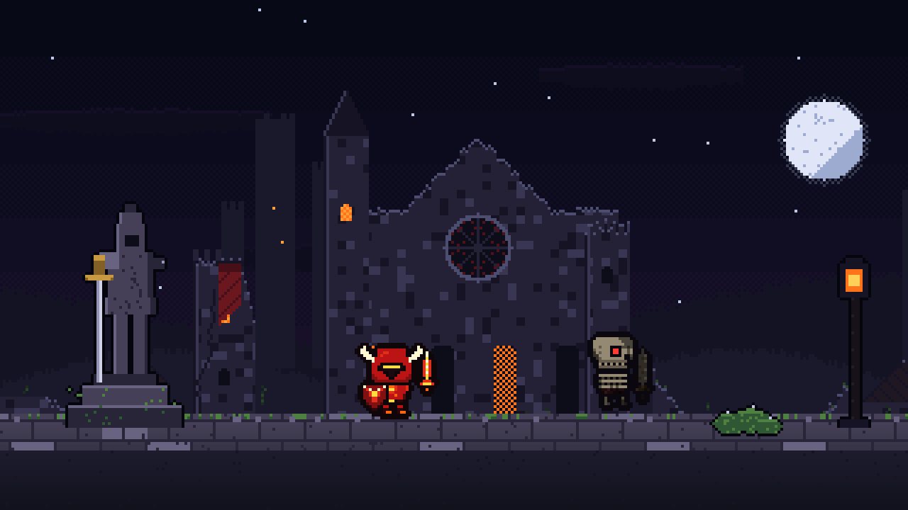

Leitura do quadro: **céu quase preto azulado → silhuetas frias → cidade com poucas luzes laranja → plano jogável cinza-lilás com musgo**. Heróis e inimigos são os únicos elementos **saturados** (vermelho do Guerreiro, olho vermelho do esqueleto). Novos cenários devem manter esse contraste: **fundo dessaturado e escuro, personagens saturados**.

### 4.2 Paleta nomeada do T1 (`Assets/Art/T1/build_t1.py`)

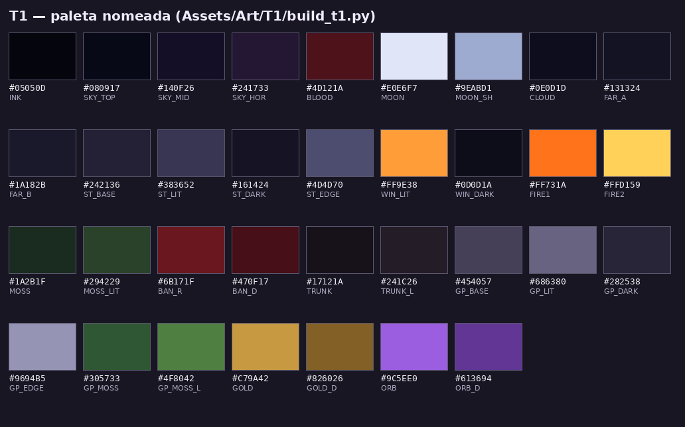

| Nome | Hex | RGB | Uso |
|---|---|---|---|
| `INK` | `#05050D` | 5, 5, 13 | outline/tinta |
| `SKY_TOP` | `#080917` | 8, 9, 23 | céu topo |
| `SKY_MID` | `#140F26` | 20, 15, 38 | céu meio |
| `SKY_HOR` | `#241733` | 36, 23, 51 | horizonte |
| `BLOOD` | `#4D121A` | 77, 18, 26 | horizonte corrompido |
| `MOON` | `#E0E6F7` | 224, 230, 247 | lua |
| `MOON_SH` | `#9EABD1` | 158, 171, 209 | sombra da lua |
| `CLOUD` | `#0E0D1D` | 14, 13, 29 | nuvens |
| `FAR_A` | `#131324` | 19, 19, 36 | silhueta distante |
| `FAR_B` | `#1A182B` | 26, 24, 43 | silhueta distante (luz) |
| `ST_BASE` | `#242136` | 36, 33, 54 | pedra cidade |
| `ST_LIT` | `#383652` | 56, 54, 82 | pedra cidade luz |
| `ST_DARK` | `#161424` | 22, 20, 36 | pedra cidade sombra |
| `ST_EDGE` | `#4D4D70` | 77, 77, 112 | aresta |
| `WIN_LIT` | `#FF9E38` | 255, 158, 56 | janela acesa |
| `WIN_DARK` | `#0D0D1A` | 13, 13, 26 | janela apagada |
| `FIRE1` | `#FF731A` | 255, 115, 26 | fogo |
| `FIRE2` | `#FFD159` | 255, 209, 89 | fogo claro |
| `MOSS` | `#1A2B1F` | 26, 43, 31 | musgo |
| `MOSS_LIT` | `#294229` | 41, 66, 41 | musgo luz |
| `BAN_R` | `#6B171F` | 107, 23, 31 | estandarte |
| `BAN_D` | `#470F17` | 71, 15, 23 | estandarte sombra |
| `TRUNK` | `#17121A` | 23, 18, 26 | tronco |
| `TRUNK_L` | `#241C26` | 36, 28, 38 | tronco luz |
| `GP_BASE` | `#454057` | 69, 64, 87 | pedra jogável |
| `GP_LIT` | `#686380` | 104, 99, 128 | pedra jogável luz |
| `GP_DARK` | `#282538` | 40, 37, 56 | pedra jogável sombra |
| `GP_EDGE` | `#9694B5` | 150, 148, 181 | aresta jogável |
| `GP_MOSS` | `#305733` | 48, 87, 51 | musgo jogável |
| `GP_MOSS_L` | `#4F8042` | 79, 128, 66 | musgo jogável luz |
| `GOLD` | `#C79A42` | 199, 154, 66 | ouro (espada da estátua) |
| `GOLD_D` | `#826026` | 130, 96, 38 | ouro sombra |
| `ORB` | `#9C5EE0` | 156, 94, 224 | orbe do Véu |
| `ORB_D` | `#613694` | 97, 54, 148 | orbe sombra |

### 4.3 Paleta medida (frequência real)

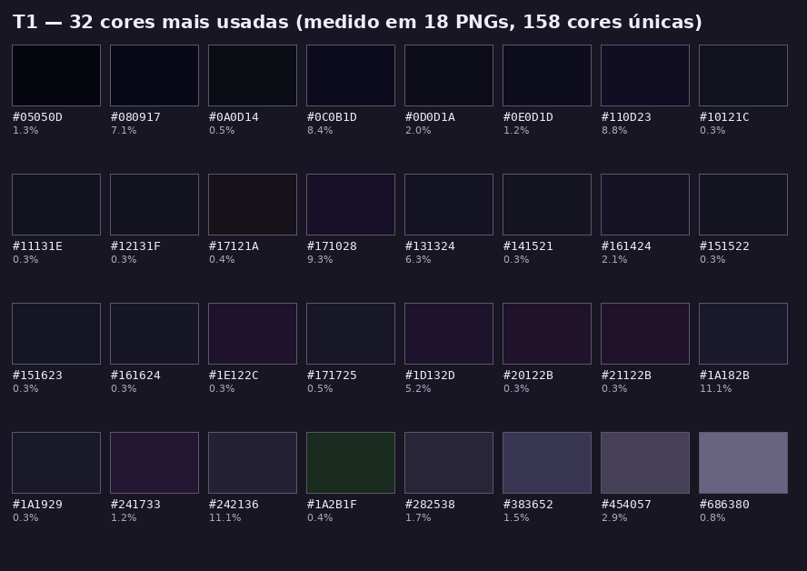

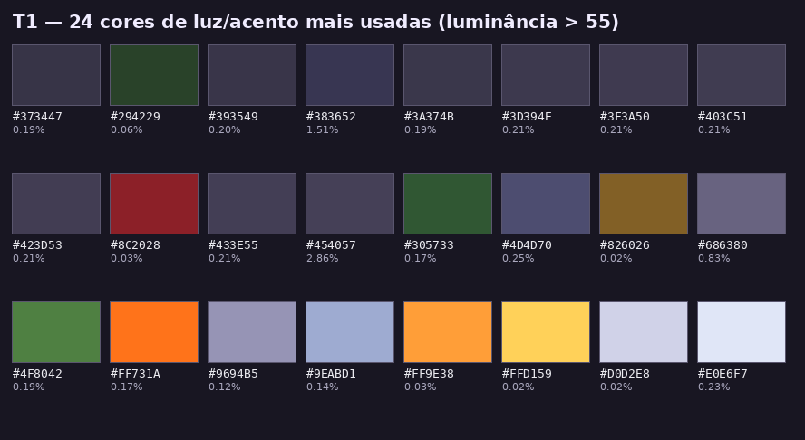

O T1 inteiro (18 PNGs) tem **158 cores únicas**, mas a maior parte da área é coberta por uns poucos azuis-roxos quase pretos (`#080917`, `#0C0B1D`, `#110D23`, `#171028`, `#1A182B`, `#242136` somam mais de 50%). As cores claras (lua, fogo, musgo, ouro) aparecem em **menos de 1%** da área cada: **acento é raro**. Esse é o segredo do clima do T1 — reproduza a proporção nos cenários novos.

### 4.4 Heróis e inimigos

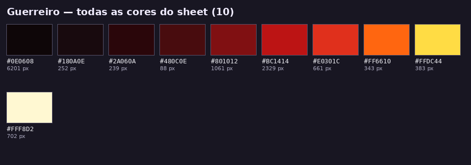
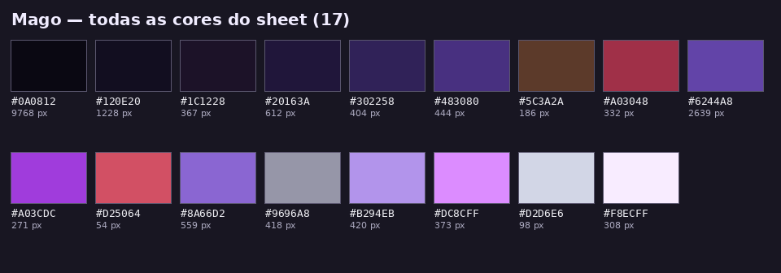
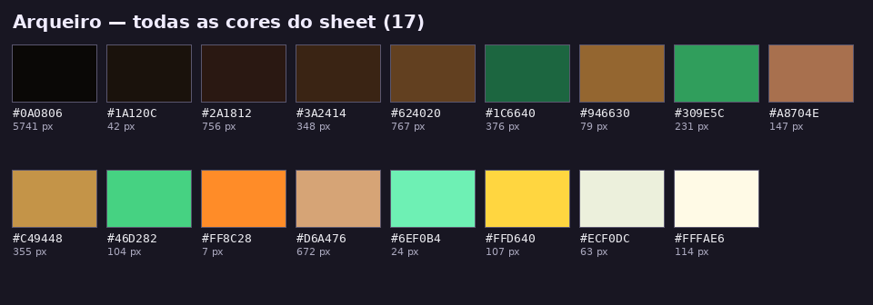
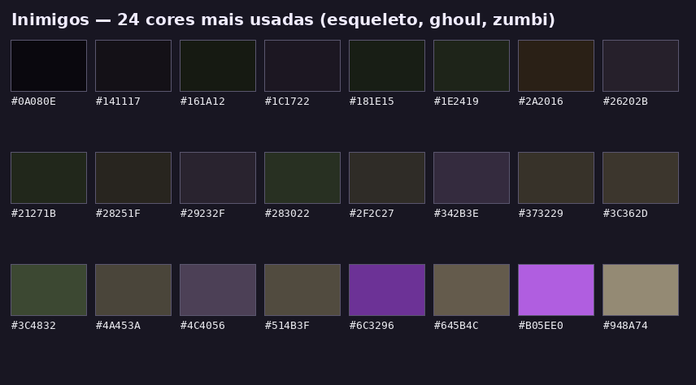

Papéis da paleta dos heróis (de `CharacterStyleGuide.md §7`):

| Papel | Guerreiro (magma) | Mago (índigo) | Arqueiro (floresta) |
|---|---|---|---|
| Outline | `#0E0608` | `#0A0812` | `#0A0806` |
| Sombra | `#2A060A` / `#180A0E` | `#120E20` / `#20163A` | `#1A120C` / `#2A1812` |
| Base escura | `#480C0E` / `#801012` | `#302258` / `#483080` | `#3A2414` / `#624020` |
| Base | `#BC1414` | `#6244A8` | `#1C6640` / `#309E5C` |
| Luz | `#E0301C` | `#8A66D2` / `#B294EB` | `#46D282` / `#C49448` |
| Highlight | `#FFDC44` / `#FFF8D2` | `#F8ECFF` / `#D2D6E6` | `#FFFAE6` / `#ECF0DC` |
| Acento | `#FF6610` | `#A03CDC` → `#DC8CFF` | `#FFD640` / `#6EF0B4` |

Observe: **o outline nunca é preto puro** — é um quase-preto tingido com a cor do personagem.

### 4.5 Tamanhos e contagem de cores dos assets

| Arquivo | Tamanho (px) | Cores |
|---|---|---|
| `Arqueiro/sheet.png` | 448×192 | 17 |
| `Guerreiro/sheet.png` | 448×192 | 10 |
| `Inimigos/esqueleto.png` | 256×64 | 27 |
| `Inimigos/ghoul.png` | 256×64 | 16 |
| `Inimigos/zumbi.png` | 256×64 | 22 |
| `Mago/sheet.png` | 448×256 | 17 |
| `T1/bush.png` | 26×14 | 4 |
| `T1/city.png` | 640×176 | 15 |
| `T1/column.png` | 24×60 | 5 |
| `T1/fallen.png` | 52×18 | 7 |
| `T1/far.png` | 512×130 | 4 |
| `T1/lamp.png` | 22×64 | 6 |
| `T1/pavement.png` | 512×44 | 43 |
| `T1/plat115.png` | 22×19 | 7 |
| `T1/plat420.png` | 71×19 | 7 |
| `T1/plat540.png` | 90×19 | 7 |
| `T1/rubble.png` | 56×22 | 6 |
| `T1/ruin_wall.png` | 80×64 | 10 |
| `T1/sky.png` | 480×192 | 88 |
| `T1/statue.png` | 40×78 | 6 |
| `T1/statue_mage.png` | 44×88 | 13 |
| `T1/statue_warrior.png` | 48×96 | 11 |
| `T1/stones.png` | 24×12 | 5 |
| `T1/tree.png` | 72×110 | 3 |

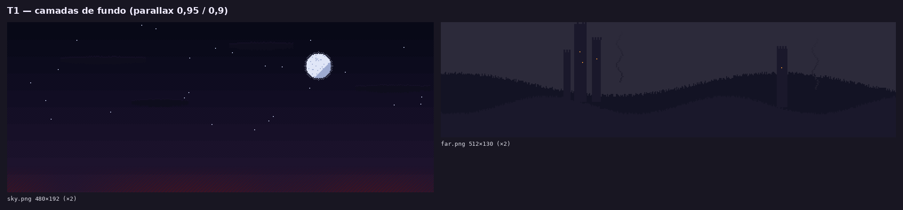
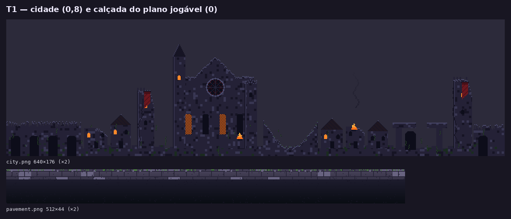
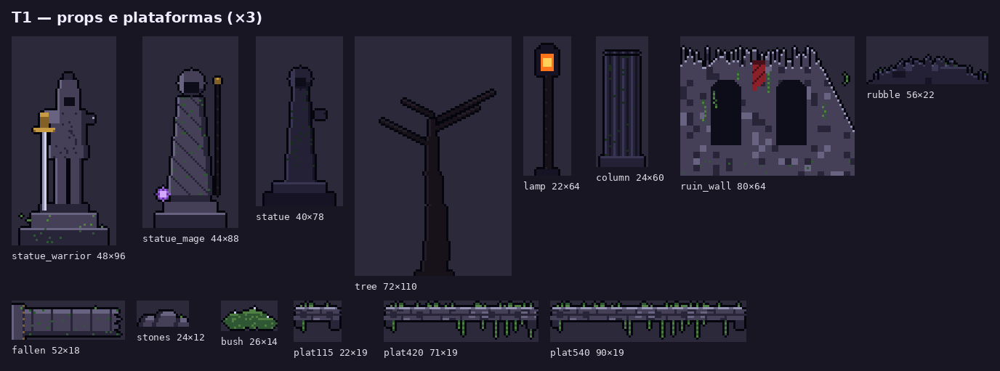
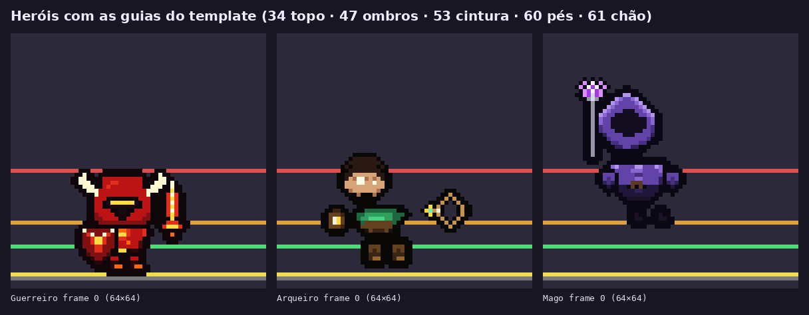
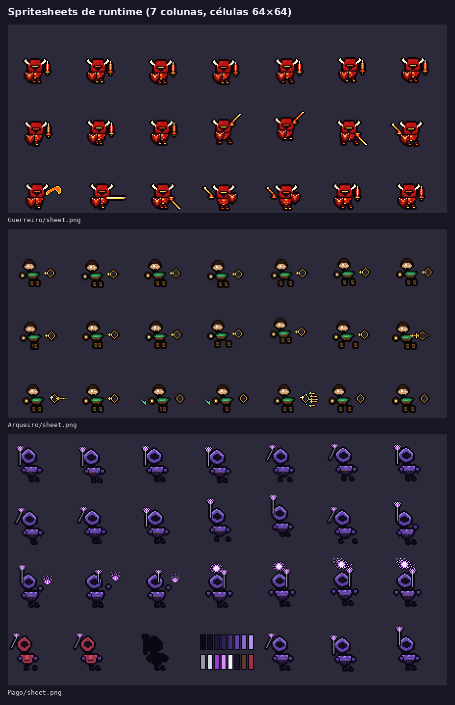
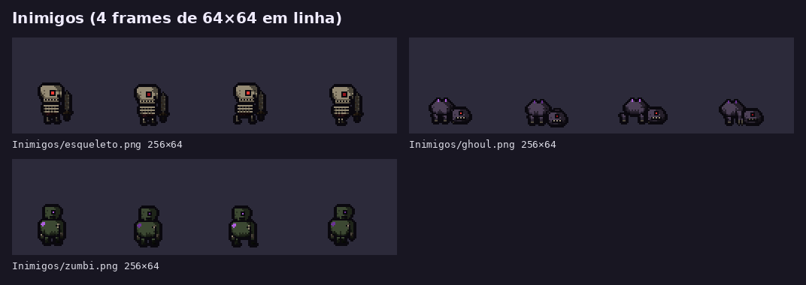

### 4.6 Regras de pixel (resumo do `CharacterStyleGuide.md` + T1)

* **Outline 1 px** contínuo em personagens, naves e props de primeiro plano; cor = quase-preto da própria paleta. Camadas distantes (`far`, `sky`) **não** têm outline — são silhuetas chapadas.
* **Luz do canto superior esquerdo** em tudo (heróis, props, naves, planetas).
* **Rampas curtas:** 3–5 tons por material (ex.: pedra `GP_DARK → GP_BASE → GP_LIT → GP_EDGE`). Sombra = 1 tom abaixo; luz = 1 tom acima; highlight = poucos pixels.
* **Contagem de cores:** herói 8–17, inimigo ≤ 27, prop 3–13, camada de fundo 4–15. O céu (88 cores) é exceção por causa do dither do horizonte — não use como referência.
* **Dither** só em transições grandes (céu, nebulosa, brilho de fogo). Padrão ordenado (Bayer 4×4) ou xadrez; nunca ruído aleatório.
* **Profundidade por valor:** quanto mais longe, mais escuro e menos contraste; a cidade ainda recebe `color = (0.8, 0.8, 0.9)` em código para "empurrar para trás". Primeiro plano (`ForeProp`) é silhueta escura e fria, escala 1,4.
* **Escala:** tudo desenhado em 1:1 no PPU da categoria; **nunca** escale sprite no Unity "para ficar maior", exceto os `ForeProp` já previstos.
* **Musgo verde, fogo laranja e orbe roxo** são os três acentos do T1. Para o T2/T3 escolha **um** acento novo dominante; para o espaço, o ciano proposto (`#59D9FF` / `#267A99`) + o roxo do Véu (`ORB #9C5EE0`).
* Personagem: célula 64×64, pés em y=60, silhueta ~27 px (máx. 32), ≤ 16 cores, sem anti-aliasing.

### 4.7 Faça / Não faça

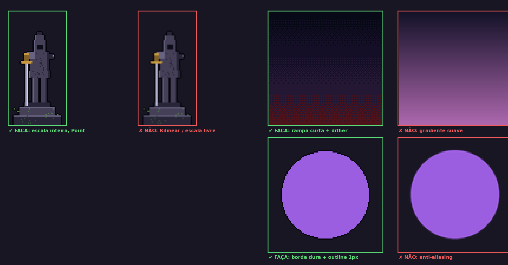

| ✅ Faça | ❌ Não faça |
|---|---|
| Escala inteira (×2, ×3, ×4) e filtro **Point** | Bilinear/Trilinear, escala fracionária, mipmaps |
| Rampa curta de paleta + dither ordenado | Gradiente suave, pincel com opacidade, *blur* |
| Bordas duras, outline 1 px | Anti-aliasing automático, "suavizar" no Aseprite |
| Paleta do T1 como base, 1 acento novo por fase | Cores puras saturadas no fundo (`#FF0000`, `#00FF00`) |
| Silhueta legível em preto puro a 50% | Detalhe de 1 px "sujo" que não descreve volume |
| Compressão **None** no Unity | Compressão Normal/High Quality (gera artefatos e muda cores) |
| PNG com transparência | JPG, fundo opaco, PNG indexado com cor de fundo no índice 0 |
| Camadas de parallax separadas (céu/longe/meio/perto) | Um fundo único "pintado" sem separação |
| Naves: hitbox pequeno e núcleo de cor clara | Naves com silhueta maior que 48 px na célula 64 |

---

## 5. Como um cenário e uma nave entram no código

### 5.1 Nova fase terrestre (ex.: T2) ✅ (pontos de extensão reais)

1. **Arte:** gerar com `CreateSceneryTemplate.lua` os tipos `sky`, `far`, `city`, `pavement`, props e `platform`; exportar para `Assets/Resources/T2/` com os **mesmos nomes** do T1.
2. **Dados:** em `StageData.cs`, criar `CreateT2()` copiando `CreateT1()` (cores do céu/chão, `HalfWidth`, `GroundTop`).
3. **Cenário:** copiar `T1Scenery.cs` → `T2Scenery.cs`, trocar o prefixo `"T1/"` em `LoadSprite` e `RuinPlatform` por `"T2/"` e reposicionar `BuildProps`/`BuildGameplayDecor` (as posições X são em unidades; `y = stage.GroundTop - 0.12f` para props no mundo). Mais limpo: parametrizar `T1Scenery` com uma pasta (`Build(stage, "T2")`).
4. **Controlador:** copiar `GroundT1Controller.cs` → `GroundT2Controller.cs`, trocar `StageData.CreateT1()`, `T1Scenery.Build` e o layout de `BuildPlayfield()` (`Platform(x, altura, largura)` — a largura precisa ter o PNG `plat<largura×100>`).
5. **Cena:** adicionar a constante em `GameScenes.cs`, o `else if` em `SceneTransitionManager.AttachFor`, e a cena em `AetherionProjectSetup` (Build Settings). O `WebGLBuilder` usa automaticamente as cenas habilitadas.

### 5.2 Fase espacial e naves (proposta, nada disso existe ainda)

1. `SpaceScenery.cs`: 3 camadas com `ParallaxLayer` (fatores ex.: 0,9 / 0,6 / 0,3) a partir de `Resources/Espaco1/`. Para loop infinito, posicione 2 cópias lado a lado e reposicione quando a câmera passar da metade (o `T1Backdrop` é um bom modelo, pois acompanha a câmera).
2. `NaveVisual.cs`: copiar a lógica de `GuerreiroVisual.cs` (carrega o sheet, fatia células 64×64 em 7 colunas com `Sprite.Create`) trocando `FootPivot` por `new Vector2(0.5f, 0.5f)` e mapeando as tags do template (idle 0–3, bank_up 4–5, bank_dn 6–7, hit 8–9, special 10–12, death 13–16).
3. `NaveController.cs`: `Rigidbody2D` com `gravityScale = 0`, `CircleCollider2D` com raio ≈ 7 px / 15 = **0,47 unidade**, input pelo mesmo legacy Input Manager do `PlayerController` (A/D/W/S ou setas; J dispara; L/Q especial; E supremo), tiros reaproveitando `Projectile.cs`/`Arrow.cs`, dano por `HealthSystem`/`DamageSystem`, faíscas com `PixelBurst`.
4. `SpaceLevelController.cs` com `EnsureExists()` e registro em `AttachFor(GameScenes.SpaceLevel)`.

### 5.3 Sorting orders usados hoje ✅

| Order | Elemento |
|---|---|
| −50 / −49 | céu / brilho da lua |
| −36 / −34 | fundo distante / bruma |
| −30 | cidade |
| −12 | bruma do meio |
| −8 | bloco do chão (colisão) |
| −7 / −6 / −5 | props perto (0,4) / brilho de lampião |
| −4 | calçada |
| −3 … −1 | decoração do plano jogável |
| 2 | plataformas |
| 12 | herói |
| 22 | `PixelBurst` |
| 25 | bruma da frente |
| 30 | `ForeProp` (primeiro plano) |

---

## 6. Aseprite + Unity com ferramentas de IA

A ideia: abrir **o repositório** num editor com agente de IA, dar a ele (a) acesso ao **terminal** para rodar o **Aseprite CLI** e os nossos scripts, e opcionalmente (b) servidores **MCP** (Model Context Protocol) que expõem Aseprite e o Editor do Unity como "ferramentas" que a IA pode chamar.

> ⚠️ Nenhum servidor MCP abaixo foi instalado ou testado pela equipe. Os links e comandos foram conferidos nos READMEs/documentações oficiais em 09/10/2026; esses projetos mudam rápido. Comece pelo **CLI (6.3)**, que é o caminho mais estável.

### 6.1 Abrir o repo em cada ferramenta

| Ferramenta | Como abrir | Arquivo de instruções do projeto (opcional) |
|---|---|---|
| **Cursor** | *File → Open Folder* na raiz do repo; agente no painel lateral (Agent) | `.cursor/rules/*.mdc` ou `AGENTS.md` |
| **OpenAI Codex** (CLI / extensão IDE / app) | no terminal: `cd aetherion-voidfall && codex` | `AGENTS.md` na raiz ✅ |
| **Claude Code** (CLI / extensão VS Code e JetBrains) | `cd aetherion-voidfall && claude` | `CLAUDE.md` na raiz ✅ |
| **Claude Desktop** | não abre pasta sozinho; precisa de MCP de sistema de arquivos ou do conector de código para acessar o repo | — |
| **Google Antigravity** | *Open Folder* / abrir workspace na raiz | `.agents/` (regras e MCP de workspace) ⚠️ |
| **VS Code + GitHub Copilot** | *File → Open Folder*; Copilot Chat em modo **Agent** | `.github/copilot-instructions.md` ✅ |
| **Windsurf** | *Open Folder* | `.windsurfrules` ⚠️ |

**Sugestão:** criar um `AGENTS.md` na raiz (Codex, Cursor e outros leem; o Claude Code lê `CLAUDE.md`, que pode só dizer "veja AGENTS.md") com o resumo das seções 3.4, 4.6 e 5 deste guia: PPU, pivôs, pastas de `Resources`, paleta, "não adicionar pacotes sem perguntar", "não editar `.meta` à mão", "Unity 6000.5.9f1, legacy Input Manager".

Dica Unity: em *Edit → Preferences → External Tools*, escolha VS Code/Cursor como editor de scripts e clique **Regenerate project files**, para o agente ter os `.csproj` e o autocomplete C#.

### 6.2 Servidores MCP

#### Aseprite MCP (projetos reais, comunitários) ✅ links conferidos

| Projeto | Linguagem / instalação | Observações |
|---|---|---|
| **letsagents/aseprite-mcp** — https://github.com/letsagents/aseprite-mcp | TypeScript; `npm install -g @letsagents/aseprite-mcp`; comando `aseprite-mcp`; variável `ASEPRITE_PATH` | ~76 ferramentas; roda o Aseprite em modo batch (`-b --script`) por baixo |
| **diivi/aseprite-mcp** — https://github.com/diivi/aseprite-mcp | Python (uv); `uv run -m aseprite_mcp` | ~104 ferramentas (desenho, camadas, frames, exportação) |
| **Vollkorn-Games/aseprite-mcp** — https://github.com/Vollkorn-Games/aseprite-mcp | Node; `node build/index.js` após build | README traz `claude mcp add aseprite-mcp -- node /caminho/build/index.js` |
| **oaktreegames/aseprite-live-mcp** — https://github.com/oaktreegames/aseprite-live-mcp (PyPI `aseprite-live-mcp` 0.2.0) | Python 3.10+; `uvx aseprite-live-mcp`; Aseprite 1.3+ | modo **live**: controla o Aseprite aberto via `claude-bridge.lua` + relay (`ASEPRITE_MCP_BACKEND=live`); tem `export_unity_sprite` que grava `.meta` — **não use o `.meta` gerado**, rode nosso Import Tool depois |

⚠️ Quantidade de ferramentas e nomes de comandos conforme os READMEs; comportamento não testado.

#### Unity MCP ✅ links conferidos

| Opção | Instalação | Observações |
|---|---|---|
| **CoplayDev/unity-mcp** ("MCP for Unity") — https://github.com/CoplayDev/unity-mcp | Package Manager → *Add package from git URL*: `https://github.com/CoplayDev/unity-mcp.git?path=/MCPForUnity#main` (ou `openupm add com.coplaydev.unity-mcp`) | Unity 2021.3–6.x; precisa Python 3.10+ e `uv`; *Window → MCP for Unity → Configure All Detected Clients* escreve a config dos clientes (Cursor, Claude, VS Code…) |
| **CoderGamester/mcp-unity** — https://github.com/CoderGamester/mcp-unity | git URL `https://github.com/CoderGamester/mcp-unity.git`; servidor Node em `Server~/build/index.js` | README cita Cursor, Claude Code, Codex, Copilot, Antigravity |
| **Unity CLI (oficial)** — https://docs.unity.com/en-us/unity-cli/replace-mcp-server-unity-cli | instalar o Unity CLI → `unity pipeline install` → `unity mcp configure <cliente>` (`claude`, `cursor`, `vscode`, `windsurf`…; `unity mcp configure --list`) | A Unity **depreciou** o MCP embutido no pacote `com.unity.ai.assistant` e o substituiu pelo `unity mcp` do CLI. Também oferece `unity command` / `unity eval` para agentes que rodam shell. Gratuito, não exige assinatura Unity AI; requer Unity 6.0 LTS+ para dirigir o Editor |

> ⚠️ **Cuidado com o projeto:** instalar um pacote MCP altera `Packages/manifest.json` e `packages-lock.json`. Faça isso **numa branch separada**, combine com o Wesley antes de commitar, e **não** inclua o pacote no build WebGL (são ferramentas de Editor).

### 6.3 Aseprite CLI — a IA roda os scripts e exporta ✅ (docs: https://www.aseprite.org/docs/cli/)

Caminho do executável:

| Sistema | Caminho |
|---|---|
| Windows | `"C:\Program Files\Aseprite\Aseprite.exe"` · Steam: `"C:\Program Files (x86)\Steam\steamapps\common\Aseprite\Aseprite.exe"` |
| macOS | `/Applications/Aseprite.app/Contents/MacOS/aseprite` · Steam: `~/Library/Application Support/Steam/steamapps/common/Aseprite/Aseprite.app/Contents/MacOS/aseprite` |
| Linux | `aseprite` (se no PATH) · Steam: `~/.steam/debian-installation/steamapps/common/Aseprite/aseprite` |

Opções principais: `-b`/`--batch` (sem janela), `--script arquivo.lua`, `--script-param chave=valor` (lido no Lua como `app.params.chave`), `--sheet`, `--data`, `--format json-hash`, `--sheet-type rows`, `--sheet-columns N`, `--ignore-layer`, `--split-layers`, `--save-as`, `--list-tags`, `--scale`.

```bash
# alias (macOS/Linux) — no Windows use o caminho completo entre aspas
ASE="/Applications/Aseprite.app/Contents/MacOS/aseprite"

# 1) criar templates sem abrir a interface (nossos scripts aceitam --script-param)
$ASE -b --script-param kind=space_h --script-param out=Art/Espaco1/espaco_far.aseprite \
     --script Tools/Aseprite/CreateSceneryTemplate.lua
$ASE -b --script-param kind=platform --script-param units=3.2 --script-param out=Art/T2/plat320.aseprite \
     --script Tools/Aseprite/CreateSceneryTemplate.lua
$ASE -b --script-param size=64 --script-param dir=right --script-param out=Art/Naves/nave_vazio.aseprite \
     --script Tools/Aseprite/CreateShipTemplate.lua

# 2) exportar nave como sheet de 7 colunas, sem as guias (só CLI, sem script)
#    (repita --ignore-layer para cada camada GUIDE do arquivo)
$ASE -b Art/Naves/nave_vazio.aseprite \
     --ignore-layer "GUIDE - Cell" --ignore-layer "GUIDE - Center" --ignore-layer "GUIDE - Max Box" \
     --ignore-layer "GUIDE - Hitbox" --ignore-layer "GUIDE - Engine" --ignore-layer "GUIDE - Muzzle" \
     --sheet Assets/Resources/Naves/nave_vazio.png --sheet-type rows --sheet-columns 7 \
     --data Assets/Resources/Naves/nave_vazio.json --format json-hash --list-tags

# 3) ou usar nosso exportador (esconde tudo que começa com "GUIDE")
$ASE -b Art/Naves/nave_vazio.aseprite --script-param mode=sheet \
     --script-param out=Assets/Resources/Naves/nave_vazio --script Tools/Aseprite/ExportForUnity.lua
$ASE -b Art/T2/t2_camadas.aseprite --script-param mode=layers \
     --script-param out=Assets/Resources/T2/x --script Tools/Aseprite/ExportForUnity.lua

# 4) preview ampliado (só para revisão/Discord — NUNCA para o Unity)
$ASE -b Assets/Resources/Naves/nave_vazio.png --scale 4 --save-as /tmp/preview_x4.png
```

⚠️ A ordem importa no CLI: o arquivo de entrada vem antes de `--script` para que o script o encontre como `app.activeSprite`. Conferido na documentação, não executado aqui.

Depois de exportar, peça à IA (ou faça você) para **voltar ao Unity** e rodar *Tools → Pixel Art → Import Tool* nos PNGs novos (desmarcando PPU+Pivot para cenário/nave). Com um MCP de Unity, a IA pode chamar o menu; sem MCP, faça manualmente.

### 6.4 Configuração MCP em cada ferramenta

Exemplo usado em todas: o **letsagents/aseprite-mcp** (instalado via npm) + o **CoplayDev/unity-mcp**. Ajuste os caminhos. ⚠️ O bloco do `unityMCP` abaixo é ilustrativo — o comando exato varia com a versão; prefira deixar o próprio pacote gerar (*Configure All Detected Clients*) ou `unity mcp configure <cliente>`.

**Cursor** ✅ — `~/.cursor/mcp.json` (global) ou `.cursor/mcp.json` (no repo):

```json
{
  "mcpServers": {
    "aseprite": {
      "command": "aseprite-mcp",
      "env": { "ASEPRITE_PATH": "/Applications/Aseprite.app/Contents/MacOS/aseprite" }
    },
    "unityMCP": {
      "command": "uvx",
      "args": ["--from", "mcpforunityserver", "mcp-for-unity"]
    }
  }
}
```

Depois: *Settings → MCP* (ou *Tools & Integrations*) para ver se ficou verde.

**Claude Code** ✅ — pela CLI; `--scope project` grava `.mcp.json` na raiz do repo (compartilhável), `local`/`user` grava em `~/.claude.json`:

```bash
claude mcp add --scope project aseprite --env ASEPRITE_PATH="/Applications/Aseprite.app/Contents/MacOS/aseprite" -- aseprite-mcp
claude mcp list          # dentro do Claude Code: /mcp mostra o status
```

**Claude Desktop** ✅ — *Settings → Developer → Edit Config*, arquivo `claude_desktop_config.json`:
macOS `~/Library/Application Support/Claude/claude_desktop_config.json` · Windows `%APPDATA%\Claude\claude_desktop_config.json`. Mesmo formato `"mcpServers"` do Cursor. Reinicie o app depois de editar. (⚠️ Linux: não há build oficial do Claude Desktop; caminho `~/.config/Claude/` é usado por builds não oficiais.)

**OpenAI Codex** ✅ — `~/.codex/config.toml` (ou `.codex/config.toml` no projeto, só em projetos marcados como confiáveis). Formato TOML, chaves em *snake_case*:

```toml
[mcp_servers.aseprite]
command = "aseprite-mcp"
env = { ASEPRITE_PATH = "/Applications/Aseprite.app/Contents/MacOS/aseprite" }
```

Ou: `codex mcp add aseprite --env ASEPRITE_PATH=... -- aseprite-mcp` e `codex mcp list`. CLI, extensão e app compartilham essa configuração.

**Google Antigravity** ⚠️ (documentação esparsa; baseado na doc e no fórum oficial) — *painel do agente → "…" → MCP Store → Manage MCP Servers → View raw config*. Arquivo global `~/.gemini/config/mcp_config.json` (algumas fontes citam `~/.gemini/antigravity/mcp_config.json` — confira em *View raw config*), de workspace `.agents/mcp_config.json`; formato `"mcpServers"` igual ao do Cursor. Use **caminho absoluto** no `command` (o PATH do terminal não é herdado) e não inclua o campo `"type"` (relatado como rejeitado).

**VS Code + GitHub Copilot** ✅ — `.vscode/mcp.json` no repo, ou comando **MCP: Add Server**. Atenção: aqui a chave raiz é **`"servers"`**:

```json
{
  "servers": {
    "aseprite": {
      "type": "stdio",
      "command": "aseprite-mcp",
      "env": { "ASEPRITE_PATH": "C:\\Program Files\\Aseprite\\Aseprite.exe" }
    }
  }
}
```

Ative no Copilot Chat em modo **Agent** (ícone de ferramentas).

**Windsurf** ✅ — `~/.codeium/windsurf/mcp_config.json`, formato `"mcpServers"`.

**Sem MCP nenhum:** todas essas ferramentas têm terminal integrado; a IA pode simplesmente rodar os comandos da seção 6.3. É o mais simples e previsível.

### 6.5 Fluxo recomendado com IA

1. Peça para a IA **ler** `Assets/Documentation/CharacterStyleGuide.md`, `Assets/Scripts/Stages/T1Scenery.cs` e este guia antes de qualquer coisa.
2. IA gera o **template** com o CLI → **você pinta** (ou a IA desenha via MCP/script e você corrige à mão — pixel art gerada por IA quase sempre precisa de limpeza).
3. IA exporta com `ExportForUnity.lua` para `Assets/Resources/<Pasta>/`.
4. Você roda o Import Tool no Unity (ou a IA via Unity MCP), aperta Play e confere a tela em 100%/200%.
5. Commit numa branch, PR para revisão (Bianca revisa estilo; Wesley revisa código).

### 6.6 Prompts de exemplo (copie e adapte)

**Camada de fundo terrestre (T2):**

> Leia `Assets/Art/T1/build_t1.py` (paleta nomeada) e `Assets/Scripts/Stages/T1Scenery.cs`. Crie um script Python com Pillow em `Assets/Art/T2/build_t2.py` no mesmo estilo do `build_t1.py`, que gere `Assets/Resources/T2/far.png` com **512×130 px**, silhuetas de **floresta petrificada** com 4 cores no máximo, sem outline, tons `FAR_A`/`FAR_B` mais um verde-musgo escuro, luz do topo-esquerdo. Pixel art 16-bit, sem anti-aliasing, sem gradiente suave, fundo transparente. Não altere outros arquivos. Corrija o caminho de saída para ser relativo ao repo (o `build_t1.py` tem um caminho fixo de Mac).

**Template + export pelo CLI:**

> Use o Aseprite em `$ASE`. Rode `Tools/Aseprite/CreateSceneryTemplate.lua` com `kind=city` salvando em `Art/T2/city.aseprite`. Depois de eu pintar, exporte com `ExportForUnity.lua` modo `flat` para `Assets/Resources/T2/city`. Mostre os comandos antes de rodar.

**Nave do jogador:**

> Crie com `CreateShipTemplate.lua` (size=64, dir=right) o arquivo `Art/Naves/nave_vazio.aseprite`. Usando o MCP do Aseprite (ou um script Lua), desenhe no frame 1 da camada HULL uma nave dark fantasy "Arca do Véu": casco de pedra rúnica (`GP_DARK #282538`, `GP_BASE #454057`, `GP_LIT #686380`, `GP_EDGE #9694B5`), núcleo roxo (`ORB #9C5EE0`), jato ciano (`#59D9FF`). Silhueta dentro de 48×48, outline 1 px `#05050D`, luz do topo-esquerdo, no máximo 16 cores, sem anti-aliasing. Copie para os frames 2–4 com o jato alternando 1 px (animação idle). Não desenhe nas camadas GUIDE.

**Inimigo espacial pequeno:**

> Template de nave com size=32. Desenhe um "olho do Vazio" voador: esfera de carne `#4D121A`/`#6B171F`, íris `#FF9E38`, tentáculos de 1 px. Tags `hit` com flash branco (`#E0E6F7`) em 1 frame e `death` em 4 frames com explosão em pixels (laranja → amarelo → fumaça `#282538`).

**Fundo espacial com loop:**

> Gere `Assets/Resources/Espaco1/stars_far.png` 640×192 com loop horizontal perfeito (a coluna 0 continua a 639). Estrelas de 1 px em 3 brilhos (`#383652`, `#9EABD1`, `#E0E6F7`), densidade baixa, sem nebulosa. Depois `nebula.png` 640×192 com nebulosa roxa usando dither Bayer 4×4 entre `SKY_MID #140F26`, `SKY_HOR #241733` e `ORB_D #613694`. Verifique o loop colando a imagem duas vezes lado a lado.

**Código da fase espacial (Wesley/Sammer):**

> Seguindo o padrão de `GroundT1Controller` (`EnsureExists`, montagem em `Start`, câmera ortográfica 5.35), crie `Assets/Scripts/Stages/SpaceLevelController.cs` e `Assets/Scripts/Player/NaveVisual.cs`. O `NaveVisual` lê `Resources/Naves/nave_vazio` (sheet 7 colunas, células 64×64), cria sprites com PPU 15 e pivô (0.5, 0.5), Point, e anima as tags idle 0–3, bank_up 4–5, bank_dn 6–7, hit 8–9, special 10–12, death 13–16 a 12 fps. Registre em `SceneTransitionManager.AttachFor` para `GameScenes.SpaceLevel`. Use o legacy Input Manager. Não adicione pacotes. Mostre o diff antes de aplicar.

**Revisão de estilo:**

> Compare `Assets/Resources/T2/*.png` com `Assets/Resources/T1/*.png`: liste para cada arquivo tamanho, número de cores, se há pixels semitransparentes (alfa entre 1 e 254, que indicam anti-aliasing) e cores fora da paleta nomeada do `build_t1.py` mais a paleta T2. Não modifique nada.

### 6.7 Limites e cuidados

* Geradores de imagem genéricos produzem "falso pixel art" (pixels de tamanhos diferentes, AA, centenas de cores). Se usar, **redesenhe por cima** no tamanho real; nunca importe direto.
* Exija sempre: tamanho exato em px, paleta em hex, "sem anti-aliasing", "transparente", "1 px de outline".
* Revise todo diff da IA; não deixe ela mexer em `ProjectSettings/`, `.meta` ou `Packages/` sem combinar.
* Não coloque chaves de API em arquivos do repo (`.mcp.json`, `.cursor/mcp.json` versionados devem conter só comandos).

---

## 7. Apêndice de código-fonte

Arquivos completos do commit `69d4612`, com uma explicação curta antes de cada um. Ficaram de fora por tamanho ou por não serem relevantes para cenário/naves: `MobileControls.cs` (543 linhas, UI de toque), `MagoVisual.cs` e `ArqueiroVisual.cs` (mesmo padrão do `GuerreiroVisual.cs`), `build_t1.py` (969 linhas — está no zip), Pong legado e telas de menu. **Tudo** está no `codigo_fonte_aetherion.zip`.

### Núcleo e cenas

#### GameScenes.cs

`Assets/Scripts/Core/GameScenes.cs` — 12 linhas

Constantes com os nomes das cenas. **Gancho:** adicione `GroundT2`, `GroundT3` etc. aqui; `SpaceLevel` já existe mas ainda não tem controlador.

```csharp
public static class GameScenes
{
    public const string Boot = "Boot";
    public const string MainMenu = "MainMenu";
    public const string Intro = "Intro";
    public const string CharacterSelection = "CharacterSelection";
    public const string GroundT1 = "Ground_T1";
    public const string GroundLevel = "GroundLevel";
    public const string SpaceLevel = "SpaceLevel";
    public const string Victory = "Victory";
    public const string Pong = "Pong";
}
```

#### SceneTransitionManager.cs

`Assets/Scripts/Core/SceneTransitionManager.cs` — 123 linhas

Carrega cenas com fade e, depois do load, chama `AttachFor(nome)`, que cria o controlador da cena. **Gancho:** um `else if` por fase nova (`SpaceLevelController.EnsureExists()`).

```csharp
using System.Collections;
using UnityEngine;
using UnityEngine.SceneManagement;
using UnityEngine.UI;

public class SceneTransitionManager : MonoBehaviour
{
    public static SceneTransitionManager Instance { get; private set; }

    [SerializeField] float _fadeDuration = 0.35f;

    CanvasGroup _fadeGroup;
    bool _busy;

    void Awake()
    {
        if (Instance != null && Instance != this)
        {
            Destroy(this);
            return;
        }

        Instance = this;
        BuildFadeOverlay();
    }

    void OnDestroy()
    {
        if (Instance == this)
            Instance = null;
    }

    public void Load(string sceneName)
    {
        if (_busy)
            return;

        StartCoroutine(LoadRoutine(sceneName));
    }

    IEnumerator LoadRoutine(string sceneName)
    {
        _busy = true;
        SceneManager.LoadScene(sceneName);
        yield return null;
        ClearFade();
        AttachFor(sceneName);
        _busy = false;
    }

    static void AttachFor(string sceneName)
    {
        if (sceneName == GameScenes.MainMenu)
            MainMenuController.EnsureExists();
        else if (sceneName == GameScenes.Intro)
            IntroController.EnsureExists();
        else if (sceneName == GameScenes.CharacterSelection)
            CharacterSelectController.EnsureExists();
        else if (sceneName == GameScenes.GroundT1)
            GroundT1Controller.EnsureExists();
    }

    public void ClearFade()
    {
        if (_fadeGroup == null)
            return;

        _fadeGroup.alpha = 0f;
        _fadeGroup.blocksRaycasts = false;
    }

    IEnumerator Fade(float target)
    {
        if (_fadeGroup == null)
            yield break;

        _fadeGroup.blocksRaycasts = true;
        float start = _fadeGroup.alpha;
        float time = 0f;

        while (time < _fadeDuration)
        {
            time += Time.unscaledDeltaTime;
            _fadeGroup.alpha = Mathf.Lerp(start, target, time / _fadeDuration);
            yield return null;
        }

        _fadeGroup.alpha = target;
        _fadeGroup.blocksRaycasts = target > 0.01f;
    }

    void BuildFadeOverlay()
    {
        var canvasObject = new GameObject("FadeCanvas");
        canvasObject.transform.SetParent(transform, false);

        var canvas = canvasObject.AddComponent<Canvas>();
        canvas.renderMode = RenderMode.ScreenSpaceOverlay;
        canvas.sortingOrder = 1000;

        var scaler = canvasObject.AddComponent<CanvasScaler>();
        scaler.uiScaleMode = CanvasScaler.ScaleMode.ScaleWithScreenSize;
        scaler.referenceResolution = new Vector2(1920f, 1080f);

        canvasObject.AddComponent<GraphicRaycaster>();

        var fadeObject = new GameObject("Fade");
        fadeObject.transform.SetParent(canvasObject.transform, false);

        var image = fadeObject.AddComponent<Image>();
        image.color = Color.black;

        var rect = fadeObject.GetComponent<RectTransform>();
        rect.anchorMin = Vector2.zero;
        rect.anchorMax = Vector2.one;
        rect.offsetMin = Vector2.zero;
        rect.offsetMax = Vector2.zero;

        _fadeGroup = fadeObject.AddComponent<CanvasGroup>();
        _fadeGroup.alpha = 0f;
        _fadeGroup.blocksRaycasts = false;
    }
}
```

#### GameManager.cs

`Assets/Scripts/Core/GameManager.cs` — 49 linhas

Singleton persistente que guarda o herói escolhido. Útil para levar o herói/nave escolhido para a fase espacial.

```csharp
using UnityEngine;

public class GameManager : MonoBehaviour
{
    public static GameManager Instance { get; private set; }

    [SerializeField] string _selectedHeroId;
    CharacterData _selectedHero;

    public string SelectedHeroId => _selectedHeroId;
    public CharacterData SelectedHero => _selectedHero;

    public static GameManager EnsureExists()
    {
        if (Instance != null)
            return Instance;

        var root = new GameObject("GameManager");
        root.AddComponent<SceneTransitionManager>();
        return root.AddComponent<GameManager>();
    }

    void Awake()
    {
        if (Instance != null && Instance != this)
        {
            Destroy(gameObject);
            return;
        }

        Instance = this;
        DontDestroyOnLoad(gameObject);

        if (GetComponent<SceneTransitionManager>() == null)
            gameObject.AddComponent<SceneTransitionManager>();
    }

    void OnDestroy()
    {
        if (Instance == this)
            Instance = null;
    }

    public void SelectHero(CharacterData hero)
    {
        _selectedHero = hero;
        _selectedHeroId = hero != null ? hero.Id : null;
    }
}
```

#### StageData.cs

`Assets/Scripts/Stages/StageData.cs` — 30 linhas

ScriptableObject com limites e cores da fase. **Gancho:** `CreateT2()`, `CreateSpace1()` seguindo `CreateT1()`.

```csharp
using UnityEngine;

[CreateAssetMenu(fileName = "Stage", menuName = "Aetherion/Stage")]
public class StageData : ScriptableObject
{
    public string Id;
    public string DisplayName;
    public float HalfWidth = 34f;
    public float HalfHeight = 8f;
    public float GroundTop = -2.35f;
    public Color GroundColor = new Color(0.16f, 0.1f, 0.09f);
    public Color SkyColor = new Color(0.18f, 0.09f, 0.14f);
    public Color RuinColor = new Color(0.28f, 0.18f, 0.16f);
    public Color AccentColor = new Color(0.42f, 0.16f, 0.28f);

    public static StageData CreateT1()
    {
        var data = CreateInstance<StageData>();
        data.Id = "t1";
        data.DisplayName = "Ruínas da Borda";
        data.HalfWidth = 34f;
        data.HalfHeight = 8f;
        data.GroundTop = -2.35f;
        data.GroundColor = new Color(0.05f, 0.07f, 0.08f);
        data.SkyColor = new Color(0.04f, 0.06f, 0.1f);
        data.RuinColor = new Color(0.16f, 0.2f, 0.24f);
        data.AccentColor = new Color(0.42f, 0.52f, 0.58f);
        return data;
    }
}
```

### Cenário

#### T1Scenery.cs

`Assets/Scripts/Stages/T1Scenery.cs` — 459 linhas

Monta o T1 em 5 camadas a partir dos PNGs de `Resources/T1` (PPU 16, pivô base). Contém `LoadSprite`, `NearProp` (parallax 0,4), `WorldProp` (fixo), `ForeProp` (primeiro plano), `RuinPlatform` (`plat<largura×100>.png`), `TiledBlock` (tijolo procedural), brumas e brilhos, além das classes `T1Backdrop`, `T1Mist` e `T1Glow`. **Gancho:** copie/parametrize para `T2Scenery`/`SpaceScenery`; os nomes dos PNGs e as posições X ficam em `BuildLayered`, `BuildProps` e `BuildGameplayDecor`.

```csharp
using UnityEngine;

// Cenário 16-bit dark fantasy de Aetherion, montado em camadas modulares:
//   1. céu (T1Backdrop ~0.95)  2. fundo distante (0.9)  3. cidade em ruínas (0.8)
//   4. props próximos (0.4)    5. plano jogável (calçada + plataformas de ruína)
// As camadas são PNGs pixel art gerados por Assets/Art/T1/build_t1.py.
public static class T1Scenery
{
    const float Ppu = 16f;

    public static Color PlatformColor => new Color(0.14f, 0.13f, 0.21f);
    public static Color PlatformEdge => new Color(0.30f, 0.30f, 0.44f);
    public static Color WoodColor => new Color(0.12f, 0.1f, 0.08f);

    public static void Build(StageData stage)
    {
        BuildLayered(stage);
    }

    static bool BuildLayered(StageData stage)
    {
        var sky = LoadSprite("sky");
        var far = LoadSprite("far");
        var city = LoadSprite("city");
        var pavement = LoadSprite("pavement");
        if (sky == null || far == null || city == null || pavement == null)
        {
            Debug.LogWarning("Camadas do T1 não encontradas em Resources/T1 — rode Assets/Art/T1/build_t1.py.");
            return false;
        }

        // camada 1 — céu noturno (lua, estrelas, nuvens, horizonte corrompido)
        var skyGo = Place("Ceu", sky, Vector3.zero, -50);
        skyGo.AddComponent<T1Backdrop>().Setup(0.95f, 0.95f, -5.8f);
        Glow(skyGo.transform, new Vector3((350f - 240f) / Ppu, 142f / Ppu, 0f),
            new Color(0.78f, 0.86f, 1f), 3.6f, 3.6f, 0.06f, 0.04f, 0.3f, -49);

        // camada 2 — montanhas e castelo distante
        Place("FundoLonge", far, new Vector3(0f, -1.6f, 0f), -36)
            .AddComponent<ParallaxLayer>().Setup(0.9f);
        DriftMist("BrumaLonge", new Vector3(0f, 2.4f, 0f), 0.85f, -34, 0.16f, 2.6f, 0.045f);

        // camada 3 — cidade de Aetherion destruída
        var cityGo = Place("Cidade", city, new Vector3(0f, -3.0f, 0f), -30);
        cityGo.GetComponent<SpriteRenderer>().color = new Color(0.8f, 0.8f, 0.9f); // empurra a cidade pra trás
        cityGo.AddComponent<ParallaxLayer>().Setup(0.8f);
        CityGlow(cityGo.transform, 268, 46, 2.4f, 1.6f, 0.10f, 0.08f, 1.8f);  // interior da catedral
        CityGlow(cityGo.transform, 300, 26, 1.4f, 1.1f, 0.12f, 0.10f, 2.6f);  // fogueira na base
        CityGlow(cityGo.transform, 446, 44, 1.4f, 1.2f, 0.12f, 0.10f, 3.0f);  // casa em chamas
        CityGlow(cityGo.transform, 586, 74, 0.9f, 0.9f, 0.10f, 0.08f, 2.2f);  // janela da torre
        DriftMist("BrumaMeio", new Vector3(4f, -0.6f, 0f), 0.7f, -12, 0.14f, 3.2f, 0.06f);

        // camada 4 — elementos próximos
        BuildProps(stage);

        // camada 5 — calçada do plano jogável (sobre o bloco de colisão)
        for (int i = -1; i <= 1; i++)
            Place("Calcada" + i, pavement, new Vector3(i * 32f, stage.GroundTop - 2.65f, 0f), -4);

        // camada 5b — decoração fixa do plano jogável (estilo SNES, sem parallax)
        BuildGameplayDecor(stage);

        DriftMist("BrumaFrente", new Vector3(-4f, -2.3f, 0f), 0.88f, 25, 0.10f, 4f, 0.08f);
        return true;
    }

    static void BuildProps(StageData stage)
    {
        float y = stage.GroundTop - 0.35f;
        NearProp("tree", -26f, y, -7);
        NearProp("statue", -17f, y, -6);
        NearProp("rubble", -9f, y, -6);
        var lampA = NearProp("lamp", -2.5f, y, -6);
        NearProp("column", 5f, y, -7);
        NearProp("tree", 13f, y, -7);
        NearProp("rubble", 20f, y, -6);
        var lampB = NearProp("lamp", 27f, y, -6);
        var fireColor = new Color(1f, 0.6f, 0.2f);
        if (lampA != null)
            Glow(lampA.transform, new Vector3(0f, 3.25f, 0f), fireColor, 1.1f, 1.1f, 0.14f, 0.12f, 3.4f, -5);
        if (lampB != null)
            Glow(lampB.transform, new Vector3(0f, 3.25f, 0f), fireColor, 1.1f, 1.1f, 0.14f, 0.12f, 3.4f, -5);
    }

    // Objetos fixos no plano jogável: ficam parados no mundo (parallax 1.0),
    // atrás do herói mas na frente da calçada — integram a plataforma ao cenário.
    static void BuildGameplayDecor(StageData stage)
    {
        float y = stage.GroundTop - 0.12f;

        WorldProp("ruin_wall", -28f, y, -3);
        WorldProp("stones", -24f, y, -1);
        WorldProp("statue_warrior", -20.5f, y, -2);
        WorldProp("fallen", -14f, y, -3);
        WorldProp("bush", -11.2f, y, -1);
        OrbGlow(WorldProp("statue_mage", -6.5f, y, -2));
        WorldProp("stones", -0.8f, y, -1);
        WorldProp("bush", 3.1f, y, -1);
        WorldProp("fallen", 6.4f, y, -3);
        WorldProp("bush", 10.8f, y, -1);
        WorldProp("statue_warrior", 15.8f, y, -2);
        WorldProp("stones", 19.6f, y, -1);
        WorldProp("ruin_wall", 25.5f, y, -3);
        OrbGlow(WorldProp("statue_mage", 29.5f, y, -2));
        WorldProp("bush", 32f, y, -1);

        // primeiro plano: silhuetas na frente do herói, mais escuras e maiores,
        // com parallax invertido leve (passam mais rápido que a fase = mais perto)
        ForeProp("stones", -18f, stage.GroundTop - 0.55f);
        ForeProp("bush", -8f, stage.GroundTop - 0.5f);
        ForeProp("stones", 1.5f, stage.GroundTop - 0.55f);
        ForeProp("bush", 12f, stage.GroundTop - 0.5f);
        ForeProp("stones", 22f, stage.GroundTop - 0.55f);
        ForeProp("bush", 31f, stage.GroundTop - 0.5f);
    }

    // Luz roxa pulsando no orbe caído da estátua de mago
    static void OrbGlow(GameObject statue)
    {
        if (statue == null)
            return;
        // orbe está no px (9, 15) do sprite 44x88 (pivô bottom-center)
        Glow(statue.transform, new Vector3((9f - 22f) / Ppu, 15f / Ppu, 0f),
            new Color(0.72f, 0.45f, 1f), 0.7f, 0.7f, 0.14f, 0.12f, 2.0f, -1);
    }

    static GameObject WorldProp(string name, float x, float y, int order)
    {
        var sprite = LoadSprite(name);
        if (sprite == null)
            return null;
        return Place(name, sprite, new Vector3(x, y, 0f), order);
    }

    static void ForeProp(string name, float x, float y)
    {
        var go = WorldProp(name, x, y, 30);
        if (go == null)
            return;
        go.transform.localScale = new Vector3(1.4f, 1.4f, 1f);
        var renderer = go.GetComponent<SpriteRenderer>();
        renderer.color = new Color(0.4f, 0.42f, 0.55f); // silhueta escura e fria
        go.AddComponent<ParallaxLayer>().Setup(-0.12f);
    }

    static GameObject NearProp(string name, float x, float y, int order)
    {
        var sprite = LoadSprite(name);
        if (sprite == null)
            return null;
        var go = Place(name, sprite, new Vector3(x, y, 0f), order);
        go.AddComponent<ParallaxLayer>().Setup(0.4f);
        return go;
    }

    // Plataforma de ruína pré-desenhada (bordas irregulares, musgo, vinhas).
    // Só visual — o colisor é criado pelo GroundT1Controller.
    public static void RuinPlatform(Vector3 center, float width, float thickness, int order)
    {
        var texture = Resources.Load<Texture2D>("T1/plat" + Mathf.RoundToInt(width * 100f));
        if (texture == null)
        {
            TiledBlock("PlataformaRuina", center, new Vector2(width, thickness), order);
            return;
        }

        texture.filterMode = FilterMode.Point;
        texture.wrapMode = TextureWrapMode.Clamp;
        // corpo de pedra ocupa [10, 10+6] px; pivô no centro do corpo
        float pivotY = (10f + thickness * Ppu * 0.5f) / texture.height;
        var sprite = Sprite.Create(
            texture,
            new Rect(0f, 0f, texture.width, texture.height),
            new Vector2(0.5f, pivotY),
            Ppu,
            0,
            SpriteMeshType.FullRect);

        var go = new GameObject("PlataformaRuina");
        go.transform.position = center;
        var renderer = go.AddComponent<SpriteRenderer>();
        renderer.sprite = sprite;
        renderer.sortingOrder = order;
    }

    // ---------- blocos tileáveis (corpo do chão / fallback) ----------

    static Sprite _brickSprite;

    public static GameObject TiledBlock(string name, Vector3 position, Vector2 size, int order)
    {
        var go = new GameObject(name);
        go.transform.position = position;
        var renderer = go.AddComponent<SpriteRenderer>();
        renderer.sprite = BrickTile();
        renderer.drawMode = SpriteDrawMode.Tiled;
        renderer.size = size;
        renderer.sortingOrder = order;
        return go;
    }

    static Sprite BrickTile()
    {
        if (_brickSprite != null)
            return _brickSprite;

        const int s = 16;
        var texture = new Texture2D(s, s, TextureFormat.RGBA32, false);
        var pixels = new Color[s * s];
        var mortar = new Color(0.045f, 0.05f, 0.085f);
        var baseA = new Color(0.13f, 0.12f, 0.20f);
        var baseB = new Color(0.11f, 0.105f, 0.18f);
        var lit = new Color(0.20f, 0.19f, 0.30f);
        var moss = new Color(0.10f, 0.17f, 0.12f);

        for (int y = 0; y < s; y++)
        {
            int row = y / 8;
            int offset = row % 2 == 0 ? 0 : 4;
            for (int x = 0; x < s; x++)
            {
                int bx = (x + offset) % 8;
                bool mortarLine = y % 8 == 7 || bx == 7;
                int brickId = (x + offset) / 8 + row * 3;
                Color c = mortarLine ? mortar : (brickId % 2 == 0 ? baseA : baseB);
                if (!mortarLine && y % 8 == 6)
                    c = lit;
                if (!mortarLine && (x * 7 + y * 13) % 29 == 0)
                    c = moss;
                pixels[y * s + x] = c;
            }
        }

        texture.SetPixels(pixels);
        texture.Apply(false, false);
        texture.filterMode = FilterMode.Point;
        texture.wrapMode = TextureWrapMode.Repeat;
        _brickSprite = Sprite.Create(
            texture, new Rect(0f, 0f, s, s), new Vector2(0.5f, 0.5f), Ppu, 0, SpriteMeshType.FullRect);
        return _brickSprite;
    }

    // ---------- neblina em deriva ----------

    static void DriftMist(string name, Vector3 position, float parallax, int order, float alpha, float amplitude, float speed)
    {
        int w = 512;
        int h = 40;
        var pixels = PixelArt.Clear(w, h);
        for (int y = 0; y < h; y++)
        {
            float fade = 1f - Mathf.Abs(y - h * 0.5f) / (h * 0.5f);
            for (int x = 0; x < w; x++)
            {
                float edge = Mathf.Clamp01(Mathf.Min(x, w - 1 - x) / 90f);
                float wave = 0.75f + 0.25f * Mathf.Sin(x * 0.045f + y * 0.3f);
                float a = fade * edge * wave * alpha;
                PixelArt.Plot(pixels, w, h, x, y, new Color(0.55f, 0.6f, 0.75f, a));
            }
        }

        var go = PixelArt.Place(name, PixelArt.Make(w, h, pixels), position, order, 0f);
        go.AddComponent<T1Mist>().Setup(parallax, amplitude, speed);
    }

    // ---------- luz pulsante ----------

    static Sprite _glowSprite;

    static void CityGlow(Transform city, int pxX, int pxY, float sizeX, float sizeY, float baseAlpha, float amplitude, float speed)
    {
        Glow(city, new Vector3((pxX - 320f) / Ppu, pxY / Ppu, 0f),
            new Color(1f, 0.5f, 0.16f), sizeX, sizeY, baseAlpha, amplitude, speed, -29);
    }

    static void Glow(
        Transform parent, Vector3 localPosition, Color color,
        float sizeX, float sizeY, float baseAlpha, float amplitude, float speed, int order)
    {
        var go = new GameObject("Brilho");
        go.transform.SetParent(parent, false);
        go.transform.localPosition = localPosition;
        go.transform.localScale = new Vector3(sizeX, sizeY, 1f);
        var renderer = go.AddComponent<SpriteRenderer>();
        renderer.sprite = GlowSprite();
        renderer.sortingOrder = order;
        go.AddComponent<T1Glow>().Setup(renderer, color, baseAlpha, amplitude, speed);
    }

    static Sprite GlowSprite()
    {
        if (_glowSprite != null)
            return _glowSprite;

        const int size = 48;
        var texture = new Texture2D(size, size, TextureFormat.RGBA32, false);
        var pixels = new Color32[size * size];
        float center = (size - 1) / 2f;
        for (int y = 0; y < size; y++)
        {
            for (int x = 0; x < size; x++)
            {
                float dx = (x - center) / center;
                float dy = (y - center) / center;
                float d = Mathf.Sqrt(dx * dx + dy * dy);
                float a = Mathf.Clamp01(1f - d);
                a = Mathf.Round(a * a * 6f) / 6f; // degraus = luz pixelada
                pixels[y * size + x] = new Color32(255, 255, 255, (byte)(a * 255f));
            }
        }

        texture.SetPixels32(pixels);
        texture.Apply();
        texture.filterMode = FilterMode.Point;
        texture.wrapMode = TextureWrapMode.Clamp;
        _glowSprite = Sprite.Create(
            texture, new Rect(0f, 0f, size, size), new Vector2(0.5f, 0.5f), size, 0, SpriteMeshType.FullRect);
        return _glowSprite;
    }

    // ---------- utilidades ----------

    static readonly System.Collections.Generic.Dictionary<string, Sprite> _sprites =
        new System.Collections.Generic.Dictionary<string, Sprite>();

    static Sprite LoadSprite(string name)
    {
        if (_sprites.TryGetValue(name, out var cached) && cached != null)
            return cached;

        var texture = Resources.Load<Texture2D>("T1/" + name);
        if (texture == null)
            return null;
        texture.filterMode = FilterMode.Point;
        texture.wrapMode = TextureWrapMode.Clamp;
        var sprite = Sprite.Create(
            texture,
            new Rect(0f, 0f, texture.width, texture.height),
            new Vector2(0.5f, 0f),
            Ppu,
            0,
            SpriteMeshType.FullRect);
        _sprites[name] = sprite;
        return sprite;
    }

    static GameObject Place(string name, Sprite sprite, Vector3 position, int order)
    {
        var go = new GameObject(name);
        go.transform.position = position;
        var renderer = go.AddComponent<SpriteRenderer>();
        renderer.sprite = sprite;
        renderer.sortingOrder = order;
        return go;
    }
}

// Acompanha a câmera com fator de parallax no X (e leve no Y),
// mantendo o fundo sempre cobrindo a visão.
public class T1Backdrop : MonoBehaviour
{
    float _factorX;
    float _factorY;
    float _yOffset;

    public void Setup(float factorX, float factorY, float yOffset)
    {
        _factorX = factorX;
        _factorY = factorY;
        _yOffset = yOffset;
        Follow();
    }

    void LateUpdate()
    {
        Follow();
    }

    void Follow()
    {
        var camera = Camera.main;
        if (camera == null)
            return;

        var p = camera.transform.position;
        transform.position = new Vector3(p.x * _factorX, p.y * _factorY + _yOffset, 5f);
    }
}

// Neblina: acompanha a câmera com parallax e deriva de um lado pro outro.
public class T1Mist : MonoBehaviour
{
    float _parallax;
    float _amplitude;
    float _speed;
    float _seed;
    Vector3 _origin;

    public void Setup(float parallax, float amplitude, float speed)
    {
        _parallax = parallax;
        _amplitude = amplitude;
        _speed = speed;
        _seed = Random.Range(0f, 10f);
        _origin = transform.position;
    }

    void LateUpdate()
    {
        var camera = Camera.main;
        if (camera == null)
            return;

        var c = camera.transform.position;
        float drift = Mathf.Sin(Time.time * _speed + _seed) * _amplitude;
        transform.position = new Vector3(
            _origin.x + c.x * _parallax + drift,
            _origin.y + c.y * _parallax * 0.18f,
            0f);
    }
}

// Pulso suave de luz (ruído Perlin) para lua, fogueiras e tochas.
public class T1Glow : MonoBehaviour
{
    SpriteRenderer _renderer;
    Color _color;
    float _base;
    float _amplitude;
    float _speed;
    float _seed;

    public void Setup(SpriteRenderer renderer, Color color, float baseAlpha, float amplitude, float speed)
    {
        _renderer = renderer;
        _color = color;
        _base = baseAlpha;
        _amplitude = amplitude;
        _speed = speed;
        _seed = Random.Range(0f, 100f);
        Apply(0.5f);
    }

    void LateUpdate()
    {
        if (_renderer == null)
            return;

        float noise = Mathf.PerlinNoise(_seed, Time.time * _speed);
        Apply(noise);
    }

    void Apply(float t)
    {
        var c = _color;
        c.a = _base + _amplitude * t;
        _renderer.color = c;
    }
}
```

#### GroundT1Controller.cs

`Assets/Scripts/Stages/GroundT1Controller.cs` — 509 linhas

Controlador da fase T1: câmera (ortho 5,35), cenário, chão com colisão, plataformas one-way (`PlatformEffector2D`), herói, spawner de ondas e HUD. **Gancho:** `BuildPlayfield()` define o layout (`Platform(x, altura, largura)`, `Stair`); copie para `GroundT2Controller` / `SpaceLevelController`.

```csharp
using UnityEngine;
using UnityEngine.UI;

public class GroundT1Controller : MonoBehaviour
{
    // Fallback de debug (FASE 5: seleção já libera o Mago).
    // Caminho principal: CharacterCatalog.UnlockMagoInSelection.
    public const bool ForceMagoForTesting = false;

    StageData _stage;
    PlayerController _player;
    SimpleEnemySpawner _spawner;
    GameObject _pausePanel;
    GameObject _defeatPanel;
    GameObject _demoCompletePanel;
    Text _hudName;
    Text _lifeText;
    Text _shieldText;
    Text _shieldLabel;
    Image _lifeFill;
    Image _shieldFill;
    GameObject _shieldTrack;
    bool _showSpecialCd;
    bool _showWard;
    Text _waveBanner;
    float _waveBannerLeft;
    const float BarWidth = 360f;
    bool _paused;
    bool _dead;
    bool _demoDone;
    int _kills;

    [RuntimeInitializeOnLoadMethod(RuntimeInitializeLoadType.AfterSceneLoad)]
    static void AutoAttach()
    {
        if (UnityEngine.SceneManagement.SceneManager.GetActiveScene().name != GameScenes.GroundT1)
            return;

        EnsureExists();
    }

    public static void EnsureExists()
    {
        if (FindFirstObjectByType<GroundT1Controller>() != null)
            return;

        var root = new GameObject("GroundT1");
        root.AddComponent<GroundT1Controller>();
    }

    void Start()
    {
        Time.timeScale = 1f;
        GameManager.EnsureExists();
        if (SceneTransitionManager.Instance != null)
            SceneTransitionManager.Instance.ClearFade();

        Physics2D.gravity = new Vector2(0f, -32f);
        _stage = StageData.CreateT1();
        var hero = ResolveHero();
        BuildStage();
        _player = SpawnHero(hero);
        BindCamera();
        var rain = gameObject.AddComponent<RainField>();
        rain.Setup(Camera.main != null ? Camera.main.transform : _player.transform);
        BuildHud(hero);
        _spawner = gameObject.AddComponent<SimpleEnemySpawner>();
        _spawner.Setup(_player.transform, _stage);
    }

    void Update()
    {
        if (_waveBannerLeft > 0f)
        {
            _waveBannerLeft -= Time.deltaTime;
            if (_waveBannerLeft <= 0f && _waveBanner != null)
                _waveBanner.gameObject.SetActive(false);
        }

        if (_dead || _demoDone)
            return;

        if (Input.GetKeyDown(KeyCode.Escape))
            TogglePause();

        // CD do especial do arqueiro usa a barra reaproveitada do escudo.
        if (_showSpecialCd || _showWard)
            RefreshHud();
    }

    public void AnnounceWave(int wave, string enemyName)
    {
        RefreshHud();
        if (_waveBanner == null)
            return;

        int total = _spawner != null ? _spawner.TotalWaves : SimpleEnemySpawner.DemoWaveCount;
        _waveBanner.text = "ONDA " + wave + "/" + total + "   ·   " + enemyName.ToUpper();
        _waveBanner.gameObject.SetActive(true);
        _waveBannerLeft = 2.4f;
    }

    public void OnDemoComplete()
    {
        if (_dead || _demoDone)
            return;

        _demoDone = true;
        Time.timeScale = 0f;
        if (_player != null)
        {
            _player.SetLocked(true);
            var combat = _player.GetComponent<PlayerCombat>();
            if (combat != null)
                combat.SetLocked(true);
        }
        if (_spawner != null)
            _spawner.SetLocked(true);
        if (_pausePanel != null)
            _pausePanel.SetActive(false);
        if (_demoCompletePanel != null)
            _demoCompletePanel.SetActive(true);
    }

    CharacterData ResolveHero()
    {
        if (ForceMagoForTesting)
        {
            var mago = CharacterCatalog.ById("mago");
            if (mago != null)
            {
                if (GameManager.Instance != null)
                    GameManager.Instance.SelectHero(mago);
                return mago;
            }
        }

        if (GameManager.Instance != null && GameManager.Instance.SelectedHero != null)
            return GameManager.Instance.SelectedHero;

        var all = CharacterCatalog.Playable();
        var fallback = all.Length > 0 ? all[0] : null;
        if (GameManager.Instance != null)
            GameManager.Instance.SelectHero(fallback);
        return fallback;
    }

    void BuildStage()
    {
        ConfigureCamera();
        BuildBackdrop();
        BuildPlayfield();
    }

    void BuildBackdrop()
    {
        T1Scenery.Build(_stage);
    }

    void BuildPlayfield()
    {
        float groundHeight = 3.4f;
        float groundY = _stage.GroundTop - groundHeight * 0.5f;
        Solid("Chao", new Vector3(0f, groundY, 0f), new Vector2(_stage.HalfWidth * 2f + 6f, groundHeight), _stage.GroundColor, -8);

        Platform(-16.5f, 2.05f, 5.4f);
        Platform(-3.4f, 3.4f, 4.2f);
        Stair(8.2f, 5, 1.15f, 0.52f);
        Platform(22.5f, 3.9f, 4.2f);
    }

    void Platform(float x, float heightFromGround, float width)
    {
        const float thickness = 0.38f;
        float top = _stage.GroundTop + heightFromGround;
        var center = new Vector3(x, top - thickness * 0.5f, 0f);

        // colisor one-way: dá pra atravessar por baixo e pousar em cima
        var go = new GameObject("Plataforma");
        go.transform.position = center;
        var collider = go.AddComponent<BoxCollider2D>();
        collider.size = new Vector2(width, thickness);
        collider.usedByEffector = true;
        var effector = go.AddComponent<PlatformEffector2D>();
        effector.useOneWay = true;
        effector.surfaceArc = 165f;

        // visual de ruína (bordas irregulares, musgo, vinhas) baked em pixel art
        T1Scenery.RuinPlatform(center, width, thickness, 2);
    }

    void Stair(float startX, int steps, float stepWidth, float stepRise)
    {
        for (int i = 0; i < steps; i++)
            Platform(startX + i * (stepWidth * 0.85f), 0.7f + i * stepRise, stepWidth);
    }

    void ConfigureCamera()
    {
        var camera = Camera.main;
        if (camera == null)
        {
            var cameraObject = new GameObject("Main Camera");
            cameraObject.tag = "MainCamera";
            camera = cameraObject.AddComponent<Camera>();
            cameraObject.AddComponent<AudioListener>();
        }

        camera.orthographic = true;
        camera.orthographicSize = 5.35f;
        camera.clearFlags = CameraClearFlags.SolidColor;
        camera.backgroundColor = _stage.SkyColor;
        camera.transform.position = new Vector3(-20f, 0.6f, -10f);
        if (camera.GetComponent<CameraFollow>() == null)
            camera.gameObject.AddComponent<CameraFollow>();
    }

    PlayerController SpawnHero(CharacterData hero)
    {
        var go = new GameObject(hero != null ? hero.DisplayName : "Heroi");
        go.transform.position = new Vector3(-22f, _stage.GroundTop + 0.7f, 0f);

        var body = go.AddComponent<Rigidbody2D>();
        body.bodyType = RigidbodyType2D.Dynamic;
        body.gravityScale = 1f;
        body.freezeRotation = true;
        body.collisionDetectionMode = CollisionDetectionMode2D.Continuous;
        body.constraints = RigidbodyConstraints2D.FreezeRotation;
        var collider = go.AddComponent<BoxCollider2D>();
        collider.isTrigger = false;
        collider.size = new Vector2(0.58f, 1.15f);
        collider.offset = new Vector2(0f, 0.08f);

        var health = go.AddComponent<HealthSystem>();
        health.Configure(hero != null ? hero.MaxHealth : 100);
        health.Changed += _ => RefreshHud();
        health.Died += OnPlayerDied;

        var player = go.AddComponent<PlayerController>();
        player.Setup(hero, _stage);

        var combat = go.AddComponent<PlayerCombat>();
        combat.Setup(hero, AbilityData.ForHero(hero));
        var shield = go.GetComponent<ShieldSystem>();
        if (shield != null)
            shield.Changed += _ => RefreshHud();

        var ward = go.GetComponent<MagicWard>();
        if (ward != null)
            ward.Changed += _ => RefreshHud();

        HeroAppearance.Build(go.transform, hero);
        return player;
    }

    void BindCamera()
    {
        var follow = Camera.main != null ? Camera.main.GetComponent<CameraFollow>() : null;
        if (follow != null)
            follow.Configure(_player.transform, _stage);
    }

    void BuildHud(CharacterData hero)
    {
        var canvas = UiKit.CreateCanvas(transform, "HudT1");
        UiKit.Label(canvas.transform, _stage.DisplayName, 22, new Vector2(0f, 470f), MenuTheme.CelestialGold, new Vector2(800f, 40f));
        _hudName = UiKit.Label(canvas.transform, "", 22, new Vector2(-620f, 430f), MenuTheme.SoftIvory, new Vector2(820f, 36f));
        _hudName.alignment = TextAnchor.MiddleLeft;

        UiKit.Label(canvas.transform, "VIDA", 14, new Vector2(-820f, 392f), new Color(1f, 0.45f, 0.38f), new Vector2(80f, 22f)).alignment = TextAnchor.MiddleLeft;
        _lifeFill = UiKit.Bar(canvas.transform, "BarraVida", new Vector2(-560f, 392f), new Vector2(BarWidth, 18f), new Color(0.12f, 0.05f, 0.06f, 0.85f), new Color(0.78f, 0.18f, 0.2f));
        _lifeText = UiKit.Label(canvas.transform, "", 14, new Vector2(-300f, 392f), MenuTheme.SoftIvory, new Vector2(140f, 22f));
        _lifeText.alignment = TextAnchor.MiddleLeft;

        _shieldLabel = UiKit.Label(canvas.transform, "ESCUDO", 14, new Vector2(-820f, 364f), new Color(0.7f, 0.82f, 0.95f), new Vector2(90f, 22f));
        _shieldLabel.alignment = TextAnchor.MiddleLeft;
        _shieldFill = UiKit.Bar(canvas.transform, "BarraEscudo", new Vector2(-560f, 364f), new Vector2(BarWidth, 16f), new Color(0.07f, 0.1f, 0.16f, 0.85f), new Color(0.55f, 0.72f, 0.92f));
        _shieldTrack = _shieldFill.transform.parent.gameObject;
        _shieldText = UiKit.Label(canvas.transform, "", 14, new Vector2(-300f, 364f), MenuTheme.SoftIvory, new Vector2(140f, 22f));
        _shieldText.alignment = TextAnchor.MiddleLeft;

        bool showShield = hero != null && hero.Id == "guerreiro";
        // Arqueiro: barra = CD do especial. Mago: barra = CAMPO (não ESCUDO).
        _showSpecialCd = hero != null && hero.Id == "arqueiro";
        _showWard = hero != null && hero.Id == "mago";
        if (_shieldLabel != null)
        {
            _shieldLabel.gameObject.SetActive(showShield || _showSpecialCd || _showWard);
            if (_showWard)
            {
                _shieldLabel.text = "CAMPO";
                _shieldLabel.color = new Color(0.55f, 0.78f, 1f);
            }
            else if (_showSpecialCd)
            {
                _shieldLabel.text = "ESPECIAL";
                _shieldLabel.color = new Color(0.55f, 0.92f, 0.65f);
            }
        }
        if (_shieldTrack != null)
            _shieldTrack.SetActive(showShield || _showSpecialCd || _showWard);
        if (_shieldText != null)
            _shieldText.gameObject.SetActive(showShield || _showSpecialCd || _showWard);
        if (_shieldFill != null)
        {
            if (_showWard)
                _shieldFill.color = new Color(0.45f, 0.7f, 1f);
            else if (_showSpecialCd)
                _shieldFill.color = new Color(0.45f, 0.88f, 0.58f);
        }

        RefreshHud();
        UiKit.Label(canvas.transform, HintFor(hero), 16, new Vector2(0f, -480f), new Color(1f, 1f, 1f, 0.55f), new Vector2(1600f, 30f));
        MobileControls.Attach(transform);
        MobileControls.SetDefenseIcon(_showWard);

        _waveBanner = UiKit.Label(canvas.transform, "", 32, new Vector2(0f, 290f), MenuTheme.CelestialGold, new Vector2(1000f, 48f));
        _waveBanner.gameObject.SetActive(false);

        _pausePanel = UiKit.Panel(canvas.transform, "Pausa", new Vector2(1920f, 1080f), Vector2.zero, new Color(0f, 0f, 0f, 0.62f)).gameObject;
        UiKit.Panel(_pausePanel.transform, "Caixa", new Vector2(520f, 280f), Vector2.zero, MenuTheme.Panel);
        UiKit.Label(_pausePanel.transform, "PAUSA", 36, new Vector2(0f, 70f), MenuTheme.CelestialGold, new Vector2(400f, 50f));
        UiKit.Button(_pausePanel.transform, "CONTINUAR", new Vector2(0f, -10f), new Vector2(240f, 58f), TogglePause);
        UiKit.Button(_pausePanel.transform, "MENU", new Vector2(0f, -85f), new Vector2(240f, 58f), BackToMenu);
        _pausePanel.SetActive(false);

        _defeatPanel = UiKit.Panel(canvas.transform, "Derrota", new Vector2(1920f, 1080f), Vector2.zero, new Color(0f, 0f, 0f, 0.72f)).gameObject;
        UiKit.Panel(_defeatPanel.transform, "Caixa", new Vector2(560f, 260f), Vector2.zero, MenuTheme.Panel);
        UiKit.Label(_defeatPanel.transform, "VOCÊ CAIU", 36, new Vector2(0f, 50f), MenuTheme.CelestialGold, new Vector2(500f, 50f));
        UiKit.Button(_defeatPanel.transform, "MENU", new Vector2(0f, -60f), new Vector2(240f, 58f), BackToMenu);
        _defeatPanel.SetActive(false);

        _demoCompletePanel = UiKit.Panel(canvas.transform, "DemoFim", new Vector2(1920f, 1080f), Vector2.zero, new Color(0f, 0f, 0f, 0.78f)).gameObject;
        UiKit.Panel(_demoCompletePanel.transform, "Caixa", new Vector2(720f, 360f), Vector2.zero, MenuTheme.Panel);
        UiKit.Label(_demoCompletePanel.transform, "PARABÉNS!", 40, new Vector2(0f, 110f), MenuTheme.CelestialGold, new Vector2(640f, 52f));
        UiKit.Label(
            _demoCompletePanel.transform,
            "Você concluiu a demo de Aetherion: Voidfall.\nObrigado por jogar — novas fases e ajustes vêm a caminho.",
            20,
            new Vector2(0f, 20f),
            MenuTheme.SoftIvory,
            new Vector2(640f, 90f));
        UiKit.Button(_demoCompletePanel.transform, "MENU", new Vector2(0f, -100f), new Vector2(240f, 58f), BackToMenu);
        _demoCompletePanel.SetActive(false);
    }

    public void RegisterKill()
    {
        _kills++;
        RefreshHud();
    }

    void RefreshHud()
    {
        if (_player == null)
            return;

        var hero = _player.Hero;
        var health = _player.GetComponent<HealthSystem>();
        var shield = _player.GetComponent<ShieldSystem>();
        string name = hero != null ? hero.DisplayName.ToUpper() : "HERÓI";
        string kit = hero != null ? hero.AbilityName.ToUpper() : "";
        if (_hudName != null)
        {
            string wave = "";
            if (_spawner != null && _spawner.Wave > 0)
                wave = "   ·   ONDA " + _spawner.Wave + "/" + _spawner.TotalWaves;
            _hudName.text = name + "   ·   " + kit + "   ·   ☠ " + _kills + wave;
        }

        float life = health != null ? health.Current : 0f;
        float lifeMax = health != null ? health.Max : 1f;
        UiKit.SetBar(_lifeFill, life / lifeMax, BarWidth);
        if (_lifeText != null)
            _lifeText.text = Mathf.CeilToInt(life) + " / " + Mathf.CeilToInt(lifeMax);

        if (shield != null && !_showSpecialCd && !_showWard)
        {
            UiKit.SetBar(_shieldFill, shield.Current / shield.Max, BarWidth);
            if (_shieldText != null)
                _shieldText.text = Mathf.CeilToInt(shield.Current) + " / " + Mathf.CeilToInt(shield.Max);
        }

        if (_showWard)
        {
            var ward = _player.GetComponent<MagicWard>();
            float n = ward != null ? ward.Normalized : 0f;
            UiKit.SetBar(_shieldFill, n, BarWidth);
            if (_shieldText != null)
            {
                if (ward != null && ward.IsActive)
                    _shieldText.text = "ATIVO";
                else
                    _shieldText.text = ward != null
                        ? Mathf.CeilToInt(ward.Charge) + " / " + Mathf.CeilToInt(ward.Max)
                        : "0";
            }
        }

        if (_showSpecialCd)
        {
            var combat = _player.GetComponent<PlayerCombat>();
            float left = combat != null ? combat.SpecialCooldownLeft : 0f;
            float max = combat != null ? combat.SpecialCooldownMax : PlayerCombat.ArcherSpecialCooldown;
            float ready = max > 0f ? 1f - Mathf.Clamp01(left / max) : 1f;
            UiKit.SetBar(_shieldFill, ready, BarWidth);
            if (_shieldText != null)
                _shieldText.text = left > 0.05f ? left.ToString("0.0") + "s" : "PRONTO";
        }
    }

    void OnPlayerDied(HealthSystem _)
    {
        if (_dead)
            return;

        _dead = true;
        Time.timeScale = 0f;
        if (_player != null)
            _player.SetLocked(true);
        var combat = _player != null ? _player.GetComponent<PlayerCombat>() : null;
        if (combat != null)
            combat.SetLocked(true);
        if (_spawner != null)
            _spawner.SetLocked(true);
        if (_defeatPanel != null)
            _defeatPanel.SetActive(true);
    }

    public void RequestPause()
    {
        if (_dead || _demoDone)
            return;
        if (!_paused)
            TogglePause();
    }

    void TogglePause()
    {
        if (_dead || _demoDone)
            return;

        _paused = !_paused;
        Time.timeScale = _paused ? 0f : 1f;
        if (_player != null)
        {
            _player.SetLocked(_paused);
            var combat = _player.GetComponent<PlayerCombat>();
            if (combat != null)
                combat.SetLocked(_paused);
        }
        if (_spawner != null)
            _spawner.SetLocked(_paused);
        if (_pausePanel != null)
            _pausePanel.SetActive(_paused);
    }

    void BackToMenu()
    {
        Time.timeScale = 1f;
        Physics2D.gravity = new Vector2(0f, -9.81f);
        SceneTransitionManager.Instance.Load(GameScenes.MainMenu);
    }

    static string HintFor(CharacterData hero)
    {
        if (MobileControls.ShouldShow() || MobileControls.IsVisible)
        {
            if (hero != null && hero.Id == "mago")
                return "Esquerda: arrasta para andar  ·  para cima pula   |   Direita: orbe / campo / especial (Núcleo Arcano)";
            if (hero != null && hero.Id == "guerreiro")
                return "Esquerda: arrasta para andar  ·  para cima pula   |   Direita: corte / escudo / especial (Onda)";
            if (hero != null && hero.Id == "arqueiro")
                return "Esquerda: arrasta para andar  ·  para cima pula   |   Direita: flecha / especial (rajada) / dash";
            return "Esquerda: arrasta para andar  ·  para cima pula   |   Direita: ataque / escudo";
        }
        if (hero != null && hero.Id == "mago")
            return "A/D andar   ·   ESPAÇO pular   ·   clique / J orbe reto   ·   S/K/direito campo   ·   L/Q Núcleo Arcano   ·   ESC pausa";
        if (hero != null && hero.Id == "arqueiro")
            return "A/D andar   ·   ESPAÇO pular   ·   clique / J flecha   ·   SHIFT dash   ·   L/Q rajada   ·   ESC pausa";
        return "A/D andar   ·   ESPAÇO pular   ·   clique / J corta   ·   L/Q onda   ·   S / K / direito bloqueia   ·   ESC pausa";
    }

    static GameObject CreateQuad(string name, Vector3 position, Vector2 size, Color color, int order)
    {
        var go = new GameObject(name);
        go.transform.position = position;
        var renderer = go.AddComponent<SpriteRenderer>();
        var texture = Texture2D.whiteTexture;
        renderer.sprite = Sprite.Create(texture, new Rect(0f, 0f, texture.width, texture.height), new Vector2(0.5f, 0.5f), texture.width);
        renderer.color = color;
        renderer.sortingOrder = order;
        go.transform.localScale = new Vector3(size.x, size.y, 1f);
        return go;
    }

    static void Decor(string name, Vector3 position, Vector2 size, Color color, int order)
    {
        CreateQuad(name, position, size, color, order);
    }

    static void Solid(string name, Vector3 position, Vector2 size, Color color, int order)
    {
        // blocos de tijolo de pedra na paleta do fundo (cor mantida só como fallback)
        var go = T1Scenery.TiledBlock(name, position, size, order);
        var collider = go.AddComponent<BoxCollider2D>();
        collider.size = size;
    }
}
```

#### ParallaxLayer.cs

`Assets/Scripts/Stages/ParallaxLayer.cs` — 26 linhas

Parallax simples: posição = origem + câmera × fator (Y atenuado em 0,18). Fator 1 = acompanha a câmera (longe), 0 = mundo, negativo = primeiro plano. **Gancho:** camadas do espaço.

```csharp
using UnityEngine;

public class ParallaxLayer : MonoBehaviour
{
    float _factor;
    Vector3 _origin;

    public void Setup(float factor)
    {
        _factor = factor;
        _origin = transform.position;
    }

    void LateUpdate()
    {
        var camera = Camera.main;
        if (camera == null)
            return;

        var cam = camera.transform.position;
        transform.position = new Vector3(
            _origin.x + cam.x * _factor,
            _origin.y + cam.y * _factor * 0.18f,
            _origin.z);
    }
}
```

#### PixelArt.cs

`Assets/Scripts/Stages/PixelArt.cs` — 60 linhas

Utilitários para gerar sprites em código (PPU 16, Point). Bom para efeitos simples (estrelas, partículas) sem PNG.

```csharp
using UnityEngine;

public static class PixelArt
{
    public const float Ppu = 16f;

    public static Sprite Make(int width, int height, Color[] pixels)
    {
        var texture = new Texture2D(width, height, TextureFormat.RGBA32, false);
        texture.filterMode = FilterMode.Point;
        texture.wrapMode = TextureWrapMode.Clamp;
        texture.SetPixels(pixels);
        texture.Apply(false, false);
        return Sprite.Create(texture, new Rect(0f, 0f, width, height), new Vector2(0.5f, 0f), Ppu);
    }

    public static Color[] Clear(int width, int height)
    {
        return new Color[width * height];
    }

    public static void Plot(Color[] pixels, int width, int height, int x, int y, Color color)
    {
        if (x < 0 || y < 0 || x >= width || y >= height)
            return;
        int i = y * width + x;
        if (color.a >= 1f || pixels[i].a <= 0f)
        {
            pixels[i] = color;
            return;
        }

        Color under = pixels[i];
        float a = color.a + under.a * (1f - color.a);
        pixels[i] = new Color(
            (color.r * color.a + under.r * under.a * (1f - color.a)) / a,
            (color.g * color.a + under.g * under.a * (1f - color.a)) / a,
            (color.b * color.a + under.b * under.a * (1f - color.a)) / a,
            a);
    }

    public static void Fill(Color[] pixels, int width, int height, int x, int y, int w, int h, Color color)
    {
        for (int yy = y; yy < y + h; yy++)
            for (int xx = x; xx < x + w; xx++)
                Plot(pixels, width, height, xx, yy, color);
    }

    public static GameObject Place(string name, Sprite sprite, Vector3 position, int order, float parallax)
    {
        var go = new GameObject(name);
        go.transform.position = position;
        var renderer = go.AddComponent<SpriteRenderer>();
        renderer.sprite = sprite;
        renderer.sortingOrder = order;
        if (parallax > 0f)
            go.AddComponent<ParallaxLayer>().Setup(parallax);
        return go;
    }
}
```

#### RainField.cs

`Assets/Scripts/Stages/RainField.cs` — 68 linhas

Chuva procedural em pixels — modelo para campo de estrelas/poeira espacial em movimento.

```csharp
using UnityEngine;

public class RainField : MonoBehaviour
{
    Transform _camera;
    Transform[] _drops;
    Vector3[] _vel;
    float _halfW = 14f;
    float _halfH = 8f;

    public void Setup(Transform camera)
    {
        _camera = camera;
        int count = 55;
        _drops = new Transform[count];
        _vel = new Vector3[count];
        var sprite = DropSprite();
        for (int i = 0; i < count; i++)
        {
            var go = new GameObject("Gota");
            go.transform.SetParent(transform, false);
            var renderer = go.AddComponent<SpriteRenderer>();
            renderer.sprite = sprite;
            renderer.color = new Color(0.62f, 0.78f, 0.86f, Random.Range(0.1f, 0.26f));
            renderer.sortingOrder = 40;
            _drops[i] = go.transform;
            _vel[i] = new Vector3(-2.8f, -11f - Random.value * 5f, 0f);
            Scatter(i, true);
        }
    }

    void LateUpdate()
    {
        if (_camera == null || _drops == null)
            return;

        var center = _camera.position;
        for (int i = 0; i < _drops.Length; i++)
        {
            _drops[i].position += _vel[i] * Time.deltaTime;
            var p = _drops[i].position;
            if (p.y < center.y - _halfH || p.x < center.x - _halfW)
                Scatter(i, false);
        }
    }

    void Scatter(int i, bool anywhere)
    {
        var center = _camera != null ? _camera.position : Vector3.zero;
        float x = center.x + Random.Range(-_halfW, _halfW);
        float y = anywhere ? center.y + Random.Range(-_halfH, _halfH) : center.y + _halfH;
        _drops[i].position = new Vector3(x, y, 0f);
    }

    static Sprite DropSprite()
    {
        int w = 2;
        int h = 8;
        var pixels = PixelArt.Clear(w, h);
        for (int y = 0; y < h; y++)
        {
            pixels[y * w] = new Color(0.7f, 0.85f, 0.92f, 0.55f);
            pixels[y * w + 1] = new Color(0.55f, 0.7f, 0.8f, 0.2f);
        }

        return PixelArt.Make(w, h, pixels);
    }
}
```

#### CameraFollow.cs

`Assets/Scripts/Player/CameraFollow.cs` — 68 linhas

Câmera segue o herói com suavização e limites da fase. **Gancho:** na fase espacial, trocar por rolagem automática.

```csharp
using UnityEngine;

public class CameraFollow : MonoBehaviour
{
    Transform _target;
    StageData _stage;
    Camera _camera;
    float _lookX;
    const float Smooth = 7.5f;
    const float LookAhead = 2.4f;

    public void Configure(Transform target, StageData stage)
    {
        _target = target;
        _stage = stage;
        _camera = GetComponent<Camera>();
        if (_target == null)
            return;

        transform.position = Clamped(TargetPoint());
    }

    public void SetTarget(Transform target)
    {
        Configure(target, _stage);
    }

    void LateUpdate()
    {
        if (_target == null)
            return;

        var next = Vector3.Lerp(transform.position, Clamped(TargetPoint()), Smooth * Time.deltaTime);
        transform.position = next;
    }

    Vector3 TargetPoint()
    {
        var player = _target.GetComponent<PlayerController>();
        float desiredLook = player != null ? player.Facing.x * LookAhead : 0f;
        _lookX = Mathf.Lerp(_lookX, desiredLook, 3.2f * Time.deltaTime);
        float y = _target.position.y + 1.15f;
        return new Vector3(_target.position.x + _lookX, y, -10f);
    }

    Vector3 Clamped(Vector3 point)
    {
        if (_stage == null || _camera == null)
            return point;

        float viewHalfH = _camera.orthographicSize;
        float viewHalfW = viewHalfH * _camera.aspect;
        float minX = -_stage.HalfWidth + viewHalfW;
        float maxX = _stage.HalfWidth - viewHalfW;
        float minY = _stage.GroundTop + viewHalfH * 0.55f;
        float maxY = _stage.GroundTop + 8.5f;
        if (minX > maxX)
        {
            minX = 0f;
            maxX = 0f;
        }

        point.x = Mathf.Clamp(point.x, minX, maxX);
        point.y = Mathf.Clamp(point.y, minY, maxY);
        point.z = -10f;
        return point;
    }
}
```

### Jogador, visual e combate

#### PlayerController.cs

`Assets/Scripts/Player/PlayerController.cs` — 222 linhas

Movimento do herói (legacy Input Manager: A/D/setas, Espaço/W pulo), coyote time, dash, travas. **Gancho:** base para `NaveController` (sem gravidade, 8 direções).

```csharp
using UnityEngine;

public class PlayerController : MonoBehaviour
{
    public const float BaseSpeed = 5.4f;
    public const float AgilityFactor = 0.045f;
    public const float JumpSpeed = 13.2f;
    const float CoyoteTime = 0.09f;
    const float JumpBuffer = 0.12f;

    CharacterData _hero;
    StageData _stage;
    Rigidbody2D _body;
    HealthSystem _health;
    bool _locked;
    Vector2 _facing = Vector2.right;
    float _coyote;
    float _jumpBuffer;
    bool _jumpHeld;
    float _dashLeft;
    float _dashSpeed;
    Vector2 _dashDir = Vector2.right;
    float _iFrames;

    public CharacterData Hero => _hero;
    public Vector2 Facing => _facing;
    public bool IsDashing => _dashLeft > 0f;
    public bool Grounded => IsGrounded();
    public Vector2 Velocity => _body != null ? _body.linearVelocity : Vector2.zero;
    public bool WantsMove => Mathf.Abs(ReadHorizontal()) > 0.01f;

    public void Setup(CharacterData hero, StageData stage)
    {
        _hero = hero;
        _stage = stage;
        _body = GetComponent<Rigidbody2D>();
        _health = GetComponent<HealthSystem>();
    }

    public void StartDash(Vector2 direction, float speed, float duration, float iFrames)
    {
        if (direction.sqrMagnitude < 0.01f)
            direction = _facing;
        _dashDir = direction.normalized;
        _facing = new Vector2(Mathf.Sign(_dashDir.x == 0f ? _facing.x : _dashDir.x), 0f);
        _dashSpeed = speed;
        _dashLeft = duration;
        _iFrames = iFrames;
        if (_health != null)
            _health.IsInvulnerable = true;
    }

    public void SetLocked(bool locked)
    {
        _locked = locked;
        if (_locked && _body != null)
        {
            _body.linearVelocity = Vector2.zero;
            _dashLeft = 0f;
        }
    }

    public float MoveSpeed
    {
        get
        {
            int agility = _hero != null ? _hero.Agility : 50;
            return BaseSpeed + agility * AgilityFactor;
        }
    }

    void Update()
    {
        if (_locked || _hero == null)
            return;

        if (WantsJumpDown())
            _jumpBuffer = JumpBuffer;

        _jumpHeld = WantsJumpHeld();
        _jumpBuffer -= Time.deltaTime;
        _coyote -= Time.deltaTime;
        if (_iFrames > 0f)
        {
            _iFrames -= Time.deltaTime;
            if (_health != null)
                _health.IsInvulnerable = _iFrames > 0f;
        }
    }

    void FixedUpdate()
    {
        if (_body == null)
            return;

        if (_locked || _hero == null)
        {
            _body.linearVelocity = Vector2.zero;
            return;
        }

        if (_dashLeft > 0f)
        {
            _dashLeft -= Time.fixedDeltaTime;
            var dashVelocity = _body.linearVelocity;
            dashVelocity.x = _dashDir.x * _dashSpeed;
            if (dashVelocity.y < -3f)
                dashVelocity.y = -3f;
            _body.linearVelocity = dashVelocity;
            FaceVisual();
            ClampX();
            return;
        }

        float x = ReadHorizontal();
        if (Mathf.Abs(x) > 0.01f)
            _facing = new Vector2(Mathf.Sign(x), 0f);

        var combat = GetComponent<PlayerCombat>();
        float speed = MoveSpeed;
        if (combat != null && combat.IsBlocking)
            speed *= 0.42f;
        else if (combat != null && combat.IsWarding)
            speed *= 0.72f; // campo canalizado — mais leve que o escudo

        var velocity = _body.linearVelocity;
        velocity.x = x * speed;

        bool grounded = IsGrounded();
        if (grounded)
            _coyote = CoyoteTime;

        if (_jumpBuffer > 0f && _coyote > 0f)
        {
            velocity.y = JumpSpeed;
            _jumpBuffer = 0f;
            _coyote = 0f;
        }
        else if (!_jumpHeld && velocity.y > 0f)
        {
            velocity.y *= 0.55f;
        }

        _body.linearVelocity = velocity;
        FaceVisual();
        ClampX();
    }

    void FaceVisual()
    {
        float sign = _facing.x >= 0f ? 1f : -1f;
        var scale = transform.localScale;
        scale.x = Mathf.Abs(scale.x) * sign;
        transform.localScale = scale;
    }

    void ClampX()
    {
        if (_stage == null)
            return;

        var position = transform.position;
        float min = -_stage.HalfWidth + 0.8f;
        float max = _stage.HalfWidth - 0.8f;
        if (position.x < min || position.x > max)
        {
            position.x = Mathf.Clamp(position.x, min, max);
            transform.position = position;
            var velocity = _body.linearVelocity;
            if ((position.x <= min && velocity.x < 0f) || (position.x >= max && velocity.x > 0f))
            {
                velocity.x = 0f;
                _body.linearVelocity = velocity;
            }
        }
    }

    bool IsGrounded()
    {
        var box = GetComponent<BoxCollider2D>();
        float bottom = box != null ? box.bounds.min.y : transform.position.y - 0.48f;
        var origin = new Vector2(transform.position.x, bottom + 0.04f);
        var hits = Physics2D.OverlapBoxAll(origin, new Vector2(0.32f, 0.16f), 0f);
        for (int i = 0; i < hits.Length; i++)
        {
            var hit = hits[i];
            if (hit == null || hit.isTrigger || hit.transform == transform || hit.transform.IsChildOf(transform))
                continue;
            if (hit.GetComponent<EnemyController>() != null)
                continue;
            return true;
        }

        return false;
    }

    static float ReadHorizontal()
    {
        float x = 0f;
        if (Input.GetKey(KeyCode.A) || Input.GetKey(KeyCode.LeftArrow)) x -= 1f;
        if (Input.GetKey(KeyCode.D) || Input.GetKey(KeyCode.RightArrow)) x += 1f;
        if (Mathf.Abs(x) < 0.01f)
            x = MobileControls.Move;
        return x;
    }

    static bool WantsJumpDown()
    {
        return Input.GetKeyDown(KeyCode.Space)
            || Input.GetKeyDown(KeyCode.W)
            || Input.GetKeyDown(KeyCode.UpArrow)
            || MobileControls.ConsumeJumpDown();
    }

    static bool WantsJumpHeld()
    {
        return Input.GetKey(KeyCode.Space)
            || Input.GetKey(KeyCode.W)
            || Input.GetKey(KeyCode.UpArrow)
            || MobileControls.JumpHeld;
    }
}
```

#### GuerreiroVisual.cs

`Assets/Scripts/Player/GuerreiroVisual.cs` — 276 linhas

Lê `Resources/Guerreiro/sheet.png`, fatia 64×64 em 7 colunas com `Sprite.Create` (PPU 15, pivô 3/64) e anima por estado. **Gancho:** modelo do `NaveVisual` (pivô 0.5,0.5 e tags do template de nave).

```csharp
using UnityEngine;

public class GuerreiroVisual : MonoBehaviour
{
    const int Cell = 64;
    const int Cols = 7;
    const int FrameCount = 21;
    const float Ppu = 15f;
    const float FootPivot = 3f / 64f;

    static readonly int[] Idle = { 0, 1, 2, 3 };
    static readonly int[] Walk = { 4, 5, 6, 7, 8, 9 };
    static readonly int[] Attack = { 13, 14, 15, 16 };
    static readonly int[] Block = { 17, 18 };
    static readonly int[] Hurt = { 19, 20 };

    static Sprite _auraSprite;

    Sprite[] _frames;
    SpriteRenderer _renderer;
    SpriteRenderer _aura;
    PlayerController _player;
    PlayerCombat _combat;
    HealthSystem _health;
    bool _bound;
    float _clock;
    int _index;
    string _clip = "";
    float _hurtLeft;

    public static bool Attach(Transform parent)
    {
        var frames = LoadFrames();
        if (frames == null || frames.Length < FrameCount)
            return false;

        var go = new GameObject("GuerreiroPixel");
        go.transform.SetParent(parent, false);
        go.transform.localPosition = new Vector3(0f, -0.5f, 0f);
        go.SetActive(false);
        var visual = go.AddComponent<GuerreiroVisual>();
        visual._frames = frames;
        visual._renderer = go.AddComponent<SpriteRenderer>();
        visual._renderer.sortingOrder = 12;
        visual._renderer.sprite = frames[0];

        var aura = new GameObject("AuraEscudo");
        aura.transform.SetParent(go.transform, false);
        aura.transform.localPosition = new Vector3(0f, 0.95f, 0f);
        visual._aura = aura.AddComponent<SpriteRenderer>();
        visual._aura.sprite = AuraSprite();
        visual._aura.sortingOrder = 11;
        visual._aura.enabled = false;

        go.SetActive(true);
        return true;
    }

    void LateUpdate()
    {
        if (_frames == null || _frames.Length < FrameCount)
            return;

        Bind();

        bool blocking = _combat != null && _combat.IsBlocking;
        UpdateAura(blocking);

        if (_hurtLeft > 0f)
            _hurtLeft -= Time.deltaTime;

        if (_hurtLeft > 0f)
        {
            Play("hurt", Hurt, 10f, false);
            return;
        }

        // bloqueio tem prioridade sobre o ataque
        if (blocking)
        {
            Play("block", Block, 5f, true);
            return;
        }

        // TODO Aseprite: frames dedicados de especial (Lâmina/Onda) no sheet 7×N.
        // Sheet atual (21 frames) não tem clip de special — reusa Attack 13–16 como placeholder.
        if (_combat != null && _combat.IsCastingSpecial)
        {
            Play("special", Attack, 12f, false);
            return;
        }

        if (_combat != null && _combat.IsAttacking)
        {
            Play("attack", Attack, 12f, false);
            return;
        }

        bool grounded = _player != null && _player.Grounded;
        Vector2 velocity = _player != null ? _player.Velocity : Vector2.zero;
        bool jumping = !grounded || velocity.y > 1.6f;

        if (jumping)
        {
            Show(JumpFrame(velocity.y));
            _clip = "jump";
            return;
        }

        bool walking = Mathf.Abs(velocity.x) > 0.12f || (_player != null && _player.WantsMove);
        if (walking)
        {
            Play("walk", Walk, 12f, true);
            return;
        }

        Play("idle", Idle, 5f, true);
    }

    void Play(string clip, int[] frames, float fps, bool loop)
    {
        if (_clip != clip)
        {
            _clip = clip;
            _index = 0;
            _clock = 0f;
            Show(frames[0]);
            return;
        }

        _clock += Time.deltaTime * fps;
        if (_clock < 1f)
            return;

        _clock -= 1f;
        if (loop)
            _index = (_index + 1) % frames.Length;
        else
            _index = Mathf.Min(_index + 1, frames.Length - 1);
        Show(frames[_index]);
    }

    static int JumpFrame(float vy)
    {
        if (vy > 2.4f)
            return 10;
        if (vy < -1.4f)
            return 12;
        return 11;
    }

    void Show(int frame)
    {
        if (_renderer == null || _frames == null)
            return;
        if (frame < 0 || frame >= _frames.Length)
            return;
        _renderer.sprite = _frames[frame];
    }

    static Sprite[] LoadFrames()
    {
        var texture = LoadSheet();
        if (texture == null)
            return null;

        var frames = new Sprite[FrameCount];
        int height = texture.height;
        for (int i = 0; i < FrameCount; i++)
        {
            int col = i % Cols;
            int rowFromTop = i / Cols;
            int x = col * Cell;
            int y = height - (rowFromTop + 1) * Cell;
            if (x + Cell > texture.width || y < 0)
                return null;

            frames[i] = Sprite.Create(
                texture,
                new Rect(x, y, Cell, Cell),
                new Vector2(0.5f, FootPivot),
                Ppu,
                0,
                SpriteMeshType.FullRect);
        }

        return frames;
    }

    static Texture2D LoadSheet()
    {
        var texture = Resources.Load<Texture2D>("Guerreiro/sheet");
        if (texture == null)
        {
            Debug.LogWarning("Resources/Guerreiro/sheet.png não encontrado.");
            return null;
        }

        texture.filterMode = FilterMode.Point;
        texture.wrapMode = TextureWrapMode.Clamp;
        return texture;
    }

    void UpdateAura(bool blocking)
    {
        if (_aura == null)
            return;

        _aura.enabled = blocking;
        if (!blocking)
            return;

        float pulse = 0.5f + 0.5f * Mathf.Sin(Time.time * 7f);
        _aura.color = new Color(1f, 1f, 1f, 0.6f + 0.35f * pulse);
        _aura.transform.localScale = Vector3.one * (1f + 0.06f * pulse);
    }

    static Sprite AuraSprite()
    {
        if (_auraSprite != null)
            return _auraSprite;

        const int W = 48;
        const int H = 52;
        var texture = new Texture2D(W, H, TextureFormat.RGBA32, false);
        var pixels = new Color32[W * H];
        float cx = (W - 1) / 2f;
        float cy = (H - 1) / 2f;
        for (int y = 0; y < H; y++)
        {
            for (int x = 0; x < W; x++)
            {
                float dx = (x - cx) / 21f;
                float dy = (y - cy) / 24f;
                float d = Mathf.Sqrt(dx * dx + dy * dy);
                Color32 color = default;
                if (d > 0.86f && d <= 1f)
                    color = new Color32(80, 160, 255, 210);
                else if (d > 0.72f && d <= 0.86f)
                    color = new Color32(150, 215, 255, 100);
                else if (d <= 0.72f)
                    color = new Color32(120, 190, 255, 26);
                pixels[y * W + x] = color;
            }
        }

        texture.SetPixels32(pixels);
        texture.Apply();
        texture.filterMode = FilterMode.Point;
        texture.wrapMode = TextureWrapMode.Clamp;
        _auraSprite = Sprite.Create(
            texture,
            new Rect(0f, 0f, W, H),
            new Vector2(0.5f, 0.5f),
            24f,
            0,
            SpriteMeshType.FullRect);
        return _auraSprite;
    }

    void Bind()
    {
        if (_bound)
            return;

        _player = GetComponentInParent<PlayerController>();
        _combat = GetComponentInParent<PlayerCombat>();
        _health = GetComponentInParent<HealthSystem>();
        if (_player == null || _combat == null)
            return;

        if (_health != null)
            _health.Damaged += _ => _hurtLeft = 0.22f;
        _bound = true;
    }
}
```

#### CharacterPixelArtStandards.cs

`Assets/Scripts/Player/CharacterPixelArtStandards.cs` — 52 linhas

Constantes do contrato de pixel art dos heróis (célula, pés, PPU) usadas pelas ferramentas de Editor.

```csharp
/// <summary>
/// Contrato de pixel art dos heróis jogáveis — valores medidos na Etapa 1
/// (<c>CharacterPixelArtAudit.md</c>) e usados em runtime pelos *Visuals.
/// Não altera gameplay; só documenta constantes compartilhadas por tools/debug.
/// </summary>
public static class CharacterPixelArtStandards
{
    public const int CellSize = 64;
    public const int SheetColumns = 7;
    public const int GuerreiroArqueiroRows = 3;
    public const int MagoRows = 4;

    /// <summary>PPU efetivo em GuerreiroVisual / MagoVisual / ArqueiroVisual.</summary>
    public const float RuntimePixelsPerUnit = 15f;

    /// <summary>Valor ainda presente nos .meta de Resources (sobrescrito no Sprite.Create).</summary>
    public const float MetaPixelsPerUnitLegacy = 28f;

    /// <summary>Pivot Y efetivo: 3px a partir da base da célula.</summary>
    public const float FootPivotY = 3f / 64f;
    public const int FootPaddingPixels = 3;

    public const float VisualLocalOffsetY = -0.5f;

    // --- Linhas-guia derivadas do idle do Guerreiro (y a partir do TOPO da célula) ---
    public const int GuideCrownY = 34;
    public const int GuideHeadBottomY = 46;
    public const int GuideShouldersY = 47;
    public const int GuideHandsY = 49;
    public const int GuideWaistY = 53;
    public const int GuideKneesY = 56;
    public const int GuideFeetY = 60;
    public const int GuideGroundY = 61; // linha do FootPivot (3px da base)

    public const int TargetSilhouetteHeightPx = 27;
    public const int TargetSilhouetteHeightMaxPx = 32;
    public const int TargetBodyWidthPx = 19;
    public const int TargetMaxWidthWithGearPx = 32;
    public const int OutlineThicknessPx = 1;
    public const int TargetColorCountMin = 8;
    public const int TargetColorCountMax = 16;

    /// <summary>
    /// Converte linha de pixel (y do topo da célula) → Y local do sprite
    /// com pivot no pé (FootPivotY) e PPU de runtime.
    /// </summary>
    public static float PixelRowToLocalY(int yFromTop)
    {
        float pxFromPivot = (CellSize - FootPaddingPixels) - yFromTop;
        return pxFromPivot / RuntimePixelsPerUnit;
    }
}
```

#### PlayerCombat.cs

`Assets/Scripts/Combat/PlayerCombat.cs` — 433 linhas

Ataque (J/mouse), escudo (K/S/mouse direito), especial (L/Q), dash (Shift) e os disparos por herói (`FireWarrior*`, `FireMage*`, `FireArcher*`). **Gancho:** o especial supremo (E) do documento 01 e as armas das naves.

```csharp
using UnityEngine;

public class PlayerCombat : MonoBehaviour
{
    AbilityData _ability;
    CharacterData _hero;
    PlayerController _player;
    HealthSystem _health;
    ShieldSystem _shield;
    MagicWard _ward;
    Transform _shieldVisual;
    Vector3 _shieldRest;
    float _cooldownLeft;
    float _dashCooldown;
    float _specialCooldownLeft;
    float _specialAnimLeft;
    float _attackLeft;
    bool _locked;
    bool _blocking;

    // Especial do Mago (Núcleo Arcano).
    public const float MageSpecialCooldown = 6.5f;
    public const float MageSpecialRadius = 3.4f;
    public const float MageSpecialDamageScale = 0.95f;

    // Especial do Guerreiro (Lâmina / Onda de Energia) — CD próprio, separado do Corte.
    public const float WarriorSpecialCooldown = 6f;
    public const float WarriorSpecialShieldCost = 10f;

    // Especial do Arqueiro (Rajada em leque) — CD próprio, espelha o padrão do Mago.
    public const float ArcherSpecialCooldown = 6.5f;

    public bool IsBlocking => CanBlock && _blocking && !_locked;
    public bool IsWarding => IsMage && _ward != null && _ward.IsActive && !_locked;
    public bool IsAttacking => _attackLeft > 0f;
    public float SpecialCooldownLeft => Mathf.Max(0f, _specialCooldownLeft);
    public float SpecialCooldownMax =>
        IsArcher ? ArcherSpecialCooldown : (IsMage ? MageSpecialCooldown : WarriorSpecialCooldown);
    public bool SpecialReady => _specialCooldownLeft <= 0f;
    public bool IsCastingSpecial => _specialAnimLeft > 0f;
    public bool IsSpecialAttacking => _specialAnimLeft > 0f;
    public ShieldSystem Shield => _shield;
    public MagicWard Ward => _ward;
    public bool IsWarrior => _hero != null && _hero.Id == "guerreiro";
    public bool IsMage => _hero != null && _hero.Id == "mago";
    public bool IsArcher => _hero != null && _hero.Id == "arqueiro";
    public bool CanBlock => IsWarrior;
    public AbilityData Ability => _ability;

    public float AttackRange
    {
        get
        {
            if (_ability == null || _hero == null)
                return 1.7f;
            float range = _ability.Range;
            if (IsMage)
                range += _hero.Power * 0.028f;
            if (IsArcher)
                range += _hero.Agility * 0.012f;
            return range;
        }
    }

    public void Setup(CharacterData hero, AbilityData ability)
    {
        _hero = hero;
        _ability = ability;
        _player = GetComponent<PlayerController>();
        _health = GetComponent<HealthSystem>();

        if (IsWarrior)
        {
            _shield = GetComponent<ShieldSystem>();
            if (_shield == null)
                _shield = gameObject.AddComponent<ShieldSystem>();
            _shield.Configure(20f + hero.Defense);
            _shieldVisual = transform.Find("Escudo");
            if (_shieldVisual != null)
                _shieldRest = _shieldVisual.localPosition;
        }

        if (IsMage)
        {
            _ward = GetComponent<MagicWard>();
            if (_ward == null)
                _ward = gameObject.AddComponent<MagicWard>();
            _ward.Configure();
        }
    }

    public void SetLocked(bool locked)
    {
        _locked = locked;
        if (_locked)
        {
            _blocking = false;
            if (_ward != null)
                _ward.SetHolding(false);
        }
    }

    public bool TryBlock(Vector3 attackerPosition, float rawDamage, out float leftover)
    {
        leftover = rawDamage;
        if (!IsBlocking || _shield == null || rawDamage <= 0f)
            return false;

        Vector2 facing = _player != null ? _player.Facing : Vector2.right;
        float side = attackerPosition.x - transform.position.x;
        if (Mathf.Abs(side) > 0.05f && Mathf.Sign(side) != Mathf.Sign(facing.x))
            return false;

        leftover = _shield.Absorb(rawDamage);
        bool blocked = leftover < rawDamage;
        if (blocked)
        {
            Vector3 impact = transform.position + new Vector3(facing.x * 0.7f, 0.9f, 0f);
            PixelBurst.Spawn(impact, new Color(0.45f, 0.72f, 1f), 5);
        }
        return blocked;
    }

    /// <summary>Campo de Magia do Mago — mitigação omnidirecional (não é escudo físico).</summary>
    public bool TryWard(float rawDamage, out float leftover)
    {
        leftover = rawDamage;
        if (!IsWarding || _ward == null || rawDamage <= 0f)
            return false;

        leftover = _ward.Mitigate(rawDamage);
        return leftover < rawDamage;
    }

    void Update()
    {
        if (_locked || _ability == null || _hero == null)
        {
            // Descarta toques mobile de especial/dash enquanto travado (pausa/morte).
            if (MobileControls.IsVisible)
            {
                MobileControls.ConsumeSpecialDown();
                MobileControls.ConsumeDashPressed();
            }
            return;
        }

        _cooldownLeft -= Time.deltaTime;
        _dashCooldown -= Time.deltaTime;
        _specialCooldownLeft -= Time.deltaTime;
        if (_specialAnimLeft > 0f)
            _specialAnimLeft -= Time.deltaTime;
        if (_attackLeft > 0f)
            _attackLeft -= Time.deltaTime;

        if (IsWarrior)
        {
            _blocking = WantsBlock();
            PoseShield();
            if (_blocking)
            {
                _attackLeft = 0f; // levantar o escudo cancela o corte
                _specialAnimLeft = 0f;
                return;
            }

            // Especial tem CD próprio — não fica bloqueado pelo CD do Corte.
            if (_specialCooldownLeft <= 0f && WantsSpecial())
                FireWarriorSpecial();

            if (WantsAttack() && _cooldownLeft <= 0f)
                FireWarrior();
            return;
        }

        _blocking = false;

        if (IsArcher && WantsDash() && _dashCooldown <= 0f && _player != null)
            Dash();

        if (IsArcher && _specialCooldownLeft <= 0f && WantsSpecial())
            FireArcherSpecial();

        if (IsMage)
        {
            // Campo de Magia: mesmo input de block do Guerreiro (S/K/direito / mobile Block).
            if (_ward != null)
                _ward.SetHolding(WantsBlock());

            // Especial tem CD próprio — não fica bloqueado pelo CD do Orbe básico.
            // CD primeiro: não consome o toque/tecla se ainda estiver em cooldown.
            if (_specialCooldownLeft <= 0f && WantsSpecial())
                FireMageSpecial();

            // Tiro básico: só clique/J (ou hold) — sem auto-fire por proximidade.
            // Hold do campo cancela o orbe (canalizar defesa).
            if (!IsWarding && WantsAttack() && _cooldownLeft <= 0f)
                FireMage();
            return;
        }

        if (IsArcher && WantsAttack() && _cooldownLeft <= 0f)
            FireArcher();
    }

    void FireWarrior()
    {
        var go = new GameObject("Corte");
        go.AddComponent<MeleeSlash>().Swing(transform, _ability, DamageForShot());
        Vector3 swingFx = transform.position + (Vector3)_player.Facing * 1.0f + Vector3.up * 0.35f;
        PixelBurst.Spawn(swingFx, _ability.Color, 6);
        // 4 frames de ataque a ~12 fps (~0.33s) + hold curto no último frame
        _attackLeft = 0.40f;
        ArmCooldown();
    }

    void FireWarriorSpecial()
    {
        // Lâmina / Onda de Energia: projétil horizontal na facing. Distinto do Corte melee.
        var wave = AbilityData.CreateOndaEspada();
        Vector2 facing = _player != null ? _player.Facing : Vector2.right;
        float damage = _hero.Strength * wave.DamageScale;
        SwordWave.Launch(transform, facing, wave, damage);

        // Custo leve de escudo (opcional) — não impede o especial se o escudo estiver baixo/quebrado.
        if (_shield != null && !_shield.IsBroken)
            _shield.Absorb(WarriorSpecialShieldCost);

        _attackLeft = 0.40f; // GuerreiroVisual: placeholder nos frames de attack
        _specialAnimLeft = 0.45f;
        _specialCooldownLeft = WarriorSpecialCooldown;
        PixelBurst.Spawn(transform.position + (Vector3)facing * 1.1f + Vector3.up * 0.45f, wave.Color, 6);
    }

    void FireMage()
    {
        // Orbe Arcano: tiro reto na facing (sem lock / sem homing). Clique/J ou hold.
        Vector2 facing = _player != null ? _player.Facing : Vector2.right;
        if (facing.sqrMagnitude < 0.01f)
            facing = Vector2.right;
        facing.Normalize();

        ArcaneBolt.Launch(transform, facing, _ability, DamageForShot());
        // 4 frames de cast @ ~12 fps (~0.33s) + hold curto no último frame — sync MagoVisual 13–16.
        _attackLeft = 0.38f;
        ArmCooldown();
    }

    void FireMageSpecial()
    {
        // Núcleo Arcano: explosão em área no inimigo mais próximo (ou à frente).
        // Distinto do Orbe básico (tiro reto) — limpa grupo com CD longo (6.5s).
        var target = FindNearest(transform, transform.position, AttackRange);
        Vector2 facing = _player != null ? _player.Facing : Vector2.right;
        Vector3 center;
        if (target != null)
            center = target.transform.position + Vector3.up * 0.55f;
        else
            center = transform.position + (Vector3)(facing.normalized * 4.2f) + Vector3.up * 0.55f;

        float damage = _hero.Power * MageSpecialDamageScale;
        var color = _ability != null ? _ability.Color : new Color(0.45f, 0.72f, 1f);
        ArcaneNova.Detonate(center, MageSpecialRadius, damage, color);

        _attackLeft = 0.45f; // cast visual (MagoVisual)
        // Clip special 17–20 (~11 fps) + hold: cobre wind-up (0.18s) e pico da explosão VFX.
        _specialAnimLeft = 0.70f;
        _specialCooldownLeft = MageSpecialCooldown; // CD próprio ~6.5s — independente do Orbe básico
        PixelBurst.Spawn(transform.position + Vector3.up * 0.8f, color, 6);
        PixelBurst.Spawn(transform.position + Vector3.up * 0.55f, new Color(0.7f, 0.45f, 1f), 4);
    }

    void FireArcher()
    {
        // Flecha visual (Arrow): 1 tiro reto na facing. Spawn com delay no frame de soltar.
        Vector2 facing = _player != null ? _player.Facing : Vector2.right;
        FireArrow(facing, Vector3.zero, DamageForShot(), _ability.Color);
        // Clip shoot 13×2→14→15 @ ~12 fps (~0.33s) + hold no recover — sync Arrow.BasicMuzzleDelay.
        _attackLeft = 0.42f;
        ArmCooldown();
    }

    void FireArcherSpecial()
    {
        // FASE 5 — Rajada em leque: 5 flechas com o mesmo sprite Arrow, spread angular na facing.
        // CD próprio ~6.5s (ArcherSpecialCooldown). Spawn sync com frame special 18.
        Vector2 facing = _player != null ? _player.Facing : Vector2.right;
        if (facing.sqrMagnitude < 0.01f)
            facing = Vector2.right;
        facing.Normalize();

        Color tint = new Color(0.55f, 0.95f, 0.62f);
        Color gold = new Color(0.95f, 0.85f, 0.35f);
        float damage = DamageForShot() * 0.5f;
        float[] angles = { -24f, -12f, 0f, 12f, 24f };
        Vector2 perp = new Vector2(-facing.y, facing.x);
        float[] lateral = { 0.22f, 0.11f, 0f, -0.11f, -0.22f };

        for (int i = 0; i < angles.Length; i++)
        {
            Vector2 dir = Rotate(facing, angles[i]);
            Vector3 offset = (Vector3)(perp * lateral[i]) + Vector3.up * 0.02f;
            // Leve cascade: todas saem no release do leque (~0.25s), com micro-stagger.
            float delay = Arrow.SpecialMuzzleDelay + i * 0.02f;
            FireArrow(dir, offset, damage, tint, delay);
        }

        // VFX de wind-up (draw) — o PixelBurst de muzzle de cada Arrow dispara no soltar.
        PixelBurst.Spawn(transform.position + (Vector3)facing * 0.45f + Vector3.up * 0.35f, tint, 10);
        PixelBurst.Spawn(transform.position + (Vector3)facing * 0.25f + Vector3.up * 0.4f, gold, 6);
        PixelBurst.Spawn(transform.position + Vector3.up * 0.55f, new Color(0.7f, 1f, 0.75f), 4);

        // Clip special {13,13,14,18} @ ~12 fps (~0.33s) + hold no leque.
        _attackLeft = 0.45f;
        _specialAnimLeft = 0.55f;
        _specialCooldownLeft = ArcherSpecialCooldown;
    }

    void Dash()
    {
        // Esquiva do arqueiro: impulso curto na facing com i-frames breves (PlayerController).
        Vector2 facing = _player != null ? _player.Facing : Vector2.right;
        float agility = Mathf.Max(40, _hero.Agility);
        float speed = 18f + agility * 0.06f;
        float duration = 0.16f;
        float iFrames = 0.24f;
        _player.StartDash(facing, speed, duration, iFrames);
        _dashCooldown = 0.82f * (70f / agility);
        PixelBurst.Spawn(transform.position, new Color(0.95f, 0.72f, 0.28f), 5);
    }

    void FireArrow(Vector2 direction, Vector3 localOffset, float damage, Color color, float muzzleDelay = -1f)
    {
        // Arrow: sprite ponta+haste+pena, rotação na direção, PixelBurst no impacto.
        Arrow.Launch(transform, direction, _ability, damage, localOffset, color, muzzleDelay);
    }

    float DamageForShot()
    {
        // Mago: Power * DamageScale (kit de dano à distância). Guerreiro continua em Strength.
        if (IsMage)
            return _hero.Power * _ability.DamageScale;
        if (IsArcher)
            return (_hero.Strength * 0.55f + _hero.Power * 0.45f) * _ability.DamageScale;
        return _hero.Strength * _ability.DamageScale;
    }

    void ArmCooldown()
    {
        float attackSpeed = Mathf.Max(20, _hero.AttackSpeed);
        float cooldown = _ability.Cooldown * (40f / attackSpeed);
        if (IsArcher)
            cooldown *= 80f / Mathf.Max(40, _hero.Agility);
        _cooldownLeft = cooldown;
    }

    public static EnemyController FindNearest(Transform from, Vector2 origin, float range)
    {
        if (from != null)
            origin = from.position;

        var enemies = FindObjectsByType<EnemyController>(FindObjectsSortMode.None);
        EnemyController best = null;
        float bestDistance = range;
        foreach (var enemy in enemies)
        {
            if (enemy.Health == null || enemy.Health.IsDead)
                continue;

            float distance = Vector2.Distance(origin, enemy.transform.position);
            if (distance < bestDistance)
            {
                bestDistance = distance;
                best = enemy;
            }
        }

        return best;
    }

    void PoseShield()
    {
        if (_shieldVisual == null)
            return;

        _shieldVisual.localPosition = _blocking
            ? _shieldRest + new Vector3(0.22f, 0.08f, 0f)
            : _shieldRest;
        _shieldVisual.localScale = _blocking
            ? new Vector3(0.38f, 0.92f, 1f)
            : new Vector3(0.28f, 0.7f, 1f);
    }

    static Vector2 Rotate(Vector2 value, float degrees)
    {
        float rad = degrees * Mathf.Deg2Rad;
        float sin = Mathf.Sin(rad);
        float cos = Mathf.Cos(rad);
        return new Vector2(value.x * cos - value.y * sin, value.x * sin + value.y * cos);
    }

    static bool WantsAttack()
    {
        if (MobileControls.IsVisible)
            return MobileControls.AttackHeld;
        return Input.GetMouseButton(0) || Input.GetKey(KeyCode.J);
    }

    static bool WantsBlock()
    {
        if (MobileControls.IsVisible)
            return MobileControls.BlockHeld;
        return Input.GetMouseButton(1)
            || Input.GetKey(KeyCode.K)
            || Input.GetKey(KeyCode.S);
    }

    static bool WantsSpecial()
    {
        // Teclado: L ou Q. Mobile: botão de especial (ConsumeSpecialDown).
        if (MobileControls.IsVisible)
            return MobileControls.ConsumeSpecialDown();
        return Input.GetKeyDown(KeyCode.L) || Input.GetKeyDown(KeyCode.Q);
    }

    static bool WantsDash()
    {
        if (MobileControls.IsVisible && MobileControls.ConsumeDashPressed())
            return true;
        return Input.GetKeyDown(KeyCode.LeftShift)
            || Input.GetKeyDown(KeyCode.RightShift);
    }
}
```

#### AbilityData.cs

`Assets/Scripts/Abilities/AbilityData.cs` — 108 linhas

Dados das habilidades (dano, recarga, cores) por herói.

```csharp
using UnityEngine;

[CreateAssetMenu(fileName = "Ability", menuName = "Aetherion/Ability")]
public class AbilityData : ScriptableObject
{
    public string Id;
    public string DisplayName;
    public float Range = 2.8f;
    public float Cooldown = 0.7f;
    public float ProjectileSpeed = 14f;
    public float Lifetime = 0.28f;
    public Vector2 ProjectileSize = new Vector2(0.95f, 0.32f);
    public float DamageScale = 0.4f;
    public Color Color = new Color(1f, 0.72f, 0.25f);

    public static AbilityData CreateCorte()
    {
        var data = CreateInstance<AbilityData>();
        data.Id = "corte";
        data.DisplayName = "Corte de Energia";
        // Janela ~0.28s cobre frames 14–16 do ataque (12 fps); hitbox ativa após delay no MeleeSlash.
        data.Range = 2.1f;
        data.Cooldown = 0.48f;
        data.ProjectileSpeed = 0f;
        data.Lifetime = 0.28f;
        data.ProjectileSize = new Vector2(1.9f, 1.15f);
        data.DamageScale = 0.45f;
        data.Color = new Color(1f, 0.7f, 0.22f);
        return data;
    }

    public static AbilityData CreateOrbe()
    {
        var data = CreateInstance<AbilityData>();
        data.Id = "orbe";
        data.DisplayName = "Orbe Arcano";
        // Kit mago: tiro reto na facing (ArcaneBolt), alcance longo, Power alto.
        // CD real ≈ Cooldown * (40 / AttackSpeed). Sem homing / lock de alvo.
        data.Range = 9.2f;
        data.Cooldown = 0.55f;
        data.ProjectileSpeed = 13f;
        data.Lifetime = 1.55f;
        data.ProjectileSize = new Vector2(0.55f, 0.55f);
        data.DamageScale = 0.36f; // dano = Power * DamageScale (100 → 36); Guerreiro melee ainda bate mais forte
        data.Color = new Color(0.4f, 0.78f, 1f);
        return data;
    }

    public static AbilityData CreateNucleoArcano()
    {
        var data = CreateInstance<AbilityData>();
        data.Id = "nucleo_arcano";
        data.DisplayName = "Núcleo Arcano";
        data.Range = 9.2f;
        data.Cooldown = 6.5f; // especial — CD fixo no PlayerCombat.MageSpecialCooldown
        data.ProjectileSpeed = 0f;
        data.Lifetime = 0.42f;
        data.ProjectileSize = new Vector2(3.4f, 3.4f);
        data.DamageScale = 0.95f; // dano = Power * DamageScale
        data.Color = new Color(0.4f, 0.75f, 1f);
        return data;
    }

    /// <summary>
    /// Especial do Guerreiro — Lâmina / Onda de Energia (projétil horizontal).
    /// CD real fica em PlayerCombat.WarriorSpecialCooldown (~6s), independente do Corte.
    /// </summary>
    public static AbilityData CreateOndaEspada()
    {
        var data = CreateInstance<AbilityData>();
        data.Id = "onda_espada";
        data.DisplayName = "Lâmina de Energia";
        data.Range = 6f; // alcance efetivo ≈ speed * lifetime
        data.Cooldown = 6f;
        data.ProjectileSpeed = 14f;
        data.Lifetime = 0.42f; // ~5.9 unidades de voo
        data.ProjectileSize = new Vector2(2.2f, 1.05f);
        data.DamageScale = 0.95f; // dano = Strength * DamageScale (90 → ~85.5)
        data.Color = new Color(1f, 0.72f, 0.2f);
        return data;
    }

    public static AbilityData CreateFlecha()
    {
        // Média distância: flecha rápida (Arrow.cs — ponta+haste+pena); dano híbrido Str/Power em PlayerCombat.
        var data = CreateInstance<AbilityData>();
        data.Id = "flecha";
        data.DisplayName = "Flecha";
        data.Range = 7.4f;
        data.Cooldown = 0.38f;
        data.ProjectileSpeed = 22f;
        data.Lifetime = 0.52f;
        // Escala visual da flecha pixel (silhueta alongada; não é mais retângulo branco).
        data.ProjectileSize = new Vector2(1.05f, 0.48f);
        data.DamageScale = 0.36f;
        data.Color = new Color(1f, 0.82f, 0.35f);
        return data;
    }

    public static AbilityData ForHero(CharacterData hero)
    {
        if (hero != null && hero.Id == "mago")
            return CreateOrbe();
        if (hero != null && hero.Id == "arqueiro")
            return CreateFlecha();
        return CreateCorte();
    }
}
```

#### MeleeSlash.cs

`Assets/Scripts/Combat/MeleeSlash.cs` — 154 linhas

Golpe corpo a corpo com arco de pixels.

```csharp
using System.Collections.Generic;
using UnityEngine;

public class MeleeSlash : MonoBehaviour
{
    // Atraso para alinhar o hit com os frames 14–16 do Guerreiro (~12 fps).
    const float ActiveDelay = 0.06f;

    static readonly string[] SlashArt =
    {
        "..oyy..........",
        "..oyyyy........",
        "...oyyyy.......",
        "....oyyyy......",
        ".....oyyyy.....",
        "......oyyyy....",
        "......oyyyyy...",
        ".......oyyyyw..",
        ".......oyyyyww.",
        ".......oyyyyww.",
        ".......oyyyyw..",
        "......oyyyyy...",
        "......oyyyy....",
        ".....oyyyy.....",
        "....oyyyy......",
        "...oyyyy.......",
        "..oyyyy........",
        "..oyy..........",
    };

    static Sprite _slashSprite;

    float _damage;
    float _life;
    float _age;
    Color _fxColor;
    SpriteRenderer _renderer;
    BoxCollider2D _hitbox;
    readonly HashSet<EnemyController> _hitIds = new HashSet<EnemyController>();

    public void Swing(Transform owner, AbilityData ability, float damage)
    {
        _damage = damage;
        _life = ability.Lifetime;
        _fxColor = ability.Color;
        transform.SetParent(owner, false);
        // Offset alto o bastante para o arco da espada no sprite 64×64 (pivot nos pés).
        transform.localPosition = new Vector3(1.08f, 0.38f, 0f);
        transform.localRotation = Quaternion.Euler(0f, 0f, -18f);
        transform.localScale = new Vector3(ability.ProjectileSize.x, ability.ProjectileSize.y, 1f);

        _renderer = gameObject.AddComponent<SpriteRenderer>();
        _renderer.sprite = SlashSprite();
        _renderer.sortingOrder = 21;

        var body = gameObject.AddComponent<Rigidbody2D>();
        body.bodyType = RigidbodyType2D.Kinematic;
        body.gravityScale = 0f;
        body.freezeRotation = true;

        _hitbox = gameObject.AddComponent<BoxCollider2D>();
        _hitbox.isTrigger = true;
        _hitbox.size = Vector2.one;
        _hitbox.enabled = false; // wind-up do frame 13

        var ownerCollider = owner.GetComponent<Collider2D>();
        if (ownerCollider != null)
            Physics2D.IgnoreCollision(_hitbox, ownerCollider, true);
    }

    void Update()
    {
        _age += Time.deltaTime;
        if (_hitbox != null && !_hitbox.enabled && _age >= ActiveDelay)
            _hitbox.enabled = true;

        if (_renderer != null)
        {
            var color = _renderer.color;
            color.a = Mathf.Lerp(1f, 0.15f, _age / Mathf.Max(0.05f, _life));
            _renderer.color = color;
        }

        if (_age >= _life)
            Destroy(gameObject);
    }

    void OnTriggerEnter2D(Collider2D other)
    {
        Hit(other);
    }

    void OnTriggerStay2D(Collider2D other)
    {
        Hit(other);
    }

    static Sprite SlashSprite()
    {
        if (_slashSprite != null)
            return _slashSprite;

        int height = SlashArt.Length;
        int width = SlashArt[0].Length;
        var texture = new Texture2D(width, height, TextureFormat.RGBA32, false);
        var pixels = new Color32[width * height];
        for (int y = 0; y < height; y++)
        {
            string row = SlashArt[height - 1 - y];
            for (int x = 0; x < width; x++)
            {
                char ch = x < row.Length ? row[x] : '.';
                pixels[y * width + x] = ch switch
                {
                    'w' => new Color32(255, 248, 210, 255),
                    'y' => new Color32(255, 220, 68, 255),
                    'o' => new Color32(255, 102, 16, 255),
                    _ => new Color32(0, 0, 0, 0),
                };
            }
        }

        texture.SetPixels32(pixels);
        texture.Apply();
        texture.filterMode = FilterMode.Point;
        texture.wrapMode = TextureWrapMode.Clamp;
        _slashSprite = Sprite.Create(
            texture,
            new Rect(0f, 0f, width, height),
            new Vector2(0.5f, 0.5f),
            15f,
            0,
            SpriteMeshType.FullRect);
        return _slashSprite;
    }

    void Hit(Collider2D other)
    {
        if (_hitbox == null || !_hitbox.enabled || _damage <= 0f)
            return;

        var enemy = other.GetComponent<EnemyController>();
        if (enemy == null)
            enemy = other.GetComponentInParent<EnemyController>();
        if (enemy == null || enemy.Health == null || enemy.Health.IsDead)
            return;

        if (!_hitIds.Add(enemy))
            return;

        enemy.ReceiveDamage(_damage);
        PixelBurst.Spawn(other.bounds.center, _fxColor, 6);
    }
}
```

#### Projectile.cs

`Assets/Scripts/Combat/Projectile.cs` — 39 linhas

Projétil genérico — reaproveitável para tiros das naves.

```csharp
using UnityEngine;

public class Projectile : MonoBehaviour
{
    Vector2 _direction;
    float _speed;
    float _lifetime;
    float _damage;
    float _age;

    public void Launch(Vector2 direction, AbilityData ability, float damage)
    {
        _direction = direction.normalized;
        _speed = ability.ProjectileSpeed;
        _lifetime = ability.Lifetime;
        _damage = damage;
        transform.right = _direction;
    }

    void Update()
    {
        transform.position += (Vector3)(_direction * _speed * Time.deltaTime);
        _age += Time.deltaTime;
        if (_age >= _lifetime)
            Destroy(gameObject);
    }

    void OnTriggerEnter2D(Collider2D other)
    {
        var enemy = other.GetComponent<EnemyController>();
        if (enemy == null)
            enemy = other.GetComponentInParent<EnemyController>();
        if (enemy == null || enemy.Health == null)
            return;

        enemy.ReceiveDamage(_damage);
        Destroy(gameObject);
    }
}
```

#### PixelBurst.cs

`Assets/Scripts/Combat/PixelBurst.cs` — 47 linhas

Explosão de pixels (sorting 22) — use em impactos e na morte das naves.

```csharp
using UnityEngine;

public class PixelBurst : MonoBehaviour
{
    Vector2 _velocity;
    float _life;
    float _age;
    SpriteRenderer _renderer;

    public static void Spawn(Vector3 position, Color color, int count)
    {
        for (int i = 0; i < count; i++)
        {
            var go = new GameObject("Pixel");
            go.transform.position = position;
            var burst = go.AddComponent<PixelBurst>();
            burst.Kick(color);
        }
    }

    void Kick(Color color)
    {
        _velocity = Random.insideUnitCircle * 3.4f;
        _life = Random.Range(0.12f, 0.22f);
        _renderer = gameObject.AddComponent<SpriteRenderer>();
        var texture = Texture2D.whiteTexture;
        _renderer.sprite = Sprite.Create(texture, new Rect(0f, 0f, texture.width, texture.height), new Vector2(0.5f, 0.5f), texture.width);
        _renderer.color = color;
        _renderer.sortingOrder = 22;
        transform.localScale = new Vector3(0.12f, 0.12f, 1f);
    }

    void Update()
    {
        transform.position += (Vector3)(_velocity * Time.deltaTime);
        _age += Time.deltaTime;
        if (_renderer != null)
        {
            var color = _renderer.color;
            color.a = 1f - _age / _life;
            _renderer.color = color;
        }

        if (_age >= _life)
            Destroy(gameObject);
    }
}
```

#### HealthSystem.cs

`Assets/Scripts/Combat/HealthSystem.cs` — 33 linhas

Vida e eventos de dano/morte.

```csharp
using System;
using UnityEngine;

public class HealthSystem : MonoBehaviour
{
    public float Max { get; private set; }
    public float Current { get; private set; }
    public bool IsDead => Current <= 0f;
    public bool IsInvulnerable { get; set; }

    public event Action<HealthSystem> Changed;
    public event Action<HealthSystem> Damaged;
    public event Action<HealthSystem> Died;

    public void Configure(float max)
    {
        Max = Mathf.Max(1f, max);
        Current = Max;
        Changed?.Invoke(this);
    }

    public void TakeDamage(float amount)
    {
        if (IsDead || IsInvulnerable)
            return;

        Current = Mathf.Max(0f, Current - amount);
        Changed?.Invoke(this);
        Damaged?.Invoke(this);
        if (IsDead)
            Died?.Invoke(this);
    }
}
```

#### DamageSystem.cs

`Assets/Scripts/Combat/DamageSystem.cs` — 13 linhas

Aplicação de dano centralizada.

```csharp
using UnityEngine;

public static class DamageSystem
{
    public static void Apply(HealthSystem target, float rawDamage, int defense = 0)
    {
        if (target == null || target.IsDead)
            return;

        float reduced = rawDamage * (100f / (100f + Mathf.Max(0, defense)));
        target.TakeDamage(Mathf.Max(1f, reduced));
    }
}
```

#### InimigoVisual.cs

`Assets/Scripts/Enemies/InimigoVisual.cs` — 107 linhas

Visual dos inimigos (4 frames 64×64 em linha). Modelo para inimigos espaciais de 32×32/64×64.

```csharp
using UnityEngine;

// Pixel art dos inimigos T1 (sheets geradas por Assets/Art/Inimigos/build_enemies.py).
// Cada sheet tem 4 células de 64px: idle A/B + passo A/B, com brilho dos olhos piscando.
public class InimigoVisual : MonoBehaviour
{
    const float Ppu = 15f;               // mesma escala do Guerreiro
    const float FootPivot = 7f / 64f;    // pés na linha 57 da célula
    static readonly int[] WalkCycle = { 2, 0, 3, 1 };

    static readonly System.Collections.Generic.Dictionary<string, Sprite[]> Cache =
        new System.Collections.Generic.Dictionary<string, Sprite[]>();

    SpriteRenderer _renderer;
    Rigidbody2D _body;
    EnemyController _controller;
    Sprite[] _frames;
    float _clock;
    float _hurtLeft;

    public static bool Attach(GameObject owner, string id)
    {
        var frames = Load(id);
        if (frames == null)
            return false;

        var go = new GameObject("Visual");
        go.transform.SetParent(owner.transform, false);
        var visual = go.AddComponent<InimigoVisual>();
        visual._frames = frames;
        visual._renderer = go.AddComponent<SpriteRenderer>();
        visual._renderer.sprite = frames[0];
        visual._renderer.sortingOrder = 8;
        visual._body = owner.GetComponent<Rigidbody2D>();
        visual._controller = owner.GetComponent<EnemyController>();
        visual._clock = Random.Range(0f, 10f); // dessincroniza a animação entre inimigos

        var health = owner.GetComponent<HealthSystem>();
        if (health != null)
            health.Damaged += _ => visual._hurtLeft = 0.14f;
        return true;
    }

    static Sprite[] Load(string id)
    {
        if (Cache.TryGetValue(id, out var cached) && cached != null)
            return cached;

        var texture = Resources.Load<Texture2D>("Inimigos/" + id);
        if (texture == null)
            return null;

        texture.filterMode = FilterMode.Point;
        texture.wrapMode = TextureWrapMode.Clamp;

        int count = texture.width / 64;
        var frames = new Sprite[count];
        for (int i = 0; i < count; i++)
        {
            frames[i] = Sprite.Create(
                texture,
                new Rect(i * 64, 0, 64, 64),
                new Vector2(0.5f, FootPivot),
                Ppu,
                0,
                SpriteMeshType.FullRect);
        }

        Cache[id] = frames;
        return frames;
    }

    void LateUpdate()
    {
        if (_renderer == null || _frames == null)
            return;

        _clock += Time.deltaTime;

        // flash de dano > telegraph de ataque > normal
        if (_hurtLeft > 0f)
        {
            _hurtLeft -= Time.deltaTime;
            _renderer.color = new Color(1f, 0.42f, 0.42f);
        }
        else if (_controller != null && _controller.IsWindingUp)
        {
            // telegraph: zumbi prestes a explodir pisca vermelho bem rápido;
            // os outros piscam laranja enquanto armam o golpe
            bool exploding = _controller.Data != null && _controller.Data.AttackKind == "explode";
            float speed = exploding ? 24f : 14f;
            var flash = exploding ? new Color(1f, 0.3f, 0.24f) : new Color(1f, 0.62f, 0.4f);
            bool on = (int)(Time.time * speed) % 2 == 0;
            _renderer.color = on ? flash : Color.white;
        }
        else
        {
            _renderer.color = Color.white;
        }

        bool moving = _body != null && Mathf.Abs(_body.linearVelocity.x) > 0.15f;
        if (moving)
            _renderer.sprite = _frames[WalkCycle[(int)(_clock * 7f) % WalkCycle.Length]];
        else
            _renderer.sprite = _frames[(int)(_clock * 2.4f) % 2];
    }
}
```

### Ferramentas de Editor e build

#### PixelCharacterImportTool.cs

`Assets/Editor/PixelCharacterImportTool.cs` — 220 linhas

**Tools → Pixel Art → Import Tool**: aplica as import settings de pixel art. Para cenário/naves desmarque o toggle de PPU+Pivot.

```csharp
#if UNITY_EDITOR
using System.Collections.Generic;
using System.Text;
using UnityEditor;
using UnityEngine;

/// <summary>
/// Aplica settings de import que o projeto realmente usa nos heróis
/// (Point, sem compressão, sem mipmaps, PPU 15, pivot pé 3/64, Readable).
/// Menu: Tools &gt; Pixel Art &gt; Import Tool
/// </summary>
public class PixelCharacterImportTool : EditorWindow
{
    Vector2 _scroll;
    readonly List<Texture2D> _textures = new List<Texture2D>();
    readonly List<string> _previewLines = new List<string>();
    bool _includePivotAndPpu = true;
    bool _forceReadable = true;

    [MenuItem("Tools/Pixel Art/Import Tool")]
    public static void Open()
    {
        var win = GetWindow<PixelCharacterImportTool>("Pixel Import");
        win.minSize = new Vector2(420, 320);
        win.RefreshSelection();
    }

    void OnSelectionChange() => RefreshSelection();

    void OnFocus() => RefreshSelection();

    void RefreshSelection()
    {
        _textures.Clear();
        _previewLines.Clear();

        foreach (var obj in Selection.objects)
        {
            var path = AssetDatabase.GetAssetPath(obj);
            if (string.IsNullOrEmpty(path))
                continue;

            var tex = AssetDatabase.LoadAssetAtPath<Texture2D>(path);
            if (tex == null)
                continue;

            _textures.Add(tex);
            _previewLines.Add(BuildDiff(path));
        }

        Repaint();
    }

    static string BuildDiff(string path)
    {
        var importer = AssetImporter.GetAtPath(path) as TextureImporter;
        if (importer == null)
            return path + "\n  ❌ não é TextureImporter";

        var sb = new StringBuilder();
        sb.AppendLine(path);

        void Line(string label, string current, string target, bool ok)
        {
            sb.Append("  ");
            sb.Append(ok ? "✅ " : "⚠ ");
            sb.Append(label);
            sb.Append(": ");
            sb.Append(current);
            if (!ok)
            {
                sb.Append(" → ");
                sb.Append(target);
            }
            sb.AppendLine();
        }

        Line("Type", importer.textureType.ToString(), "Sprite",
            importer.textureType == TextureImporterType.Sprite);
        Line("Sprite Mode", importer.spriteImportMode.ToString(), "Single",
            importer.spriteImportMode == SpriteImportMode.Single);
        Line("Filter", importer.filterMode.ToString(), "Point",
            importer.filterMode == FilterMode.Point);
        Line("Mipmaps", importer.mipmapEnabled ? "On" : "Off", "Off",
            !importer.mipmapEnabled);
        Line("Readable", importer.isReadable ? "On" : "Off", "On",
            importer.isReadable);

        var settings = new TextureImporterSettings();
        importer.ReadTextureSettings(settings);
        Line("PPU", settings.spritePixelsPerUnit.ToString("0.##"),
            CharacterPixelArtStandards.RuntimePixelsPerUnit.ToString("0.##"),
            Mathf.Approximately(settings.spritePixelsPerUnit, CharacterPixelArtStandards.RuntimePixelsPerUnit));

        var pivot = settings.spriteAlignment == (int)SpriteAlignment.Custom
            ? settings.spritePivot
            : AlignmentToPivot((SpriteAlignment)settings.spriteAlignment);
        var targetPivot = new Vector2(0.5f, CharacterPixelArtStandards.FootPivotY);
        bool pivotOk = Mathf.Abs(pivot.x - targetPivot.x) < 0.001f
                       && Mathf.Abs(pivot.y - targetPivot.y) < 0.001f;
        Line("Pivot", $"({pivot.x:0.####}, {pivot.y:0.####})",
            $"({targetPivot.x:0.####}, {targetPivot.y:0.####})", pivotOk);

        var platform = importer.GetDefaultPlatformTextureSettings();
        Line("Compression", platform.textureCompression.ToString(), "Uncompressed",
            platform.textureCompression == TextureImporterCompression.Uncompressed);

        return sb.ToString();
    }

    static Vector2 AlignmentToPivot(SpriteAlignment alignment)
    {
        switch (alignment)
        {
            case SpriteAlignment.Center: return new Vector2(0.5f, 0.5f);
            case SpriteAlignment.TopLeft: return new Vector2(0f, 1f);
            case SpriteAlignment.TopCenter: return new Vector2(0.5f, 1f);
            case SpriteAlignment.TopRight: return new Vector2(1f, 1f);
            case SpriteAlignment.LeftCenter: return new Vector2(0f, 0.5f);
            case SpriteAlignment.RightCenter: return new Vector2(1f, 0.5f);
            case SpriteAlignment.BottomLeft: return new Vector2(0f, 0f);
            case SpriteAlignment.BottomCenter: return new Vector2(0.5f, 0f);
            case SpriteAlignment.BottomRight: return new Vector2(1f, 0f);
            default: return new Vector2(0.5f, 0.5f);
        }
    }

    void OnGUI()
    {
        EditorGUILayout.LabelField("Pixel Character Import Tool", EditorStyles.boldLabel);
        EditorGUILayout.HelpBox(
            "Aplica o contrato medido no audit / usado pelos *Visuals:\n" +
            "Sprite · Point · Compression None · Mipmaps Off · Readable On · " +
            $"PPU {CharacterPixelArtStandards.RuntimePixelsPerUnit} · " +
            $"Pivot (0.5, {CharacterPixelArtStandards.FootPivotY:0.####}).\n" +
            "Não reescreve pixels — só TextureImporter.",
            MessageType.Info);

        _includePivotAndPpu = EditorGUILayout.ToggleLeft(
            "Atualizar PPU + Pivot para o contrato de runtime", _includePivotAndPpu);
        _forceReadable = EditorGUILayout.ToggleLeft(
            "Forçar Read/Write (necessário para Sprite.Create nos Visuals)", _forceReadable);

        EditorGUILayout.Space();
        EditorGUILayout.LabelField($"Selecionados: {_textures.Count}", EditorStyles.miniBoldLabel);

        _scroll = EditorGUILayout.BeginScrollView(_scroll);
        if (_previewLines.Count == 0)
            EditorGUILayout.LabelField("Selecione Texture2D / sprites no Project.");
        else
            foreach (var block in _previewLines)
                EditorGUILayout.TextArea(block, GUILayout.MinHeight(80));
        EditorGUILayout.EndScrollView();

        using (new EditorGUI.DisabledScope(_textures.Count == 0))
        {
            if (GUILayout.Button("Aplicar settings (com Undo)", GUILayout.Height(32)))
                ApplyAll();
        }

        if (GUILayout.Button("Recarregar seleção"))
            RefreshSelection();
    }

    void ApplyAll()
    {
        Undo.IncrementCurrentGroup();
        int group = Undo.GetCurrentGroup();
        Undo.SetCurrentGroupName("Pixel Character Import Settings");

        int changed = 0;
        foreach (var tex in _textures)
        {
            var path = AssetDatabase.GetAssetPath(tex);
            var importer = AssetImporter.GetAtPath(path) as TextureImporter;
            if (importer == null)
                continue;

            Undo.RecordObject(importer, "Pixel Import " + path);

            importer.textureType = TextureImporterType.Sprite;
            importer.spriteImportMode = SpriteImportMode.Single;
            importer.filterMode = FilterMode.Point;
            importer.mipmapEnabled = false;
            importer.npotScale = TextureImporterNPOTScale.None;
            importer.alphaIsTransparency = true;
            if (_forceReadable)
                importer.isReadable = true;

            if (_includePivotAndPpu)
            {
                var settings = new TextureImporterSettings();
                importer.ReadTextureSettings(settings);
                settings.spritePixelsPerUnit = CharacterPixelArtStandards.RuntimePixelsPerUnit;
                settings.spriteAlignment = (int)SpriteAlignment.Custom;
                settings.spritePivot = new Vector2(0.5f, CharacterPixelArtStandards.FootPivotY);
                settings.spriteMode = (int)SpriteImportMode.Single;
                importer.SetTextureSettings(settings);
            }

            var platform = importer.GetDefaultPlatformTextureSettings();
            platform.textureCompression = TextureImporterCompression.Uncompressed;
            platform.crunchedCompression = false;
            importer.SetPlatformTextureSettings(platform);

            EditorUtility.SetDirty(importer);
            importer.SaveAndReimport();
            changed++;
        }

        Undo.CollapseUndoOperations(group);
        AssetDatabase.Refresh();
        RefreshSelection();
        EditorUtility.DisplayDialog(
            "Pixel Import",
            $"Settings aplicados em {changed} textura(s).\nUndo: Edit > Undo.",
            "OK");
    }
}
#endif
```

#### CharacterSpriteValidator.cs

`Assets/Editor/CharacterSpriteValidator.cs` — 280 linhas

**Tools → Pixel Art → Character Validator**: mede os três sheets dos heróis contra o contrato; só lê, nunca altera.

```csharp
#if UNITY_EDITOR
using System.Collections.Generic;
using System.IO;
using UnityEditor;
using UnityEngine;

/// <summary>
/// Compara Guerreiro / Arqueiro / Mago contra o contrato do audit.
/// Nunca altera arte automaticamente.
/// Menu: Tools &gt; Pixel Art &gt; Character Validator
/// </summary>
public class CharacterSpriteValidator : EditorWindow
{
    Vector2 _scroll;
    readonly List<string> _report = new List<string>();

    struct HeroInfo
    {
        public string Id;
        public string Display;
        public string ResourcesPath;
        public int ExpectedRows;
    }

    static readonly HeroInfo[] Heroes =
    {
        new HeroInfo
        {
            Id = "guerreiro", Display = "Guerreiro",
            ResourcesPath = "Assets/Resources/Guerreiro/sheet.png",
            ExpectedRows = CharacterPixelArtStandards.GuerreiroArqueiroRows
        },
        new HeroInfo
        {
            Id = "arqueiro", Display = "Arqueiro",
            ResourcesPath = "Assets/Resources/Arqueiro/sheet.png",
            ExpectedRows = CharacterPixelArtStandards.GuerreiroArqueiroRows
        },
        new HeroInfo
        {
            Id = "mago", Display = "Mago",
            ResourcesPath = "Assets/Resources/Mago/sheet.png",
            ExpectedRows = CharacterPixelArtStandards.MagoRows
        }
    };

    [MenuItem("Tools/Pixel Art/Character Validator")]
    public static void Open()
    {
        var win = GetWindow<CharacterSpriteValidator>("Character Validator");
        win.minSize = new Vector2(520, 400);
        win.RunValidation();
    }

    void OnGUI()
    {
        EditorGUILayout.LabelField("Character Sprite Validator", EditorStyles.boldLabel);
        EditorGUILayout.HelpBox(
            "Somente diagnóstico. Não corrige sprites/prefabs.\n" +
            "✅ ok  ·  ⚠ aviso (legado conhecido)  ·  ❌ fora do contrato Guerreiro.",
            MessageType.Info);

        if (GUILayout.Button("Revalidar", GUILayout.Height(28)))
            RunValidation();

        _scroll = EditorGUILayout.BeginScrollView(_scroll);
        foreach (var line in _report)
        {
            var style = EditorStyles.label;
            if (line.StartsWith("❌"))
                style = EditorStyles.boldLabel;
            EditorGUILayout.LabelField(line, style);
        }
        EditorGUILayout.EndScrollView();
    }

    void RunValidation()
    {
        _report.Clear();
        _report.Add($"Contrato: célula {CharacterPixelArtStandards.CellSize}, " +
                    $"PPU runtime {CharacterPixelArtStandards.RuntimePixelsPerUnit}, " +
                    $"pivot (0.5, {CharacterPixelArtStandards.FootPivotY:0.####}), Point, Uncompressed.");
        _report.Add($"Altura alvo ~{CharacterPixelArtStandards.TargetSilhouetteHeightPx}px " +
                    $"(máx construção {CharacterPixelArtStandards.TargetSilhouetteHeightMaxPx}px); " +
                    $"pés y={CharacterPixelArtStandards.GuideFeetY}.");
        _report.Add("");

        foreach (var hero in Heroes)
            ValidateHero(hero);

        ValidateSceneScales();
        Repaint();
    }

    void ValidateHero(HeroInfo hero)
    {
        _report.Add($"━━ {hero.Display} ━━");
        if (!File.Exists(hero.ResourcesPath))
        {
            _report.Add("❌ Sheet Resources ausente: " + hero.ResourcesPath);
            _report.Add("");
            return;
        }

        var tex = AssetDatabase.LoadAssetAtPath<Texture2D>(hero.ResourcesPath);
        var importer = AssetImporter.GetAtPath(hero.ResourcesPath) as TextureImporter;

        int cell = CharacterPixelArtStandards.CellSize;
        int cols = CharacterPixelArtStandards.SheetColumns;
        int expectW = cols * cell;
        int expectH = hero.ExpectedRows * cell;

        if (tex != null)
        {
            Mark(tex.width == expectW && tex.height == expectH,
                $"Resolução sheet {tex.width}×{tex.height} (esperado {expectW}×{expectH})",
                warnOnly: false);
            Mark(tex.width % cell == 0 && tex.height % cell == 0,
                $"Célula divisível por {cell}", warnOnly: false);
        }
        else
            _report.Add("❌ Não carregou Texture2D");

        if (importer != null)
        {
            Mark(importer.textureType == TextureImporterType.Sprite, "Texture Type = Sprite", false);
            Mark(importer.filterMode == FilterMode.Point, "Filter = Point", false);
            Mark(!importer.mipmapEnabled, "Mipmaps Off", false);
            Mark(importer.isReadable, "Read/Write On", false);

            var platform = importer.GetDefaultPlatformTextureSettings();
            Mark(platform.textureCompression == TextureImporterCompression.Uncompressed,
                "Compression = None", false);

            var settings = new TextureImporterSettings();
            importer.ReadTextureSettings(settings);

            bool ppuRuntime = Mathf.Approximately(settings.spritePixelsPerUnit,
                CharacterPixelArtStandards.RuntimePixelsPerUnit);
            bool ppuLegacy = Mathf.Approximately(settings.spritePixelsPerUnit,
                CharacterPixelArtStandards.MetaPixelsPerUnitLegacy);
            if (ppuRuntime)
                _report.Add("✅ PPU meta = 15 (alinhado aos Visuals)");
            else if (ppuLegacy)
                _report.Add("⚠ PPU meta = 28 (legado); runtime Visual força 15 via Sprite.Create");
            else
                _report.Add($"❌ PPU meta = {settings.spritePixelsPerUnit} (esperado 15 ou legado 28)");

            var pivot = settings.spriteAlignment == (int)SpriteAlignment.Custom
                ? settings.spritePivot
                : new Vector2(0.5f, 0f);
            bool pivotRuntime = Mathf.Abs(pivot.x - 0.5f) < 0.001f
                                && Mathf.Abs(pivot.y - CharacterPixelArtStandards.FootPivotY) < 0.001f;
            bool pivotLegacy = Mathf.Abs(pivot.x - 0.5f) < 0.001f && Mathf.Abs(pivot.y) < 0.001f;
            if (pivotRuntime)
                _report.Add("✅ Pivot meta = (0.5, 3/64)");
            else if (pivotLegacy)
                _report.Add("⚠ Pivot meta = (0.5, 0); runtime Visual usa (0.5, 3/64)");
            else
                _report.Add($"❌ Pivot meta = ({pivot.x}, {pivot.y})");
        }
        else
            _report.Add("❌ TextureImporter ausente");

        // Medidas do frame 0 (precisa readable)
        if (tex != null && tex.isReadable)
            MeasureIdle(tex, hero);
        else if (tex != null)
            _report.Add("⚠ Textura não readable — pulando medida de silhueta (use Import Tool)");

        _report.Add($"ℹ Runtime Visual: PPU {CharacterPixelArtStandards.RuntimePixelsPerUnit}, " +
                    $"FootPivot {CharacterPixelArtStandards.FootPivotY:0.####}, " +
                    $"localPosition.y {CharacterPixelArtStandards.VisualLocalOffsetY}");
        _report.Add("");
    }

    void MeasureIdle(Texture2D tex, HeroInfo hero)
    {
        int cell = CharacterPixelArtStandards.CellSize;
        // Frame 0 no topo-esquerdo; GetPixels origem = canto inferior esquerdo
        int yBl = tex.height - cell;
        Color32[] pixels;
        try
        {
            pixels = tex.GetPixels32();
        }
        catch
        {
            _report.Add("⚠ GetPixels32 falhou");
            return;
        }

        int minX = cell, maxX = -1, minY = cell, maxY = -1;
        // Converter para coords com y=0 no topo da célula
        for (int cy = 0; cy < cell; cy++)
        {
            for (int cx = 0; cx < cell; cx++)
            {
                int texX = cx;
                int texY = yBl + (cell - 1 - cy); // cy from top → tex Y
                int idx = texY * tex.width + texX;
                if (idx < 0 || idx >= pixels.Length)
                    continue;
                if (pixels[idx].a <= 10)
                    continue;
                if (cx < minX) minX = cx;
                if (cx > maxX) maxX = cx;
                if (cy < minY) minY = cy;
                if (cy > maxY) maxY = cy;
            }
        }

        if (maxX < 0)
        {
            _report.Add("❌ Frame 0 vazio");
            return;
        }

        int silH = maxY - minY + 1;
        int silW = maxX - minX + 1;
        int emptyBelow = (cell - 1) - maxY;

        bool heightOk = silH <= CharacterPixelArtStandards.TargetSilhouetteHeightMaxPx;
        bool heightIdeal = Mathf.Abs(silH - CharacterPixelArtStandards.TargetSilhouetteHeightPx) <= 3;
        if (heightIdeal)
            _report.Add($"✅ Altura visual idle ≈ {silH}px (alvo ~{CharacterPixelArtStandards.TargetSilhouetteHeightPx})");
        else if (heightOk)
            _report.Add($"⚠ Altura visual idle ≈ {silH}px (dentro do teto {CharacterPixelArtStandards.TargetSilhouetteHeightMaxPx}, longe do Guerreiro {CharacterPixelArtStandards.TargetSilhouetteHeightPx})");
        else
            _report.Add($"❌ Altura visual idle ≈ {silH}px (acima do teto {CharacterPixelArtStandards.TargetSilhouetteHeightMaxPx})");

        _report.Add($"ℹ BBox idle: {silW}×{silH} @ x {minX}–{maxX}, y {minY}–{maxY}");

        int deltaFeet = emptyBelow - CharacterPixelArtStandards.FootPaddingPixels;
        if (Mathf.Abs(deltaFeet) <= 1)
            _report.Add($"✅ Baseline pés: {emptyBelow}px vazios abaixo (contrato {CharacterPixelArtStandards.FootPaddingPixels})");
        else if (Mathf.Abs(deltaFeet) <= 3)
            _report.Add($"⚠ Baseline pés: {emptyBelow}px vazios (Δ {deltaFeet} vs {CharacterPixelArtStandards.FootPaddingPixels})");
        else
            _report.Add($"❌ Baseline pés: {emptyBelow}px vazios — flutuação ~{deltaFeet}px vs FootPivot (Guerreiro=3)");
    }

    void ValidateSceneScales()
    {
        _report.Add("━━ Escala na cena aberta ━━");
        var visuals = Object.FindObjectsByType<Transform>(FindObjectsSortMode.None);
        int found = 0;
        foreach (var t in visuals)
        {
            if (t.name != "GuerreiroPixel" && t.name != "MagoPixel" && t.name != "ArqueiroPixel")
                continue;
            found++;
            var s = t.localScale;
            bool scaleOk = Mathf.Abs(Mathf.Abs(s.x) - 1f) < 0.01f
                           && Mathf.Abs(s.y - 1f) < 0.01f
                           && Mathf.Abs(s.z - 1f) < 0.01f;
            Mark(scaleOk, $"{t.name} localScale {s} (esperado |x|=1,y=1,z=1)", false);

            float y = t.localPosition.y;
            if (Mathf.Abs(y - CharacterPixelArtStandards.VisualLocalOffsetY) < 0.01f)
                _report.Add($"✅ {t.name} localPosition.y = {y}");
            else
                _report.Add($"⚠ {t.name} localPosition.y = {y} (Visuals usam {CharacterPixelArtStandards.VisualLocalOffsetY})");
        }

        if (found == 0)
            _report.Add("ℹ Nenhum *Pixel na cena aberta (ok — valide em Play na T1).");
    }

    void Mark(bool ok, string message, bool warnOnly)
    {
        if (ok)
            _report.Add("✅ " + message);
        else if (warnOnly)
            _report.Add("⚠ " + message);
        else
            _report.Add("❌ " + message);
    }
}
#endif
```

#### CharacterComparisonWindow.cs

`Assets/Editor/CharacterComparisonWindow.cs` — 147 linhas

**Tools → Pixel Art → Character Comparison**: heróis lado a lado com guias.

```csharp
#if UNITY_EDITOR
using UnityEditor;
using UnityEngine;

/// <summary>
/// Compara Guerreiro | Arqueiro | Mago lado a lado com o mesmo chão/PPU/linhas.
/// Menu: Tools &gt; Pixel Art &gt; Character Comparison
/// Não altera prefabs de produção.
/// </summary>
public class CharacterComparisonWindow : EditorWindow
{
    const float PreviewScale = 8f;

    Texture2D _guerreiro;
    Texture2D _arqueiro;
    Texture2D _mago;
    bool _showGuides = true;
    Vector2 _scroll;

    struct HeroPreview
    {
        public string Name;
        public Texture2D Sheet;
        public Color Tint;
    }

    [MenuItem("Tools/Pixel Art/Character Comparison")]
    public static void Open()
    {
        var win = GetWindow<CharacterComparisonWindow>("Character Comparison");
        win.minSize = new Vector2(720, 420);
        win.LoadSheets();
    }

    void OnEnable() => LoadSheets();

    void LoadSheets()
    {
        _guerreiro = Resources.Load<Texture2D>("Guerreiro/sheet");
        _arqueiro = Resources.Load<Texture2D>("Arqueiro/sheet");
        _mago = Resources.Load<Texture2D>("Mago/sheet");
        if (_guerreiro == null)
            _guerreiro = AssetDatabase.LoadAssetAtPath<Texture2D>("Assets/Resources/Guerreiro/sheet.png");
        if (_arqueiro == null)
            _arqueiro = AssetDatabase.LoadAssetAtPath<Texture2D>("Assets/Resources/Arqueiro/sheet.png");
        if (_mago == null)
            _mago = AssetDatabase.LoadAssetAtPath<Texture2D>("Assets/Resources/Mago/sheet.png");
    }

    void OnGUI()
    {
        EditorGUILayout.LabelField("Character Comparison (idle frame 0)", EditorStyles.boldLabel);
        EditorGUILayout.HelpBox(
            "Mesmo chão / PPU 15 / linhas do Guerreiro. Ferramenta de editor — não grava cena nem prefab.",
            MessageType.Info);

        using (new EditorGUILayout.HorizontalScope())
        {
            if (GUILayout.Button("Recarregar sheets", GUILayout.Width(140)))
                LoadSheets();
            _showGuides = GUILayout.Toggle(_showGuides, "Mostrar guias", GUILayout.Width(120));
        }

        EditorGUILayout.Space(4);
        _scroll = EditorGUILayout.BeginScrollView(_scroll);

        float cell = CharacterPixelArtStandards.CellSize;
        float draw = cell * PreviewScale;
        float startX = 40f;

        var heroes = new[]
        {
            new HeroPreview { Name = "Guerreiro", Sheet = _guerreiro, Tint = new Color(1f, 0.85f, 0.85f) },
            new HeroPreview { Name = "Arqueiro", Sheet = _arqueiro, Tint = new Color(0.85f, 1f, 0.85f) },
            new HeroPreview { Name = "Mago", Sheet = _mago, Tint = new Color(0.9f, 0.85f, 1f) }
        };

        var area = GUILayoutUtility.GetRect(
            startX * 2 + draw * 3 + 80,
            20f + draw + 60f);

        Handles.BeginGUI();
        float gY = area.y + 20f + CharacterPixelArtStandards.GuideGroundY * PreviewScale;
        Handles.color = new Color(0.75f, 0.75f, 0.75f, 1f);
        Handles.DrawLine(
            new Vector3(area.x + 20f, gY),
            new Vector3(area.xMax - 20f, gY), 2f);

        for (int i = 0; i < heroes.Length; i++)
        {
            float x = area.x + startX + i * (draw + 48f);
            float y = area.y + 20f;
            var hero = heroes[i];

            EditorGUI.LabelField(new Rect(x, y - 18f, draw, 18f), hero.Name, EditorStyles.boldLabel);

            if (hero.Sheet != null)
            {
                float u0 = 0f;
                float u1 = cell / hero.Sheet.width;
                float v1 = 1f;
                float v0 = 1f - cell / hero.Sheet.height;
                GUI.color = hero.Tint;
                GUI.DrawTextureWithTexCoords(
                    new Rect(x, y, draw, draw),
                    hero.Sheet,
                    new Rect(u0, v0, u1 - u0, v1 - v0));
                GUI.color = Color.white;
            }
            else
            {
                EditorGUI.HelpBox(new Rect(x, y, draw, 40f), "Sheet não encontrado", MessageType.Warning);
            }

            if (_showGuides)
                DrawGuidesGui(x, y, draw);
        }

        Handles.EndGUI();
        EditorGUILayout.EndScrollView();

        EditorGUILayout.Space();
        EditorGUILayout.LabelField(
            $"Contrato: célula {CharacterPixelArtStandards.CellSize} · PPU {CharacterPixelArtStandards.RuntimePixelsPerUnit} · " +
            $"pivot (0.5, {CharacterPixelArtStandards.FootPivotY:0.####}) · silhueta alvo ~{CharacterPixelArtStandards.TargetSilhouetteHeightPx}px",
            EditorStyles.miniLabel);
    }

    static void DrawGuidesGui(float x, float y, float draw)
    {
        void H(int row, Color c)
        {
            float py = y + row * (draw / CharacterPixelArtStandards.CellSize);
            Handles.color = c;
            Handles.DrawLine(new Vector3(x, py), new Vector3(x + draw, py), 1.5f);
        }

        H(CharacterPixelArtStandards.GuideCrownY, new Color(1f, 0.3f, 0.3f, 0.85f));
        H(CharacterPixelArtStandards.GuideShouldersY, new Color(1f, 0.7f, 0.2f, 0.85f));
        H(CharacterPixelArtStandards.GuideHandsY, new Color(0.3f, 0.8f, 1f, 0.85f));
        H(CharacterPixelArtStandards.GuideWaistY, new Color(0.3f, 0.9f, 0.4f, 0.85f));
        H(CharacterPixelArtStandards.GuideKneesY, new Color(0.7f, 0.4f, 1f, 0.85f));
        H(CharacterPixelArtStandards.GuideFeetY, new Color(1f, 0.9f, 0.2f, 0.85f));
        H(CharacterPixelArtStandards.GuideGroundY, new Color(0.8f, 0.8f, 0.8f, 0.9f));
    }
}
#endif
```

#### AetherionProjectSetup.cs

`Assets/Editor/AetherionProjectSetup.cs` — 83 linhas

Registra as cenas no Build Settings e o menu **Aetherion → Abrir Boot**. **Gancho:** adicionar as cenas novas aqui.

```csharp
#if UNITY_EDITOR
using UnityEditor;
using UnityEditor.SceneManagement;
using UnityEngine;

[InitializeOnLoad]
public static class AetherionProjectSetup
{
    const string BootPath = "Assets/Scenes/Boot.unity";

    static readonly string[] RequiredFolders =
    {
        "Assets/Art",
        "Assets/Animations",
        "Assets/Audio",
        "Assets/Materials",
        "Assets/Prefabs",
        "Assets/Scenes",
        "Assets/Scripts",
        "Assets/Scripts/Core",
        "Assets/Scripts/Boot",
        "Assets/Scripts/Player",
        "Assets/Scripts/Enemies",
        "Assets/Scripts/Combat",
        "Assets/Scripts/Abilities",
        "Assets/Scripts/Upgrades",
        "Assets/Scripts/Waves",
        "Assets/Scripts/UI",
        "Assets/Scripts/Ships",
        "Assets/Scripts/Managers",
        "Assets/ScriptableObjects",
        "Assets/Scripts/Stages",
        "Assets/UI"
    };

    static AetherionProjectSetup()
    {
        EditorApplication.delayCall += EnsureFoundation;
    }

    static void EnsureFoundation()
    {
        if (Application.isPlaying)
            return;

        foreach (var folder in RequiredFolders)
            EnsureFolder(folder);

        var boot = AssetDatabase.LoadAssetAtPath<SceneAsset>(BootPath);
        if (boot != null)
            EditorSceneManager.playModeStartScene = boot;

        EditorBuildSettings.scenes = new[]
        {
            new EditorBuildSettingsScene(BootPath, true),
            new EditorBuildSettingsScene("Assets/Scenes/MainMenu.unity", true),
            new EditorBuildSettingsScene("Assets/Scenes/Intro.unity", true),
            new EditorBuildSettingsScene("Assets/Scenes/CharacterSelection.unity", true),
            new EditorBuildSettingsScene("Assets/Scenes/Ground_T1.unity", true),
            new EditorBuildSettingsScene("Assets/Scenes/Pong.unity", false)
        };
    }

    static void EnsureFolder(string path)
    {
        if (AssetDatabase.IsValidFolder(path))
            return;

        var parent = path.Substring(0, path.LastIndexOf('/'));
        var name = path.Substring(path.LastIndexOf('/') + 1);
        if (!AssetDatabase.IsValidFolder(parent))
            EnsureFolder(parent);

        AssetDatabase.CreateFolder(parent, name);
    }

    [MenuItem("Aetherion/Abrir Boot")]
    static void OpenBoot()
    {
        EditorSceneManager.OpenScene(BootPath);
    }
}
#endif
```

#### WebGLBuilder.cs

`Assets/Editor/WebGLBuilder.cs` — 40 linhas

Build WebGL por linha de comando (`-executeMethod WebGLBuilder.Build`), Gzip + fallback, usando as cenas habilitadas.

```csharp
#if UNITY_EDITOR
using System.Linq;
using UnityEditor;
using UnityEditor.Build.Reporting;
using UnityEngine;

public static class WebGLBuilder
{
    public static void Build()
    {
        PlayerSettings.WebGL.decompressionFallback = true;
        PlayerSettings.WebGL.compressionFormat = WebGLCompressionFormat.Gzip;
        PlayerSettings.runInBackground = true;

        var scenes = EditorBuildSettings.scenes
            .Where(scene => scene.enabled)
            .Select(scene => scene.path)
            .ToArray();

        var options = new BuildPlayerOptions
        {
            scenes = scenes,
            locationPathName = "webgl",
            target = BuildTarget.WebGL,
            options = BuildOptions.CompressWithLz4HC
        };

        var report = BuildPipeline.BuildPlayer(options);
        if (report.summary.result != BuildResult.Succeeded)
        {
            Debug.LogError("WebGL build falhou: " + report.summary.result);
            EditorApplication.Exit(1);
            return;
        }

        Debug.Log("WebGL build ok em webgl/  (" + report.summary.totalSize + " bytes)");
        EditorApplication.Exit(0);
    }
}
#endif
```

### Scripts Aseprite e arte

#### CreateCharacterTemplate.lua

`Tools/Aseprite/CreateCharacterTemplate.lua` — 177 linhas

Template 64×64 com guias do Guerreiro (script original do repo).

```lua
-- CreateCharacterTemplate.lua
-- Aetherion: Voidfall — template 64x64 com guias do Guerreiro (audit Etapa 1).
-- Uso: File > Scripts > CreateCharacterTemplate (copie este arquivo para a pasta Scripts do Aseprite).

local CELL = 64

-- Y a partir do TOPO da célula (igual CharacterStyleGuide / CharacterPixelArtStandards)
local GUIDE = {
  { name = "GUIDE - Bounding Box", y = 61, color = Color{ r=80,  g=80,  b=80,  a=255 } },
  { name = "GUIDE - Skeleton",     y = -1, color = Color{ r=120, g=120, b=140, a=255 } }, -- verticals only
  { name = "GUIDE - Head",         y = 34, color = Color{ r=220, g=80,  b=80,  a=255 } },
  { name = "GUIDE - Shoulders",    y = 47, color = Color{ r=220, g=160, b=60,  a=255 } },
  { name = "GUIDE - Hands",        y = 49, color = Color{ r=80,  g=180, b=220, a=255 } },
  { name = "GUIDE - Waist",        y = 53, color = Color{ r=80,  g=220, b=120, a=255 } },
  { name = "GUIDE - Knees",        y = 56, color = Color{ r=160, g=100, b=220, a=255 } },
  { name = "GUIDE - Feet",         y = 60, color = Color{ r=240, g=220, b=80,  a=255 } },
  { name = "GUIDE - Weapon Area",  y = -2, color = Color{ r=200, g=100, b=200, a=255 } },
}

local PAINT_LAYERS = {
  "BODY",
  "CLOTHING",
  "EQUIPMENT",
  "OUTLINE",
  "SHADOW",
  "HIGHLIGHT",
  "FX",
}

local function clear_layer(layer, rgba)
  app.transaction(function()
    local cel = layer:cel(1)
    if not cel then
      app.activeLayer = layer
      -- ensure cel exists by putting a transparent pixel then clearing
    end
  end)
end

local function draw_hline(img, y, color)
  if y < 0 or y >= CELL then return end
  for x = 0, CELL - 1 do
    img:drawPixel(x, y, color)
  end
end

local function draw_vline(img, x, y0, y1, color)
  if x < 0 or x >= CELL then return end
  if y0 > y1 then y0, y1 = y1, y0 end
  for y = y0, y1 do
    if y >= 0 and y < CELL then
      img:drawPixel(x, y, color)
    end
  end
end

local function draw_rect_outline(img, x0, y0, x1, y1, color)
  for x = x0, x1 do
    img:drawPixel(x, y0, color)
    img:drawPixel(x, y1, color)
  end
  for y = y0, y1 do
    img:drawPixel(x0, y, color)
    img:drawPixel(x1, y, color)
  end
end

app.transaction("Create Character Template", function()
  local spr = Sprite(CELL, CELL, ColorMode.RGB)
  app.activeSprite = spr

  -- Rename default layer to first GUIDE, then create the rest
  local base = spr.layers[1]
  base.name = GUIDE[1].name
  base.isVisible = true
  base.isEditable = true

  -- Create remaining GUIDE layers + paint layers
  for i = 2, #GUIDE do
    local layer = spr:newLayer()
    layer.name = GUIDE[i].name
    layer.isVisible = true
  end
  for _, name in ipairs(PAINT_LAYERS) do
    local layer = spr:newLayer()
    layer.name = name
    layer.isVisible = true
  end

  -- Helper: find layer by name
  local function layer_by_name(name)
    for i = 1, #spr.layers do
      if spr.layers[i].name == name then return spr.layers[i] end
    end
    return nil
  end

  local function ensure_cel_image(layer)
    local cel = layer:cel(1)
    if not cel then
      app.activeLayer = layer
      local img = Image(CELL, CELL, ColorMode.RGB)
      img:clear()
      spr:newCel(layer, 1, img, Point(0, 0))
      cel = layer:cel(1)
    end
    return cel.image
  end

  -- Bounding box: safe content rect (x 12-51, y 34-60) + ground line 61
  do
    local img = ensure_cel_image(layer_by_name("GUIDE - Bounding Box"))
    img:clear()
    local c = GUIDE[1].color
    draw_rect_outline(img, 12, 34, 51, 60, c)
    draw_hline(img, 61, c)
    -- outer cell edge faint
    draw_rect_outline(img, 0, 0, 63, 63, Color{ r=50, g=50, b=50, a=255 })
  end

  -- Skeleton: center spine + shoulder / hip ticks
  do
    local img = ensure_cel_image(layer_by_name("GUIDE - Skeleton"))
    img:clear()
    local c = Color{ r=120, g=120, b=140, a=255 }
    local cx = 31
    draw_vline(img, cx, 34, 60, c)
    -- shoulder width tick
    for x = 22, 40 do img:drawPixel(x, 47, c) end
    -- hip width tick
    for x = 24, 38 do img:drawPixel(x, 53, c) end
  end

  -- Horizontal guides
  local horizontals = {
    { "GUIDE - Head", 34 },
    { "GUIDE - Shoulders", 47 },
    { "GUIDE - Hands", 49 },
    { "GUIDE - Waist", 53 },
    { "GUIDE - Knees", 56 },
    { "GUIDE - Feet", 60 },
  }
  for _, g in ipairs(horizontals) do
    local layer = layer_by_name(g[1])
    local img = ensure_cel_image(layer)
    img:clear()
    local color = nil
    for _, def in ipairs(GUIDE) do
      if def.name == g[1] then color = def.color break end
    end
    draw_hline(img, g[2], color)
    -- head also marks base of head at 46
    if g[1] == "GUIDE - Head" then
      draw_hline(img, 46, Color{ r=180, g=60, b=60, a=200 })
    end
  end

  -- Weapon area (right-side idle pocket like Guerreiro sword)
  do
    local img = ensure_cel_image(layer_by_name("GUIDE - Weapon Area"))
    img:clear()
    local c = Color{ r=200, g=100, b=200, a=255 }
    draw_rect_outline(img, 34, 36, 46, 58, c)
  end

  -- Clear paint layers (empty transparent)
  for _, name in ipairs(PAINT_LAYERS) do
    local layer = layer_by_name(name)
    local img = ensure_cel_image(layer)
    img:clear()
  end

  -- Select BODY for painting; leave GUIDEs visible but user can hide group easily
  app.activeLayer = layer_by_name("BODY")
end)

app.alert("Template 64x64 criado.\nGuias = proporções do Guerreiro (audit).\nOculte as camadas GUIDE - * antes de exportar.")
```

#### import_frames.lua

`Assets/Art/Guerreiro/import_frames.lua` — 28 linhas

Monta um `.aseprite` a partir de frames soltos e cria as tags (idle, walk, jump, attack, block, hurt). Atenção: caminho raiz fixo de Mac no topo do arquivo.

```lua
local root = "/Users/gabriellucas/Desktop/trabalho jogo sexta/Assets/Art/Guerreiro/"
local sprite = app.open(root .. "frames/g_00.png")
local layer = sprite.layers[1]

for i = 1, 20 do
  local img = Image{ fromFile = root .. string.format("frames/g_%02d.png", i) }
  local frame = sprite:newEmptyFrame(i + 1)
  sprite:newCel(layer, frame, img, Point(0, 0))
end

while #sprite.tags > 0 do
  sprite:deleteTag(sprite.tags[1])
end

local function tag(name, a, b)
  local t = sprite:newTag(a, b)
  t.name = name
end

tag("idle", 1, 4)
tag("walk", 5, 10)
tag("jump", 11, 13)
tag("attack", 14, 17)
tag("block", 18, 19)
tag("hurt", 20, 21)

sprite:saveAs(root .. "Guerreiro.aseprite")
print("aseprite ok")
```

#### tag_anims.lua

`Assets/Art/Guerreiro/tag_anims.lua` — 16 linhas

Recria as tags de animação num `.aseprite` existente.

```lua
local spr = app.activeSprite
if not spr then return end
while #spr.tags > 0 do
  spr:deleteTag(spr.tags[1])
end
local function tag(name, a, b)
  local t = spr:newTag(a, b)
  t.name = name
end
tag("idle", 1, 4)
tag("walk", 5, 10)
tag("jump", 11, 13)
tag("attack", 14, 17)
tag("block", 18, 19)
tag("hurt", 20, 21)
spr:saveAs(spr.filename)
```

